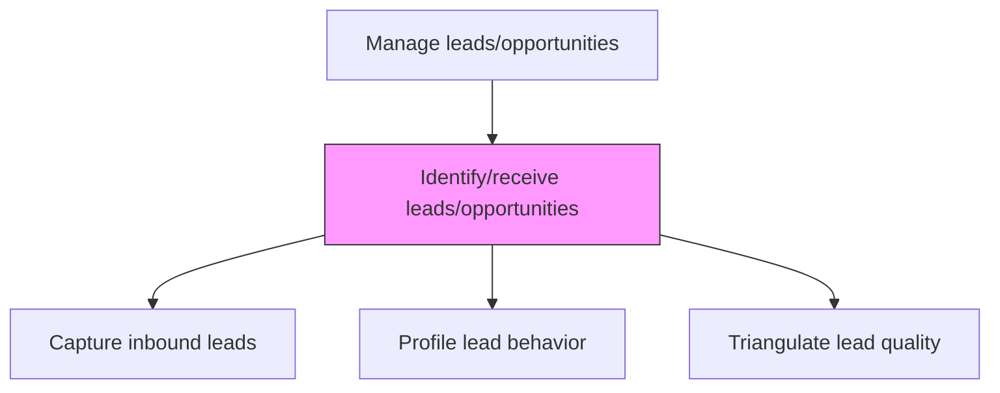
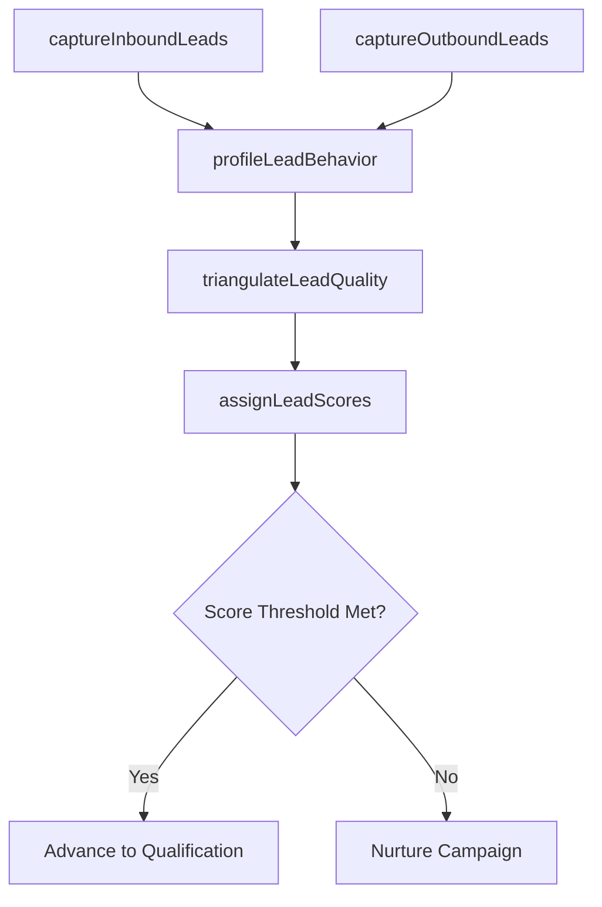

# Identify/receive leads/opportunities

> Business-as-Code definition for lead identification and reception. Models the process of capturing, profiling, and triangulating inbound and outbound leads by evaluating prospect behavior, existing product usage, and decision-making authority.

## Overview

Qualifying the prospective customers into credible leads by gauging their behavior against the organization's offering. Triangulate leads to increase the efficiency of sales and marketing efforts. Build a detailed profile of the prospects. Determine what products/services they already use, if they have decision-making authority, their views on the products/services they already use, how prone they are to switch, if the organization's solution better in some attributes than those prospects currently use, etc.

## Process Hierarchy



## GraphDL

```yaml
identify/receive:
  object: Leads/opportunities
  actor: SalesDevelopmentRep
  result: LeadRecord
```

## Actions

| Action | Description |
|--------|-------------|
| captureInboundLeads | Register leads from marketing campaigns, website forms, events, and referrals |
| captureOutboundLeads | Log leads generated through cold calling, email campaigns, and social selling |
| profileLeadBehavior | Analyze prospect engagement patterns, content consumption, and buying signals |
| triangulateLeadQuality | Cross-reference lead data from multiple sources to validate quality and intent |
| assignLeadScores | Apply scoring models to rank leads based on fit and engagement level |

## Events

| Event | Description |
|-------|-------------|
| inboundLeadsCaptured | Marketing-sourced leads registered in CRM |
| outboundLeadsCaptured | Sales-sourced leads logged from outreach activities |
| leadBehaviorProfiled | Lead engagement and behavioral data compiled |
| leadQualityTriangulated | Lead quality validated through multi-source verification |
| leadScoresAssigned | Lead scores calculated and updated in pipeline |

## Searches

| Search | Description |
|--------|-------------|
| getLeadsBySource | Retrieve leads filtered by source channel or campaign |
| getLeadScores | Access lead scoring data with breakdown by criteria |
| getLeadEngagement | Query lead engagement history and behavioral signals |

## Process Flow



## RACI Matrix

| Activity | Responsible | Accountable | Consulted | Informed |
|----------|-------------|-------------|-----------|----------|
| captureInboundLeads | MarketingOpsSpecialist | SalesDevelopmentManager | Marketing | Sales |
| captureOutboundLeads | SalesDevelopmentRep | SalesDevelopmentManager | SalesOperations | Marketing |
| assignLeadScores | SalesOperationsAnalyst | SalesDevelopmentManager | Marketing | ProductManagement |

## Related Processes

| Process | Relationship |
|---------|-------------|
| 3.5.1.1 Identify potential customers | Upstream - identified prospects become leads |
| 3.5.1.3 Validate and qualify leads/opportunities | Downstream - scored leads advance to qualification |
| 3.3.3 Design and execute brand and product marketing programs | Upstream - campaigns generate inbound leads |

## Related Departments

| Department | Role |
|-----------|------|
| Sales Development | Captures and profiles outbound leads |
| Marketing | Generates and routes inbound leads |
| Sales Operations | Manages lead scoring models and CRM automation |
| IT | Maintains lead capture integrations and data flows |

## Related Occupations

| Occupation | Involvement |
|-----------|-------------|
| Sales Development Representative | Generates and captures outbound leads |
| Marketing Operations Specialist | Manages inbound lead capture and routing |
| Sales Operations Analyst | Maintains lead scoring models |

## KPIs

| KPI | Description | Unit |
|-----|-------------|------|
| Lead Volume | Total number of leads captured per period by source | Count |
| Lead Response Time | Average time from lead capture to first contact | Hours |
| Lead Score Distribution | Distribution of leads across scoring tiers | % |

## Usage

```typescript
import { identifyReceiveLeadsOpportunities } from '@headlessly/identify-receive-leads-opportunities'

const leads = identifyReceiveLeadsOpportunities()

// Capture and score inbound leads
const inbound = await leads.captureInboundLeads({
  source: 'webinar-registration',
  campaign: 'q1-product-launch',
  leads: leadBatch
})

// Assign lead scores
const scored = await leads.assignLeadScores({
  leads: inbound.map(l => l.id),
  model: 'BANT-plus-engagement',
  thresholds: { qualified: 70, hot: 90 }
})
```
