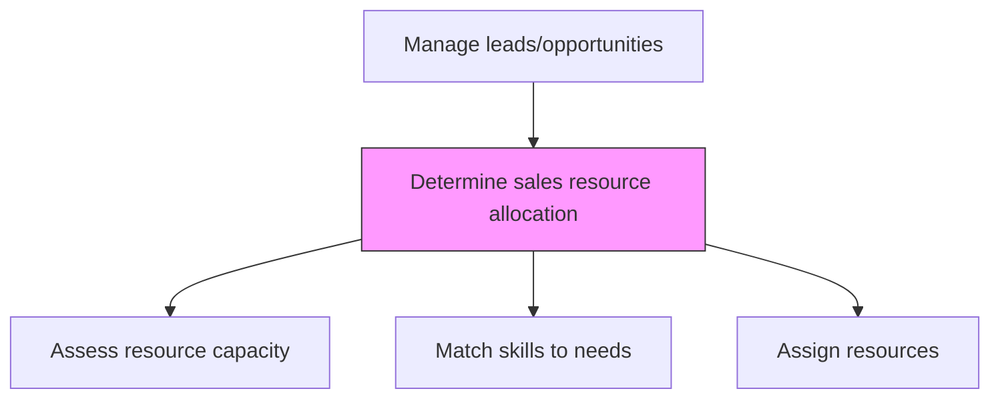
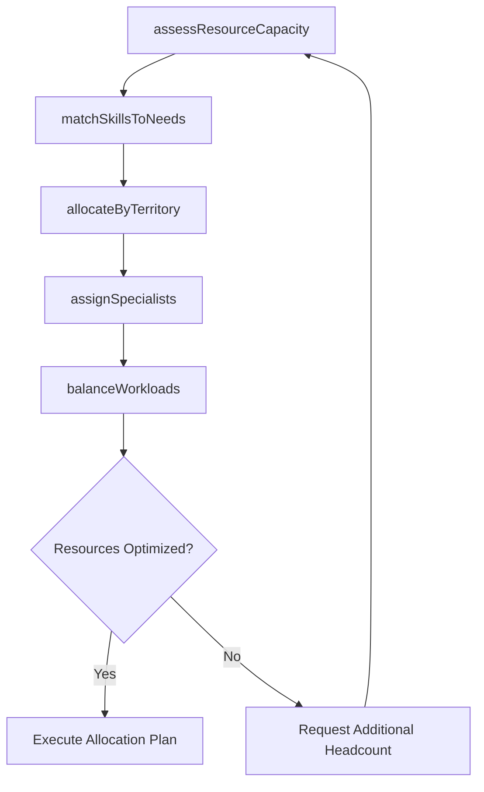

# Determine sales resource allocation

> Business-as-Code definition for sales resource allocation planning. Models the distribution of sales personnel, specialists, and support resources across territories, accounts, and opportunities based on pipeline priorities and skill requirements.

## Overview

Planning the distribution of personnel across various sales functions. Match the capabilities of individual employees with the skill sets needed for specific roles. Seek assistance from HR.

## Process Hierarchy



## GraphDL

```yaml
determine:
  object: Sales Resource Allocation
  actor: SalesOperationsManager
  result: ResourceAllocationPlan
```

## Actions

| Action | Description |
|--------|-------------|
| assessResourceCapacity | Evaluate available sales headcount, skills, and bandwidth across teams |
| matchSkillsToNeeds | Align rep competencies and experience with opportunity requirements |
| allocateByTerritory | Distribute sales resources across geographic territories based on pipeline density |
| assignSpecialists | Deploy solution engineers, pre-sales consultants, and executive sponsors to deals |
| balanceWorkloads | Redistribute assignments to prevent burnout and optimize coverage |

## Events

| Event | Description |
|-------|-------------|
| resourceCapacityAssessed | Sales team capacity and availability evaluated |
| skillsMatchedToNeeds | Rep competencies aligned with opportunity requirements |
| territoryResourcesAllocated | Sales resources distributed across territories |
| specialistsAssigned | Technical and executive resources deployed to key deals |
| workloadsBalanced | Sales team workload distribution optimized |

## Searches

| Search | Description |
|--------|-------------|
| getResourceAllocation | Retrieve current resource assignments by territory or team |
| getCapacityReport | Access sales team capacity and utilization data |
| getSkillsInventory | Query sales team skill profiles and certifications |

## Process Flow



## RACI Matrix

| Activity | Responsible | Accountable | Consulted | Informed |
|----------|-------------|-------------|-----------|----------|
| assessResourceCapacity | SalesOperationsManager | VP Sales | HR | Finance |
| matchSkillsToNeeds | SalesManager | VP Sales | HR | SalesOperations |
| allocateByTerritory | SalesOperationsManager | VP Sales | SalesDirectors | Finance |

## Related Processes

| Process | Relationship |
|---------|-------------|
| 3.5.1.6 Manage opportunity pipeline | Upstream - pipeline priorities drive resource allocation |
| 3.4.5 Establish sales goals and measures | Upstream - quotas and goals inform headcount needs |
| 7.1.2 Recruit, source, and select employees | Parallel - hiring fills resource gaps in sales |

## Related Departments

| Department | Role |
|-----------|------|
| Sales Operations | Plans and optimizes resource allocation |
| Sales | Receives and deploys allocated resources |
| HR | Supports hiring and skill development for sales roles |
| Finance | Approves headcount and compensation budgets |

## Related Occupations

| Occupation | Involvement |
|-----------|-------------|
| Sales Operations Manager | Plans sales resource allocation and territory design |
| Sales Director | Assigns reps and specialists to opportunities |
| HR Business Partner | Supports sales talent planning and development |

## KPIs

| KPI | Description | Unit |
|-----|-------------|------|
| Resource Utilization | Percentage of sales team bandwidth actively engaged in deals | % |
| Territory Coverage | Percentage of territories with adequate sales coverage | % |
| Specialist Deployment Rate | Percentage of qualified opportunities receiving specialist support | % |

## Usage

```typescript
import { determineSalesResourceAllocation } from '@headlessly/determine-sales-resource-allocation'

const allocation = determineSalesResourceAllocation()

// Assess resource capacity
const capacity = await allocation.assessResourceCapacity({
  teams: ['enterprise', 'mid-market', 'smb'],
  includeAvailability: true,
  period: 'current-quarter'
})

// Allocate by territory
const plan = await allocation.allocateByTerritory({
  territories: ['northeast', 'southeast', 'midwest', 'west'],
  pipelineDensityWeighted: true,
  maxDealsPerRep: 25
})
```
