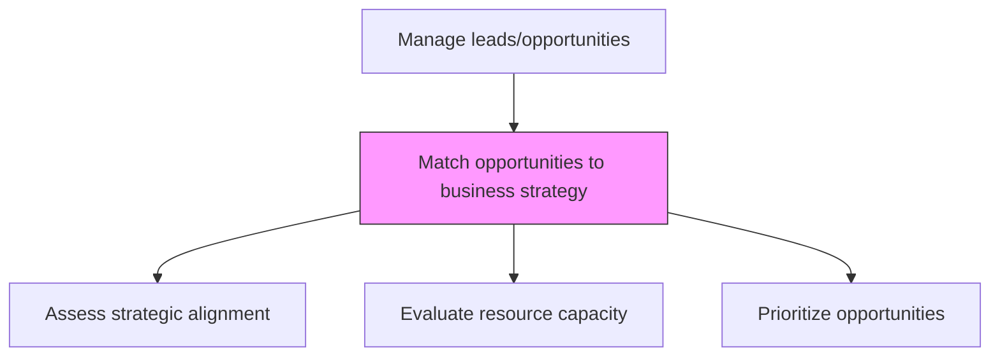
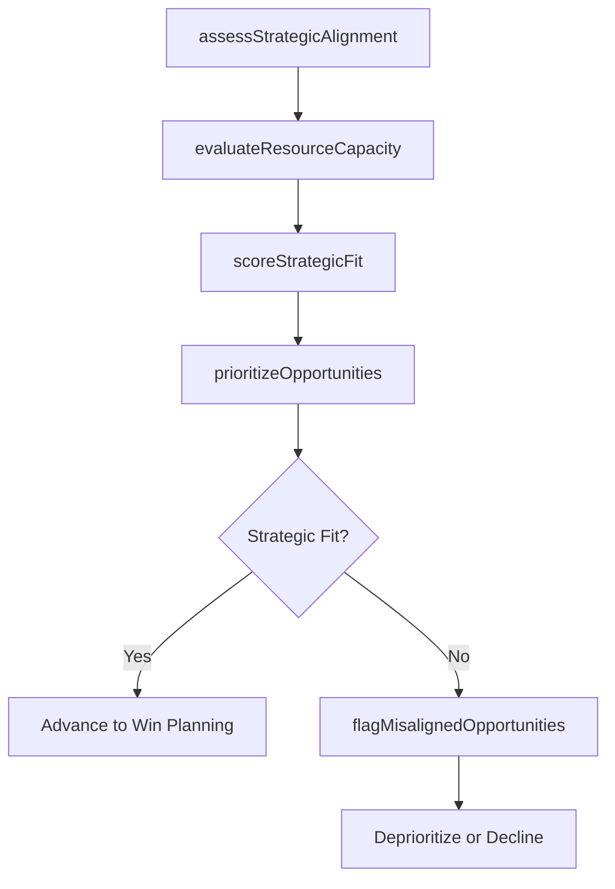

# Match opportunities to business strategy

> Business-as-Code definition for opportunity-strategy alignment. Models the process of evaluating qualified sales opportunities against organizational business objectives, strategic priorities, and resource capacity to ensure pursuit of the right deals.

## Overview

Aligning sales leads with business objectives.

## Process Hierarchy



## GraphDL

```yaml
match:
  object: Opportunities To Business Strategy
  actor: SalesManager
  result: StrategicOpportunityAssessment
```

## Actions

| Action | Description |
|--------|-------------|
| assessStrategicAlignment | Evaluate how each opportunity aligns with corporate growth priorities and target segments |
| evaluateResourceCapacity | Determine whether the organization has capacity to pursue and deliver the opportunity |
| scoreStrategicFit | Rate opportunities on strategic value, competitive advantage, and growth potential |
| prioritizeOpportunities | Rank opportunities by strategic alignment and revenue potential for resource allocation |
| flagMisalignedOpportunities | Identify opportunities that do not fit strategic criteria for deprioritization |

## Events

| Event | Description |
|-------|-------------|
| strategicAlignmentAssessed | Opportunity evaluated against business strategy criteria |
| resourceCapacityEvaluated | Organizational capacity confirmed for opportunity pursuit |
| strategicFitScored | Opportunity rated on strategic value dimensions |
| opportunitiesPrioritized | Opportunity ranking updated based on strategic alignment |
| misalignedOpportunitiesFlagged | Non-strategic opportunities identified for deprioritization |

## Searches

| Search | Description |
|--------|-------------|
| getStrategicOpportunities | Retrieve opportunities ranked by strategic alignment score |
| getStrategyAlignment | Access strategic fit assessment for a specific opportunity |
| getCapacityAvailability | Query organizational capacity for opportunity pursuit |

## Process Flow



## RACI Matrix

| Activity | Responsible | Accountable | Consulted | Informed |
|----------|-------------|-------------|-----------|----------|
| assessStrategicAlignment | SalesManager | VP Sales | Strategy | Marketing |
| evaluateResourceCapacity | SalesOperationsManager | VP Sales | Delivery | HR |
| prioritizeOpportunities | SalesManager | VP Sales | Finance | ExecutiveTeam |

## Related Processes

| Process | Relationship |
|---------|-------------|
| 3.5.1.3 Validate and qualify leads/opportunities | Upstream - qualified leads assessed for strategic fit |
| 3.5.1.5 Develop opportunity win plans | Downstream - strategically aligned opportunities get win plans |
| 1.2 Define and evaluate strategic options | Upstream - corporate strategy defines alignment criteria |

## Related Departments

| Department | Role |
|-----------|------|
| Sales | Assesses opportunities against strategic priorities |
| Strategy | Defines strategic criteria and growth priorities |
| Sales Operations | Provides pipeline analytics and capacity data |
| Delivery | Confirms implementation and fulfillment capacity |

## Related Occupations

| Occupation | Involvement |
|-----------|-------------|
| Sales Manager | Evaluates opportunity-strategy alignment |
| Strategic Planner | Defines strategic fit criteria |
| Sales Operations Manager | Provides pipeline and capacity analytics |

## KPIs

| KPI | Description | Unit |
|-----|-------------|------|
| Strategic Alignment Score | Average strategic fit score across pipeline opportunities | Score (1-10) |
| Strategic Win Rate | Win rate for opportunities rated as strategically aligned | % |
| Deprioritization Rate | Percentage of opportunities flagged as non-strategic | % |

## Usage

```typescript
import { matchOpportunitiesToBusinessStrategy } from '@headlessly/match-opportunities-to-business-strategy'

const alignment = matchOpportunitiesToBusinessStrategy()

// Assess strategic alignment of pipeline opportunities
const assessed = await alignment.assessStrategicAlignment({
  opportunities: pipelineOpportunities,
  strategyPriorities: ['enterprise-expansion', 'vertical-growth', 'platform-adoption'],
  minimumFitScore: 6
})

// Prioritize opportunities
const ranked = await alignment.prioritizeOpportunities({
  opportunities: assessed.aligned,
  weightings: { strategicFit: 0.4, dealSize: 0.3, winProbability: 0.3 }
})
```
