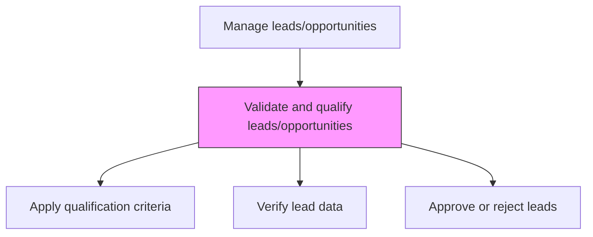
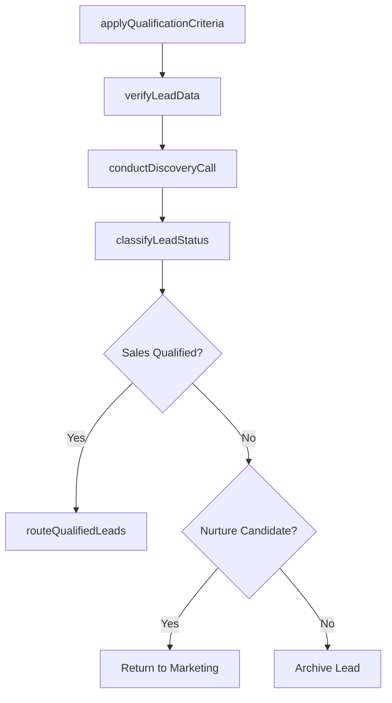

# Validate and qualify leads/opportunities

> Business-as-Code definition for lead validation and qualification. Models the review, verification, and approval of potential customers against company requirements, using scoring criteria such as BANT to determine sales-readiness.

## Overview

Reviewing the set of potential customers and sales opportunities. Approve the leads that meet company requirements on new businesses.

## Process Hierarchy



## GraphDL

```yaml
validate:
  object: And Qualify Leads/opportunities
  actor: SalesDevelopmentRep
  result: QualifiedLead
```

## Actions

| Action | Description |
|--------|-------------|
| applyQualificationCriteria | Evaluate leads against BANT or custom qualification frameworks |
| verifyLeadData | Confirm accuracy of contact information, company data, and stated needs |
| conductDiscoveryCall | Perform initial conversation to validate budget, authority, need, and timeline |
| classifyLeadStatus | Categorize leads as sales-qualified, marketing-qualified, or disqualified |
| routeQualifiedLeads | Assign sales-qualified leads to appropriate account executives or territories |

## Events

| Event | Description |
|-------|-------------|
| qualificationCriteriaApplied | Lead evaluated against qualification framework |
| leadDataVerified | Lead contact and company information confirmed |
| discoveryCallConducted | Initial qualification conversation completed |
| leadStatusClassified | Lead categorized by qualification level |
| qualifiedLeadsRouted | Sales-ready leads assigned to account owners |

## Searches

| Search | Description |
|--------|-------------|
| getQualifiedLeads | Retrieve leads that have passed qualification criteria |
| getDisqualifiedLeads | Access leads that did not meet qualification thresholds |
| getQualificationMetrics | Query lead qualification rates and conversion data |

## Process Flow



## RACI Matrix

| Activity | Responsible | Accountable | Consulted | Informed |
|----------|-------------|-------------|-----------|----------|
| applyQualificationCriteria | SalesDevelopmentRep | SalesDevelopmentManager | SalesOperations | Marketing |
| conductDiscoveryCall | SalesDevelopmentRep | SalesDevelopmentManager | Sales | PreSales |
| routeQualifiedLeads | SalesDevelopmentManager | VP Sales | SalesOperations | AccountExecutive |

## Related Processes

| Process | Relationship |
|---------|-------------|
| 3.5.1.2 Identify/receive leads/opportunities | Upstream - captured leads advance to qualification |
| 3.5.1.4 Match opportunities to business strategy | Downstream - qualified leads assessed for strategic fit |
| 3.5.1.5 Develop opportunity win plans | Downstream - qualified opportunities trigger win planning |

## Related Departments

| Department | Role |
|-----------|------|
| Sales Development | Performs lead qualification and discovery |
| Sales | Receives qualified leads for opportunity management |
| Marketing | Provides lead context and receives disqualified leads for nurture |
| Sales Operations | Maintains qualification criteria and routing rules |

## Related Occupations

| Occupation | Involvement |
|-----------|-------------|
| Sales Development Representative | Qualifies leads through discovery conversations |
| Sales Development Manager | Oversees qualification standards and team performance |
| Sales Operations Analyst | Manages qualification scoring and routing automation |

## KPIs

| KPI | Description | Unit |
|-----|-------------|------|
| Lead Qualification Rate | Percentage of leads passing qualification criteria | % |
| SQL Conversion Rate | Percentage of MQLs converting to sales-qualified leads | % |
| Discovery Call Completion Rate | Percentage of leads receiving a discovery call | % |
| Lead Routing Time | Average time from qualification to account executive assignment | Hours |

## Usage

```typescript
import { validateAndQualifyLeadsOpportunities } from '@headlessly/validate-and-qualify-leads-opportunities'

const qualification = validateAndQualifyLeadsOpportunities()

// Apply qualification criteria
const results = await qualification.applyQualificationCriteria({
  leads: leadBatch,
  framework: 'BANT',
  minimumScore: 70
})

// Route qualified leads
await qualification.routeQualifiedLeads({
  leads: results.qualified,
  routingRules: 'territory-based',
  notifyAccountOwners: true
})
```
