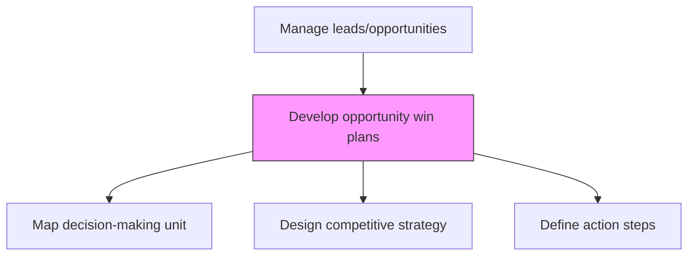
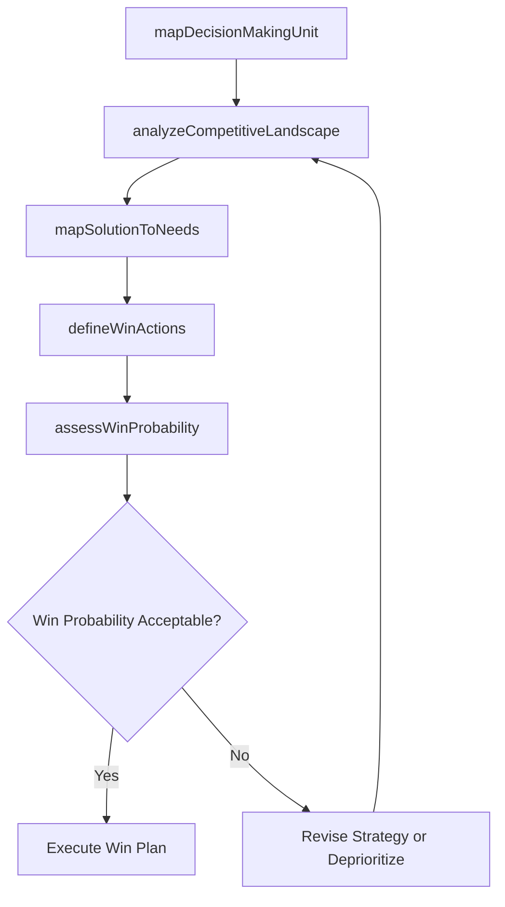

# Develop opportunity win plans

> Business-as-Code definition for opportunity win plan development. Models the creation of tactical plans outlining competitive positioning, stakeholder engagement, solution mapping, and action steps to close specific sales opportunities.

## Overview

Creating plans about how to close leads and win sales opportunities.

## Process Hierarchy



## GraphDL

```yaml
develop:
  object: Opportunity Win Plans
  actor: AccountExecutive
  result: OpportunityWinPlan
```

## Actions

| Action | Description |
|--------|-------------|
| mapDecisionMakingUnit | Identify all stakeholders, decision makers, influencers, and champions at the prospect |
| analyzeCompetitiveLandscape | Assess competitive threats and define differentiation strategy for the deal |
| mapSolutionToNeeds | Align the proposed solution to the customer’s stated and latent requirements |
| defineWinActions | Create a sequenced action plan with milestones, owners, and deadlines to close the deal |
| assessWinProbability | Evaluate likelihood of winning based on competitive position, relationships, and solution fit |

## Events

| Event | Description |
|-------|-------------|
| decisionMakingUnitMapped | All stakeholders and decision makers identified and profiled |
| competitiveLandscapeAnalyzed | Competitive positioning strategy defined for the deal |
| solutionMappedToNeeds | Solution aligned to customer requirements and value drivers |
| winActionsDefined | Action plan with milestones and owners established |
| winProbabilityAssessed | Deal win likelihood evaluated and documented |

## Searches

| Search | Description |
|--------|-------------|
| getWinPlan | Retrieve the win plan for a specific opportunity |
| getStakeholderMap | Access the decision-making unit map for an opportunity |
| getWinProbability | Query win probability assessments across pipeline |

## Process Flow



## RACI Matrix

| Activity | Responsible | Accountable | Consulted | Informed |
|----------|-------------|-------------|-----------|----------|
| mapDecisionMakingUnit | AccountExecutive | SalesManager | PreSales | Marketing |
| analyzeCompetitiveLandscape | AccountExecutive | SalesManager | CompetitiveIntelligence | ProductManagement |
| defineWinActions | AccountExecutive | SalesManager | PreSales | SalesOperations |

## Related Processes

| Process | Relationship |
|---------|-------------|
| 3.5.1.4 Match opportunities to business strategy | Upstream - strategically aligned opportunities get win plans |
| 3.5.1.6 Manage opportunity pipeline | Downstream - win plan execution tracked in pipeline |
| 3.5.3 Develop and manage sales proposals, bids, and quotes | Downstream - win plan guides proposal strategy |

## Related Departments

| Department | Role |
|-----------|------|
| Sales | Creates and executes opportunity win plans |
| Pre-Sales | Supports solution mapping and technical positioning |
| Marketing | Provides competitive intelligence and positioning materials |
| Product Management | Contributes product roadmap and differentiation insights |

## Related Occupations

| Occupation | Involvement |
|-----------|-------------|
| Account Executive | Authors and drives win plan execution |
| Solution Architect | Maps solution capabilities to customer needs |
| Sales Manager | Reviews and coaches on win plan strategy |

## KPIs

| KPI | Description | Unit |
|-----|-------------|------|
| Win Plan Coverage | Percentage of qualified opportunities with documented win plans | % |
| Win Plan Win Rate | Win rate for deals with formal win plans vs. without | % |
| Win Plan Accuracy | Correlation between assessed win probability and actual outcomes | % |

## Usage

```typescript
import { developOpportunityWinPlans } from '@headlessly/develop-opportunity-win-plans'

const winPlanning = developOpportunityWinPlans()

// Map the decision-making unit
const stakeholders = await winPlanning.mapDecisionMakingUnit({
  opportunityId: 'opp-enterprise-001',
  roles: ['decision-maker', 'influencer', 'champion', 'blocker']
})

// Define win actions
const plan = await winPlanning.defineWinActions({
  opportunityId: 'opp-enterprise-001',
  actions: [
    { action: 'executive-briefing', owner: 'vp-sales', deadline: '2026-02-15' },
    { action: 'technical-deep-dive', owner: 'solution-architect', deadline: '2026-02-20' },
    { action: 'reference-call', owner: 'account-exec', deadline: '2026-02-28' }
  ]
})
```
