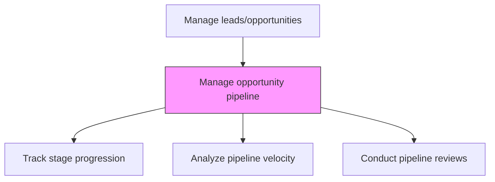
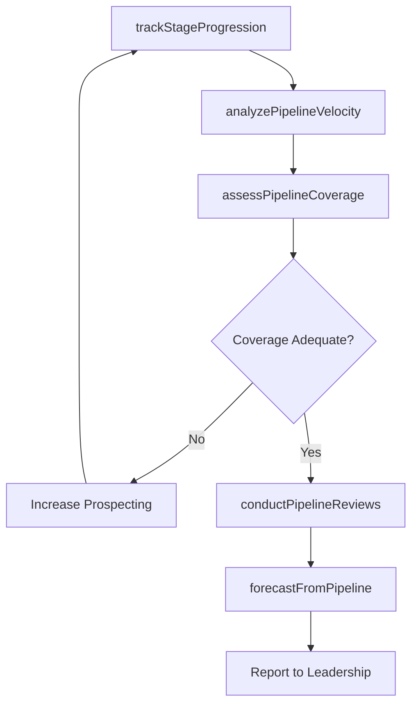

# Manage opportunity pipeline

> Business-as-Code definition for opportunity pipeline management. Models the oversight and optimization of the sales pipeline, including stage progression tracking, velocity analysis, coverage monitoring, and pipeline review cadences.

## Overview

Overseeing and planning the acquisition of new customers.

## Process Hierarchy



## GraphDL

```yaml
manage:
  object: Opportunity Pipeline
  actor: SalesOperationsManager
  result: PipelineHealthReport
```

## Actions

| Action | Description |
|--------|-------------|
| trackStageProgression | Monitor opportunity movement through pipeline stages and flag stalled deals |
| analyzePipelineVelocity | Measure the speed at which deals move through each stage of the pipeline |
| assessPipelineCoverage | Evaluate pipeline value relative to quota to ensure adequate coverage |
| conductPipelineReviews | Facilitate regular pipeline review sessions with sales managers and reps |
| forecastFromPipeline | Generate revenue forecasts based on pipeline stage-weighted probabilities |

## Events

| Event | Description |
|-------|-------------|
| stageProgressionTracked | Pipeline stage transitions and stalled deals identified |
| pipelineVelocityAnalyzed | Deal velocity metrics computed across pipeline stages |
| pipelineCoverageAssessed | Pipeline coverage ratio calculated against quota targets |
| pipelineReviewConducted | Pipeline review meeting completed with action items |
| pipelineForecastGenerated | Stage-weighted revenue forecast produced from pipeline |

## Searches

| Search | Description |
|--------|-------------|
| getPipelineByStage | Retrieve pipeline breakdown by deal stage and value |
| getPipelineVelocity | Access deal velocity data by stage, rep, or territory |
| getStalledDeals | Query opportunities that have not progressed within expected timeframes |
| getPipelineCoverage | Retrieve coverage ratio data by territory or team |

## Process Flow



## RACI Matrix

| Activity | Responsible | Accountable | Consulted | Informed |
|----------|-------------|-------------|-----------|----------|
| trackStageProgression | SalesOperationsAnalyst | SalesOperationsManager | Sales | VP Sales |
| conductPipelineReviews | SalesManager | VP Sales | SalesOperations | Finance |
| forecastFromPipeline | SalesOperationsManager | VP Sales | Finance | ExecutiveTeam |

## Related Processes

| Process | Relationship |
|---------|-------------|
| 3.5.1.5 Develop opportunity win plans | Upstream - win plans guide deal progression |
| 3.5.1.7 Determine sales resource allocation | Downstream - pipeline health informs resource decisions |
| 3.4.1 Develop sales forecast | Downstream - pipeline data feeds forecast models |

## Related Departments

| Department | Role |
|-----------|------|
| Sales Operations | Manages pipeline analytics, reporting, and review cadence |
| Sales | Owns pipeline opportunities and progresses deals |
| Finance | Validates pipeline-based revenue forecasts |
| Executive Leadership | Reviews pipeline health and coverage |

## Related Occupations

| Occupation | Involvement |
|-----------|-------------|
| Sales Operations Manager | Oversees pipeline management processes and analytics |
| Sales Operations Analyst | Builds pipeline dashboards and velocity reports |
| Sales Manager | Conducts pipeline reviews and coaches on deal progression |

## KPIs

| KPI | Description | Unit |
|-----|-------------|------|
| Pipeline Coverage Ratio | Pipeline value divided by quota target | Ratio |
| Pipeline Velocity | Average days from opportunity creation to close | Days |
| Stalled Deal Rate | Percentage of deals stalled beyond stage duration thresholds | % |
| Stage Conversion Rate | Percentage of deals advancing from one stage to the next | % |

## Usage

```typescript
import { manageOpportunityPipeline } from '@headlessly/manage-opportunity-pipeline'

const pipeline = manageOpportunityPipeline()

// Analyze pipeline velocity
const velocity = await pipeline.analyzePipelineVelocity({
  period: 'current-quarter',
  segmentBy: ['stage', 'territory', 'deal-size-tier']
})

// Assess pipeline coverage
const coverage = await pipeline.assessPipelineCoverage({
  quotaTarget: 5000000,
  includeWeightedValue: true,
  excludeStages: ['closed-lost', 'closed-won']
})
```
