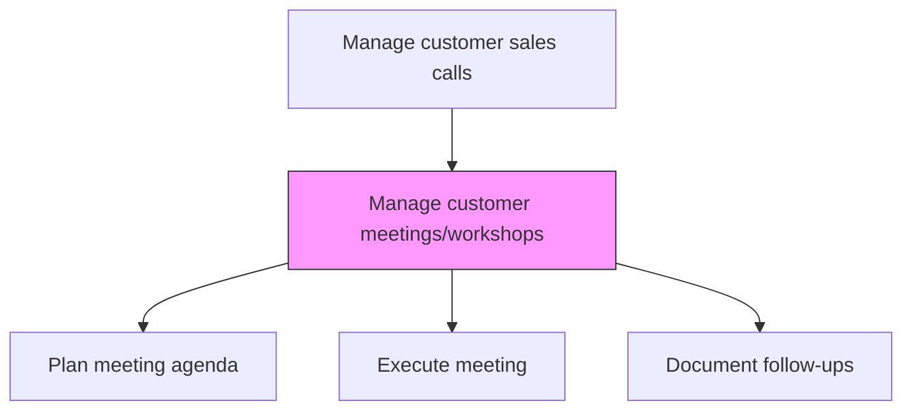
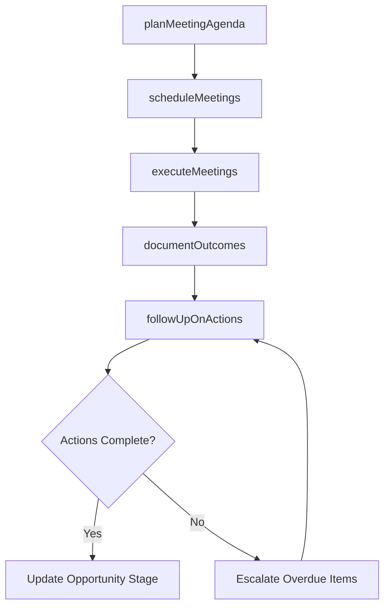

# Manage customer meetings/workshops

> Business-as-Code definition for customer meeting and workshop management. Models the planning, scheduling, execution, and follow-up of customer-facing sales meetings, product demonstrations, discovery workshops, and executive briefings.

## Overview

Arranging and leading meetings, seminars, workshops and training events with customers to educate them about current offerings, best practices and technological advances to provide more value to customers and to increase their attrition and loyalty.

## Process Hierarchy



## GraphDL

```yaml
manage:
  object: Customer Meetings/workshops
  actor: AccountExecutive
  result: MeetingOutcomeRecord
```

## Actions

| Action | Description |
|--------|-------------|
| planMeetingAgenda | Develop agenda, objectives, and materials for customer meetings and workshops |
| scheduleMeetings | Coordinate schedules with customer stakeholders and internal team members |
| executeMeetings | Conduct product demos, discovery workshops, and executive briefings |
| documentOutcomes | Record meeting notes, action items, decisions, and next steps in CRM |
| followUpOnActions | Track and complete post-meeting action items and deliverables |

## Events

| Event | Description |
|-------|-------------|
| meetingAgendaPlanned | Meeting objectives, agenda, and materials prepared |
| meetingsScheduled | Customer meetings coordinated and calendar invites sent |
| meetingsExecuted | Customer-facing meeting or workshop completed |
| outcomesDocumented | Meeting notes and action items recorded in CRM |
| actionsFollowedUp | Post-meeting action items completed and tracked |

## Searches

| Search | Description |
|--------|-------------|
| getUpcomingMeetings | Retrieve scheduled customer meetings by account or date range |
| getMeetingHistory | Access past meeting records and outcomes for an account |
| getPendingActions | Query outstanding action items from customer meetings |

## Process Flow



## RACI Matrix

| Activity | Responsible | Accountable | Consulted | Informed |
|----------|-------------|-------------|-----------|----------|
| planMeetingAgenda | AccountExecutive | SalesManager | PreSales | ProductManagement |
| executeMeetings | AccountExecutive | SalesManager | SolutionArchitect | ExecutiveSponsor |
| documentOutcomes | AccountExecutive | SalesManager | SalesOperations | PreSales |

## Related Processes

| Process | Relationship |
|---------|-------------|
| 3.5.1.8 Manage customer sales calls | Parent - meetings are a key component of sales call management |
| 3.5.1.5 Develop opportunity win plans | Upstream - win plans define meeting objectives and stakeholders |
| 3.5.3 Develop and manage sales proposals, bids, and quotes | Downstream - meeting outcomes inform proposal development |

## Related Departments

| Department | Role |
|-----------|------|
| Sales | Plans and executes customer meetings |
| Pre-Sales | Supports product demonstrations and technical workshops |
| Marketing | Provides presentation materials and case studies |
| Executive Leadership | Participates in executive briefings and sponsor meetings |

## Related Occupations

| Occupation | Involvement |
|-----------|-------------|
| Account Executive | Plans and leads customer meetings |
| Solution Architect | Delivers product demonstrations and technical workshops |
| Sales Coordinator | Manages meeting logistics and scheduling |

## KPIs

| KPI | Description | Unit |
|-----|-------------|------|
| Meeting-to-Advance Rate | Percentage of meetings resulting in deal stage advancement | % |
| Meeting Follow-Up Completion | Percentage of action items completed within deadline | % |
| Meeting Frequency | Average number of customer meetings per opportunity per month | Count |

## Usage

```typescript
import { manageCustomerMeetingsWorkshops } from '@headlessly/manage-customer-meetings-workshops'

const meetings = manageCustomerMeetingsWorkshops()

// Plan a customer meeting
const agenda = await meetings.planMeetingAgenda({
  opportunityId: 'opp-enterprise-001',
  meetingType: 'discovery-workshop',
  objectives: ['validate-requirements', 'demo-platform', 'identify-champions'],
  attendees: ['cto', 'vp-engineering', 'procurement-lead']
})

// Document meeting outcomes
await meetings.documentOutcomes({
  meetingId: agenda.meetingId,
  notes: 'Customer confirmed budget approval timeline...',
  actionItems: [
    { action: 'send-technical-specs', owner: 'solution-architect', deadline: '2026-02-10' }
  ]
})
```
