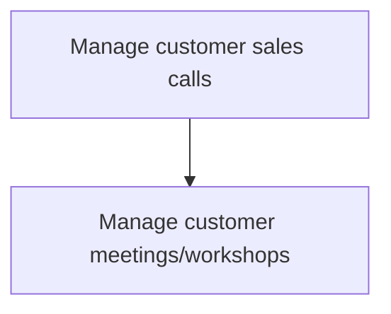
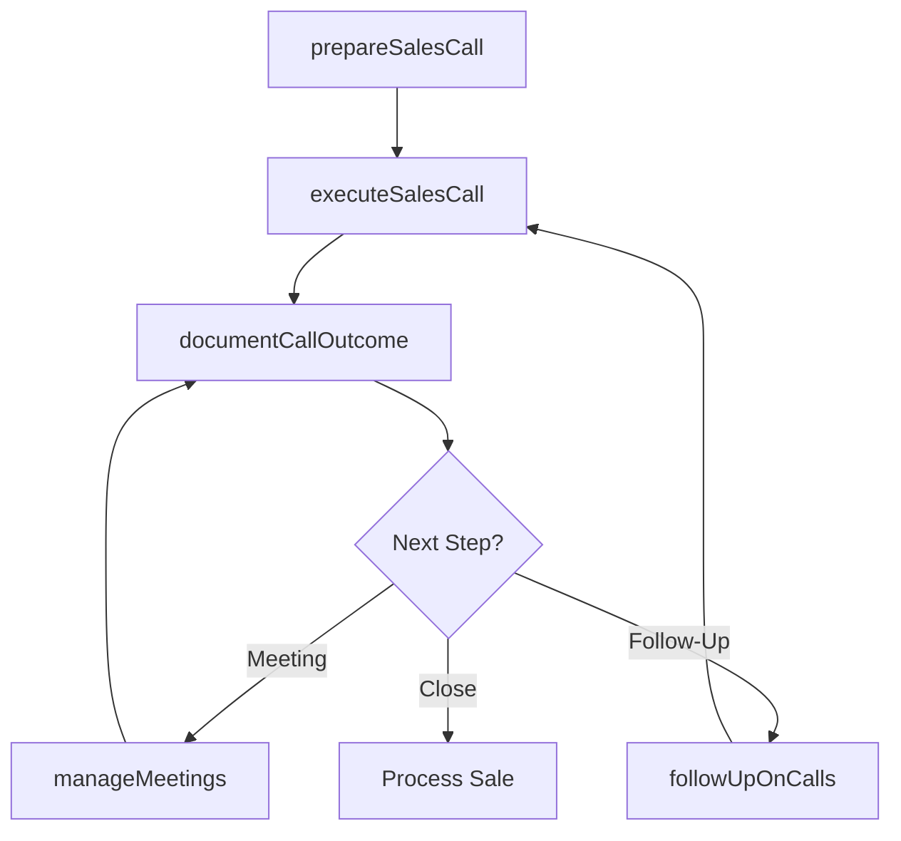

# Manage customer sales calls

> Business-as-Code definition for customer sales call management. Models the preparation, execution, follow-up, and documentation of sales calls and customer meetings throughout the sales process from opening to close.

## Overview

Managing the entire sales process, from using leads to open sales to closing sales and creating records. Govern all sales activities. Make sales calls based on leads and preparatory work (drafting terms of the sale, creating proposals, suggesting prices, etc.). Close the sale, along with any administrative activities related to data entry and the processing of the sale.

## Process Hierarchy



## GraphDL

```yaml
manage:
  object: Customer Sales Calls
  actor: AccountExecutive
  result: SalesCallOutcome
```

## Actions

| Action | Description |
|--------|-------------|
| prepareSalesCall | Research customer needs and prepare materials for the sales call |
| executeSalesCall | Conduct the sales call, present solutions, and address objections |
| manageMeetings | Schedule and facilitate customer meetings and workshops |
| documentCallOutcome | Record call results, next steps, and update CRM records |
| followUpOnCalls | Execute post-call follow-up actions and nurture sequences |

## Events

| Event | Description |
|-------|-------------|
| salesCallPrepared | Sales call preparation completed with materials ready |
| salesCallExecuted | Sales call conducted with outcome recorded |
| meetingsManaged | Customer meetings or workshops facilitated |
| callOutcomeDocumented | Call results and next steps entered into CRM |
| callFollowUpCompleted | Post-call follow-up actions executed |

## Searches

| Search | Description |
|--------|-------------|
| getSalesCallHistory | Retrieve sales call records by account, rep, or date |
| getCallOutcomes | Access call outcome data and disposition summaries |
| getMeetingSchedule | Query upcoming customer meetings and workshops |
| getFollowUpQueue | Retrieve pending follow-up actions by representative |

## Process Flow



## RACI Matrix

| Activity | Responsible | Accountable | Consulted | Informed |
|----------|-------------|-------------|-----------|----------|
| prepareSalesCall | AccountExecutive | SalesManager | PreSales | Marketing |
| executeSalesCall | AccountExecutive | SalesManager | SolutionArchitect | SalesOperations |
| manageMeetings | AccountExecutive | SalesManager | ProductManagement | CustomerSuccess |
| documentCallOutcome | AccountExecutive | SalesManager | SalesOperations | Finance |

## Sub-Processes

| ID | Name | Description |
|----|------|-------------|
| 3.5.1.8.1 | Manage customer meetings/workshops | Arranging and leading meetings, seminars, workshops and training events with customers to educate th |

## Related Processes

| Process | Relationship |
|---------|-------------|
| 3.5.1.5 Develop opportunity win plans | Upstream - win plans guide sales call strategy |
| 3.5.3 Develop and manage sales proposals, bids, and quotes | Downstream - calls may trigger proposal requests |
| 3.5.2.6 Manage customer relationships | Parallel - calls strengthen customer relationships |
| 3.5.1.6 Manage opportunity pipeline | Parallel - call outcomes update pipeline status |

## Related Departments

| Department | Role |
|-----------|------|
| Sales | Executes customer sales calls and manages relationships |
| Pre-Sales | Provides technical support during complex sales calls |
| Sales Operations | Tracks call activity and provides CRM tools |
| Marketing | Supplies sales collateral and campaign context |

## Related Occupations

| Occupation | Involvement |
|-----------|-------------|
| Account Executive | Conducts sales calls and manages deal progression |
| Sales Manager | Coaches reps and reviews call strategies |
| Solution Architect | Supports technical discussions during customer calls |
| Sales Development Representative | Handles initial outreach calls and discovery |

## KPIs

| KPI | Description | Unit |
|-----|-------------|------|
| Call-to-Meeting Conversion | Percentage of calls resulting in scheduled meetings | % |
| Calls Per Opportunity | Average number of calls required to close an opportunity | Count |
| Call Activity Rate | Number of sales calls per representative per week | Count |
| Average Call Duration | Mean length of customer sales calls | Minutes |
| Call-to-Close Rate | Percentage of initial calls eventually resulting in a sale | % |

## Usage

```typescript
import { manageCustomerSalesCalls } from '@headlessly/manage-customer-sales-calls'

const salesCalls = manageCustomerSalesCalls()

// Prepare for a sales call
const prep = await salesCalls.prepareSalesCall({
  accountId: 'enterprise-client-001',
  opportunityId: 'opp-12345',
  callType: 'discovery',
  attendees: ['buyer', 'technical-lead']
})

// Document call outcome
const outcome = await salesCalls.documentCallOutcome({
  callId: prep.callId,
  disposition: 'positive',
  nextSteps: ['send-proposal', 'schedule-demo'],
  notes: 'Customer interested in enterprise tier'
})
```
