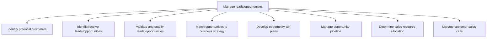
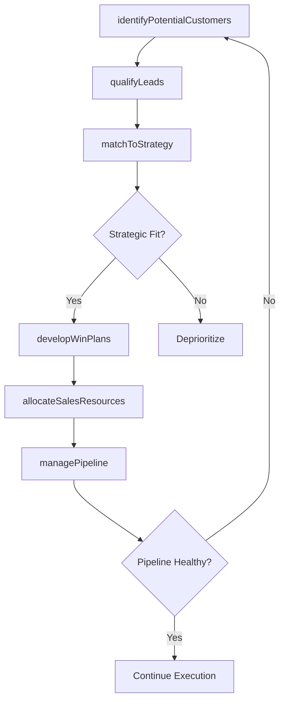

# Manage leads/opportunities

> Business-as-Code definition for lead and opportunity management. Models the complete sales pipeline from customer identification and lead generation through qualification, strategic alignment, win planning, pipeline management, resource allocation, and sales call execution.

## Overview

Generating leads of prospective customers to grow the organization's business. Identify viable customers based on customer and market research. Discover leads through IT applications, cold calling, reference/network development, or other sales and business development techniques. Employ a scoring model qualify the prospective customers into leads, and prioritize them.

## Process Hierarchy



## GraphDL

```yaml
manage:
  object: Leads/opportunities
  actor: SalesDevelopmentManager
  result: QualifiedPipelineReport
```

## Actions

| Action | Description |
|--------|-------------|
| identifyPotentialCustomers | Prospect for potential customers using market data and outreach |
| qualifyLeads | Score and validate leads against qualification criteria |
| matchToStrategy | Align qualified opportunities with business strategy and priorities |
| developWinPlans | Create action plans to close specific opportunities |
| managePipeline | Oversee opportunity pipeline stages, velocity, and health |
| allocateSalesResources | Assign sales representatives and resources to opportunities |

## Events

| Event | Description |
|-------|-------------|
| potentialCustomersIdentified | New prospects added to the lead database |
| leadsQualified | Leads scored and advanced or disqualified |
| opportunitiesMatchedToStrategy | Opportunities aligned with strategic priorities |
| winPlansDeveloped | Opportunity-specific win plans created |
| pipelineManaged | Pipeline review completed with stage updates |
| salesResourcesAllocated | Sales team assignments updated based on pipeline |

## Searches

| Search | Description |
|--------|-------------|
| getLeadPipeline | Retrieve leads and opportunities by stage, owner, or score |
| getQualifiedOpportunities | Access qualified opportunities with win probability data |
| getPipelineMetrics | Query pipeline velocity, conversion rates, and coverage |
| getResourceAllocation | Retrieve sales team assignments and capacity |
| getWinPlans | Access win plans for specific opportunities |

## Process Flow



## RACI Matrix

| Activity | Responsible | Accountable | Consulted | Informed |
|----------|-------------|-------------|-----------|----------|
| identifyPotentialCustomers | SalesDevelopmentRep | SalesDevelopmentManager | Marketing | Sales |
| qualifyLeads | SalesDevelopmentRep | SalesDevelopmentManager | ProductManagement | Marketing |
| matchToStrategy | SalesManager | VP Sales | Strategy | Marketing |
| developWinPlans | AccountExecutive | SalesManager | PreSales | ProductManagement |
| managePipeline | SalesOperationsManager | VP Sales | Finance | ExecutiveTeam |

## Sub-Processes

| ID | Name | Description |
|----|------|-------------|
| 3.5.1.1 | Identify potential customers | Identifying people who can be converted into customers. Leverage personal and professional networks, |
| 3.5.1.2 | Identify/receive leads/opportunities | Qualifying the prospective customers into credible leads by gauging their behavior against the organ |
| 3.5.1.3 | Validate and qualify leads/opportunities | Reviewing the set of potential customers and sales opportunities. Approve the leads that meet compan |
| 3.5.1.4 | Match opportunities to business strategy | Aligning sales leads with business objectives. |
| 3.5.1.5 | Develop opportunity win plans | Creating plans about how to close leads and win sales opportunities. |
| 3.5.1.6 | Manage opportunity pipeline | Overseeing and planning the acquisition of new customers. |
| 3.5.1.7 | Determine sales resource allocation | Planning the distribution of personnel across various sales functions. Match the capabilities of ind |
| 3.5.1.8 | Manage customer sales calls | Managing the entire sales process, from using leads to open sales to closing sales and creating reco |

## Related Processes

| Process | Relationship |
|---------|-------------|
| 3.5.2 Manage customers and accounts | Downstream - qualified leads become managed accounts |
| 3.5.3 Develop and manage sales proposals, bids, and quotes | Downstream - opportunities trigger proposal development |
| 3.3.3 Design and execute brand and product marketing programs | Upstream - campaigns generate leads for pipeline |
| 3.4.1 Develop sales forecast | Parallel - pipeline data feeds forecast models |

## Related Departments

| Department | Role |
|-----------|------|
| Sales Development | Generates and qualifies leads through outbound efforts |
| Sales | Manages qualified opportunities through the pipeline |
| Marketing | Generates inbound leads through campaigns and content |
| Sales Operations | Manages CRM, pipeline reporting, and resource allocation |
| Pre-Sales | Supports opportunity qualification with technical expertise |

## Related Occupations

| Occupation | Involvement |
|-----------|-------------|
| Sales Development Representative | Prospects and qualifies new leads |
| Account Executive | Manages qualified opportunities and closes deals |
| Sales Development Manager | Oversees lead generation team and qualification processes |
| Sales Operations Analyst | Tracks pipeline metrics and conversion rates |

## KPIs

| KPI | Description | Unit |
|-----|-------------|------|
| Lead Conversion Rate | Percentage of leads converting to qualified opportunities | % |
| Pipeline Velocity | Average days from lead to closed deal | Days |
| Pipeline Coverage Ratio | Pipeline value relative to quota target | Ratio |
| Win Rate | Percentage of qualified opportunities resulting in closed deals | % |
| Cost Per Lead | Average cost to generate one qualified lead | USD |

## Usage

```typescript
import { manageLeadsOpportunities } from '@headlessly/manage-leads-opportunities'

const pipeline = manageLeadsOpportunities()

// Qualify a batch of new leads
const qualified = await pipeline.qualifyLeads({
  leads: leadBatch,
  scoringModel: 'BANT',
  minimumScore: 70
})

// Manage pipeline health
const health = await pipeline.managePipeline({
  period: 'current-quarter',
  metrics: ['velocity', 'conversion', 'coverage'],
  stageBreakdown: true
})
```
