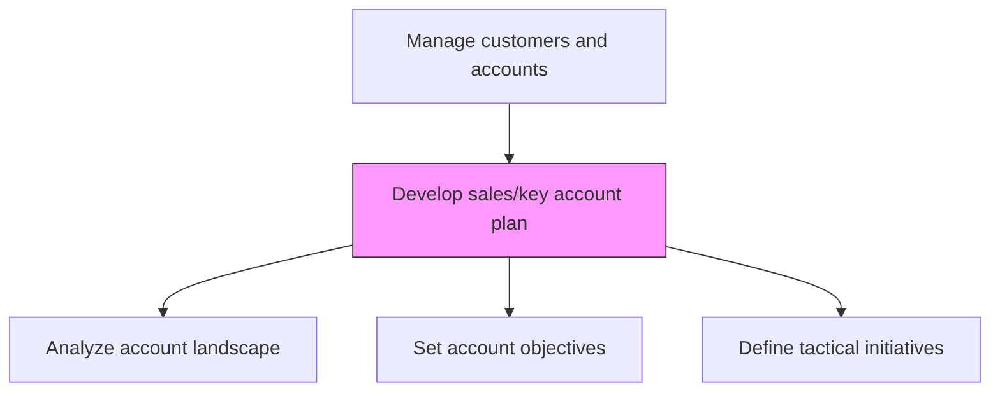
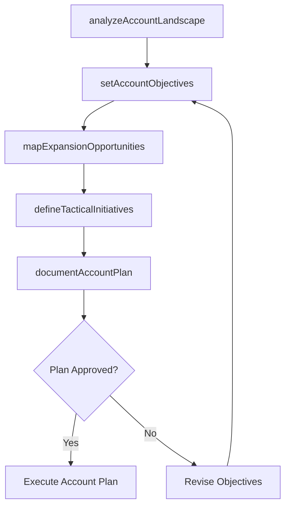

# Develop sales/key account plan

> Business-as-Code definition for sales and key account plan development. Models the creation of comprehensive account plans that define growth strategies, relationship objectives, revenue targets, and tactical actions for strategic customer accounts.

## Overview

Creating a plan for managing the accounts of key customers in order to better maintain relationships with them. Chart a scheme for managing sales. Create a plan for administering accounts of the significant and most important customers of the organization. Coordinate the accounts of principal clients.

## Process Hierarchy



## GraphDL

```yaml
develop:
  object: Sales/key Account Plan
  actor: KeyAccountManager
  result: KeyAccountPlan
```

## Actions

| Action | Description |
|--------|-------------|
| analyzeAccountLandscape | Assess the customer organization, decision makers, competitive presence, and whitespace |
| setAccountObjectives | Define revenue, growth, and relationship objectives for the account |
| mapExpansionOpportunities | Identify cross-sell, upsell, and new business unit opportunities |
| defineTacticalInitiatives | Plan specific actions, events, and campaigns for the account |
| documentAccountPlan | Compile the formal account plan with timelines, owners, and milestones |

## Events

| Event | Description |
|-------|-------------|
| accountLandscapeAnalyzed | Customer organization and competitive assessment completed |
| accountObjectivesSet | Account-level revenue and relationship targets established |
| expansionOpportunitiesMapped | Cross-sell and upsell opportunities identified |
| tacticalInitiativesDefined | Account-specific actions and campaigns planned |
| accountPlanDocumented | Formal account plan completed and distributed |

## Searches

| Search | Description |
|--------|-------------|
| getAccountPlan | Retrieve account plan details for a specific customer |
| getAccountObjectives | Access revenue and growth objectives by account |
| getExpansionPipeline | Query expansion opportunities across key accounts |

## Process Flow



## RACI Matrix

| Activity | Responsible | Accountable | Consulted | Informed |
|----------|-------------|-------------|-----------|----------|
| analyzeAccountLandscape | KeyAccountManager | SalesDirector | Marketing | PreSales |
| setAccountObjectives | KeyAccountManager | VP Sales | Finance | Strategy |
| documentAccountPlan | KeyAccountManager | SalesDirector | SalesOperations | VP Sales |

## Related Processes

| Process | Relationship |
|---------|-------------|
| 3.5.2.1 Select key customers/accounts | Upstream - selected key accounts receive dedicated plans |
| 3.5.2.3 Manage sales/key account plan | Downstream - created plans are managed and tracked |
| 3.4.6 Establish customer management goals, and strategies | Upstream - customer strategy guides plan development |

## Related Departments

| Department | Role |
|-----------|------|
| Sales | Creates and owns key account plans |
| Pre-Sales | Contributes technical assessment and solution mapping |
| Customer Success | Provides usage and satisfaction data for planning |
| Finance | Validates revenue targets and investment assumptions |

## Related Occupations

| Occupation | Involvement |
|-----------|-------------|
| Key Account Manager | Authors and drives key account plan development |
| Sales Director | Reviews and approves account plans |
| Solution Architect | Maps solution capabilities to account needs |

## KPIs

| KPI | Description | Unit |
|-----|-------------|------|
| Account Plan Coverage | Percentage of key accounts with documented plans | % |
| Account Plan Freshness | Average age of most recent account plan update | Days |
| Plan Revenue Achievement | Percentage of account plan revenue targets met | % |

## Usage

```typescript
import { developSalesKeyAccountPlan } from '@headlessly/develop-sales-key-account-plan'

const accountPlanning = developSalesKeyAccountPlan()

// Analyze account landscape
const landscape = await accountPlanning.analyzeAccountLandscape({
  accountId: 'enterprise-acme-corp',
  dimensions: ['org-structure', 'decision-makers', 'competitors', 'whitespace']
})

// Set account objectives
const objectives = await accountPlanning.setAccountObjectives({
  accountId: 'enterprise-acme-corp',
  revenueTarget: 2000000,
  growthRate: 0.20,
  expansionGoals: ['new-business-unit', 'platform-upsell']
})
```
