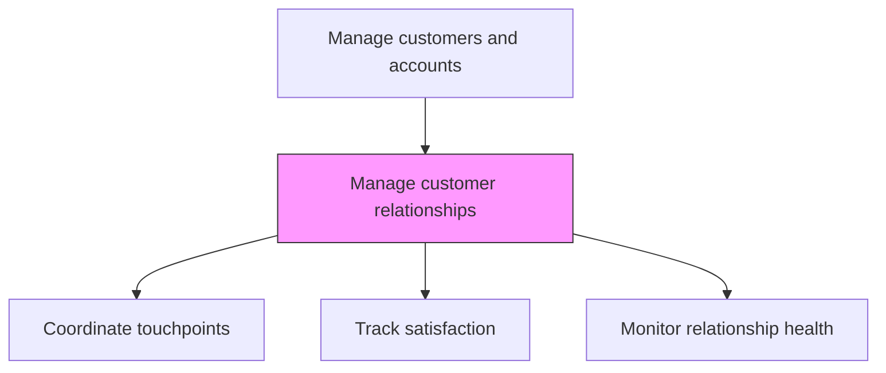
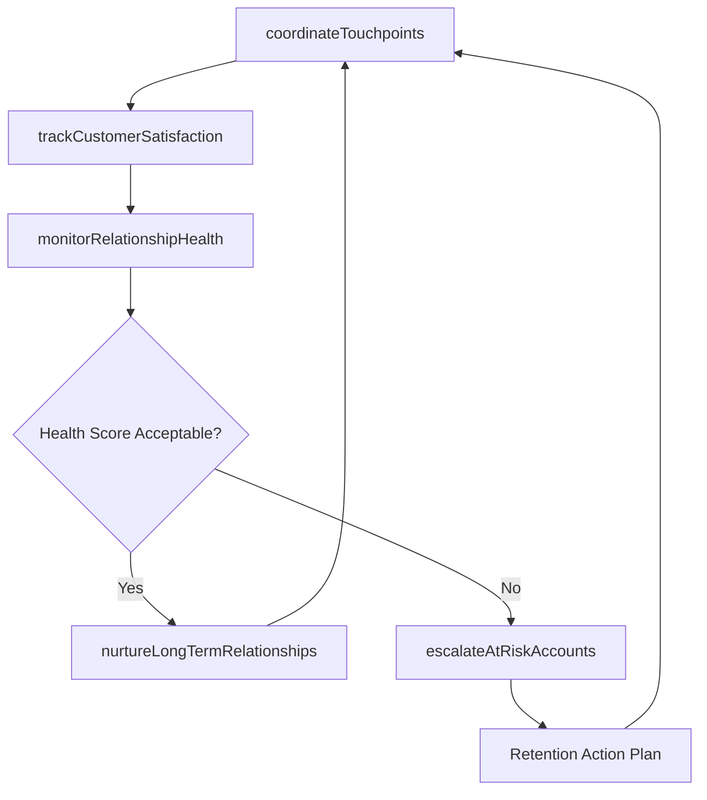

# Manage customer relationships

> Business-as-Code definition for customer relationship management. Models the systematic coordination of customer interactions across multiple touchpoints, including communication cadence management, satisfaction tracking, and relationship health monitoring.

## Overview

Managing the organization's relationship with its customers, by systematically coordinating interactions over multiple touch points, on a regular basis. Coordinate the organization's efforts to reach out to its customers. Create and manage effective touch points for interactions from the customers, which could include emails, social-media interactions, newsletters, and direct conversations.

## Process Hierarchy



## GraphDL

```yaml
manage:
  object: Customer Relationships
  actor: AccountExecutive
  result: CustomerRelationshipReport
```

## Actions

| Action | Description |
|--------|-------------|
| coordinateTouchpoints | Manage regular customer interactions across email, meetings, events, and digital channels |
| trackCustomerSatisfaction | Monitor customer sentiment through surveys, feedback, and interaction quality metrics |
| monitorRelationshipHealth | Assess overall relationship health using engagement, satisfaction, and renewal signals |
| escalateAtRiskAccounts | Flag declining relationships for executive intervention and retention action |
| nurtureLongTermRelationships | Build strategic partnerships through executive sponsorship and value-added engagement |

## Events

| Event | Description |
|-------|-------------|
| touchpointsCoordinated | Customer interaction cadence maintained across channels |
| customerSatisfactionTracked | Satisfaction scores and feedback collected and analyzed |
| relationshipHealthMonitored | Account health scores updated and trends identified |
| atRiskAccountsEscalated | Declining relationships flagged for executive attention |
| longTermRelationshipsNurtured | Strategic engagement activities completed with key stakeholders |

## Searches

| Search | Description |
|--------|-------------|
| getRelationshipHealth | Retrieve relationship health scores by account |
| getCustomerSatisfaction | Access satisfaction survey results and sentiment data |
| getAtRiskAccounts | Query accounts flagged as at-risk for churn |
| getTouchpointHistory | Access interaction history for a customer account |

## Process Flow



## RACI Matrix

| Activity | Responsible | Accountable | Consulted | Informed |
|----------|-------------|-------------|-----------|----------|
| coordinateTouchpoints | AccountExecutive | SalesManager | CustomerSuccess | Marketing |
| monitorRelationshipHealth | AccountExecutive | SalesDirector | CustomerSuccess | SalesOperations |
| escalateAtRiskAccounts | SalesManager | VP Sales | CustomerSuccess | ExecutiveTeam |

## Related Processes

| Process | Relationship |
|---------|-------------|
| 3.5.2.3 Manage sales/key account plan | Parallel - relationship management supports plan execution |
| 5.0 Manage Customer Service | Parallel - service quality impacts relationship health |
| 3.5.2.4 Develop sales communication plan | Upstream - communication plan guides interaction cadence |

## Related Departments

| Department | Role |
|-----------|------|
| Sales | Owns primary customer relationship management |
| Customer Success | Monitors satisfaction and supports retention |
| Marketing | Provides engagement content and event opportunities |
| Executive Leadership | Sponsors executive-level customer relationships |

## Related Occupations

| Occupation | Involvement |
|-----------|-------------|
| Account Executive | Manages day-to-day customer relationships |
| Customer Success Manager | Monitors customer health and satisfaction |
| Sales Manager | Coaches team on relationship management and escalations |

## KPIs

| KPI | Description | Unit |
|-----|-------------|------|
| Customer Health Score | Composite measure of engagement, satisfaction, and risk | Score (1-100) |
| Net Promoter Score | Customer likelihood to recommend the organization | NPS (-100 to 100) |
| Customer Retention Rate | Percentage of customers retained period over period | % |
| Touchpoint Cadence Adherence | Percentage of planned touchpoints completed | % |

## Usage

```typescript
import { manageCustomerRelationships } from '@headlessly/manage-customer-relationships'

const crm = manageCustomerRelationships()

// Monitor relationship health across accounts
const health = await crm.monitorRelationshipHealth({
  accounts: 'all-key-accounts',
  signals: ['engagement', 'satisfaction', 'usage', 'support-tickets'],
  period: 'last-90-days'
})

// Escalate at-risk accounts
const escalated = await crm.escalateAtRiskAccounts({
  accounts: health.atRisk,
  notifyExecutiveSponsor: true,
  requireRetentionPlan: true
})
```
