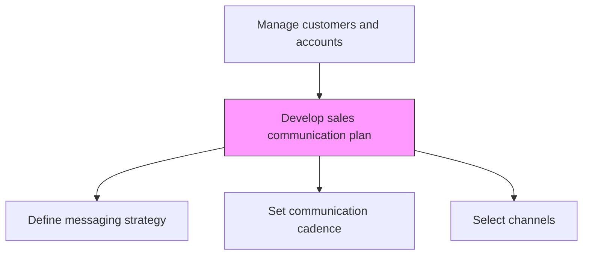
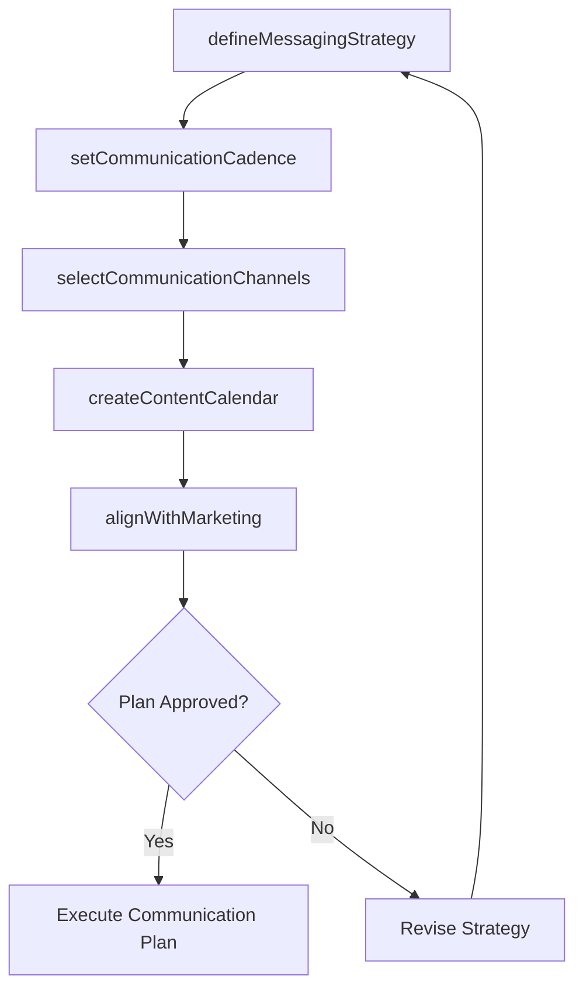

# Develop sales communication plan

> Business-as-Code definition for sales communication plan development. Models the creation of structured communication strategies that define messaging cadence, channel mix, content themes, and stakeholder-specific communication approaches for customer engagement.

## Overview

Designing a comprehensive communication strategy that guides how the sales team engages with customers across all touchpoints. Define messaging themes, communication frequency, channel preferences, and stakeholder-specific approaches. Align sales communications with marketing campaigns and ensure consistent brand voice across all customer interactions.

## Process Hierarchy



## GraphDL

```yaml
develop:
  object: Sales Communication Plan
  actor: SalesEnablementManager
  result: SalesCommunicationPlan
```

## Actions

| Action | Description |
|--------|-------------|
| defineMessagingStrategy | Establish core messaging themes, value propositions, and talking points for each customer segment |
| setCommunicationCadence | Define the frequency and timing of touchpoints for different customer tiers |
| selectCommunicationChannels | Choose optimal channels (email, phone, social, in-person) for each customer type |
| createContentCalendar | Plan sales content and collateral distribution across the communication timeline |
| alignWithMarketing | Synchronize sales communication plan with marketing campaigns and brand messaging |

## Events

| Event | Description |
|-------|-------------|
| messagingStrategyDefined | Core messaging themes and value propositions established |
| communicationCadenceSet | Touchpoint frequency defined for each customer tier |
| communicationChannelsSelected | Channel mix determined for customer segments |
| contentCalendarCreated | Sales content distribution plan published |
| marketingAlignmentCompleted | Sales and marketing communication plans synchronized |

## Searches

| Search | Description |
|--------|-------------|
| getCommunicationPlan | Retrieve the sales communication plan by customer segment or tier |
| getContentCalendar | Access the scheduled content and collateral distribution plan |
| getCommunicationMetrics | Query customer engagement data across communication channels |

## Process Flow



## RACI Matrix

| Activity | Responsible | Accountable | Consulted | Informed |
|----------|-------------|-------------|-----------|----------|
| defineMessagingStrategy | SalesEnablementManager | VP Sales | Marketing | ProductMarketing |
| setCommunicationCadence | SalesEnablementManager | SalesDirector | SalesOperations | CustomerSuccess |
| alignWithMarketing | SalesEnablementManager | VP Sales | VP Marketing | ContentMarketing |

## Related Processes

| Process | Relationship |
|---------|-------------|
| 3.5.2.2 Develop sales/key account plan | Upstream - account plans define communication needs |
| 3.3.3 Design and execute brand and product marketing programs | Parallel - marketing campaigns align with sales comms |
| 3.5.2.6 Manage customer relationships | Downstream - communication plan guides relationship management |

## Related Departments

| Department | Role |
|-----------|------|
| Sales Enablement | Creates and manages the sales communication plan |
| Marketing | Provides brand messaging and campaign alignment |
| Sales | Executes communication plan at the customer level |
| Product Marketing | Contributes product messaging and positioning |

## Related Occupations

| Occupation | Involvement |
|-----------|-------------|
| Sales Enablement Manager | Designs the sales communication strategy |
| Content Marketing Manager | Creates sales content and collateral |
| Account Executive | Executes communication plan with customers |

## KPIs

| KPI | Description | Unit |
|-----|-------------|------|
| Communication Adherence | Percentage of planned touchpoints executed | % |
| Customer Engagement Rate | Percentage of customers engaging with communications | % |
| Message Consistency Score | Rating of brand and message consistency across channels | Score (1-10) |

## Usage

```typescript
import { developSalesCommunicationPlan } from '@headlessly/develop-sales-communication-plan'

const commsPlan = developSalesCommunicationPlan()

// Define messaging strategy
const messaging = await commsPlan.defineMessagingStrategy({
  segments: ['enterprise', 'mid-market', 'smb'],
  themes: ['digital-transformation', 'cost-reduction', 'innovation'],
  valueProps: ['time-to-value', 'scalability', 'integration']
})

// Create content calendar
const calendar = await commsPlan.createContentCalendar({
  period: 'Q2-2026',
  channels: ['email', 'linkedin', 'webinar', 'direct-mail'],
  cadence: { enterprise: 'weekly', midMarket: 'biweekly', smb: 'monthly' }
})
```
