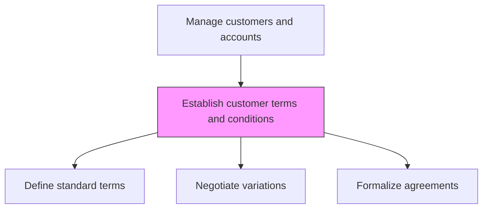
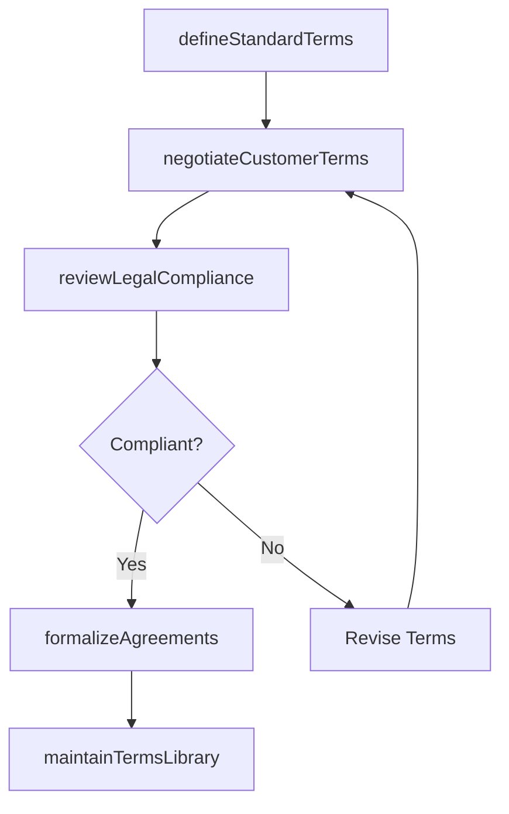

# Establish customer terms and conditions

> Business-as-Code definition for customer terms and conditions establishment. Models the creation, negotiation, and formalization of commercial terms including payment conditions, service level agreements, pricing structures, and contractual obligations.

## Overview

Defining and formalizing the commercial terms under which the organization conducts business with its customers. Establish standard terms and conditions templates, negotiate customer-specific variations, and ensure terms comply with legal and regulatory requirements. Cover payment terms, warranties, liability provisions, service levels, and intellectual property rights.

## Process Hierarchy



## GraphDL

```yaml
establish:
  object: Customer Terms And Conditions
  actor: ContractsManager
  result: CustomerTermsAgreement
```

## Actions

| Action | Description |
|--------|-------------|
| defineStandardTerms | Create standard commercial terms templates for each customer segment and product |
| negotiateCustomerTerms | Negotiate customer-specific variations to standard terms within approval guidelines |
| reviewLegalCompliance | Ensure all terms comply with applicable laws, regulations, and company policies |
| formalizeAgreements | Execute final terms and conditions agreements with authorized signatories |
| maintainTermsLibrary | Manage the repository of approved terms templates and customer-specific agreements |

## Events

| Event | Description |
|-------|-------------|
| standardTermsDefined | Standard terms and conditions templates created or updated |
| customerTermsNegotiated | Customer-specific terms negotiated and documented |
| legalComplianceReviewed | Terms reviewed for legal and regulatory compliance |
| agreementsFormalized | Terms and conditions agreements executed |
| termsLibraryMaintained | Terms repository updated with new or revised agreements |

## Searches

| Search | Description |
|--------|-------------|
| getCustomerTerms | Retrieve terms and conditions for a specific customer |
| getStandardTerms | Access standard terms templates by product or segment |
| getTermsExpirations | Query terms agreements approaching renewal or expiration |

## Process Flow



## RACI Matrix

| Activity | Responsible | Accountable | Consulted | Informed |
|----------|-------------|-------------|-----------|----------|
| defineStandardTerms | ContractsManager | VP Sales | Legal | Finance |
| negotiateCustomerTerms | AccountExecutive | SalesDirector | Legal | ContractsManager |
| formalizeAgreements | ContractsManager | VP Sales | Legal | Finance |

## Related Processes

| Process | Relationship |
|---------|-------------|
| 3.5.3 Develop and manage sales proposals, bids, and quotes | Downstream - terms are included in proposals |
| 3.5.4 Manage sales orders | Downstream - order terms reference customer agreements |
| 11.2 Manage legal and ethical compliance | Upstream - compliance requirements guide terms |

## Related Departments

| Department | Role |
|-----------|------|
| Legal | Reviews and approves terms for compliance |
| Sales | Negotiates terms with customers |
| Finance | Defines payment terms and credit policies |
| Contracts Administration | Manages terms repository and agreement execution |

## Related Occupations

| Occupation | Involvement |
|-----------|-------------|
| Contracts Manager | Manages terms templates and agreement lifecycle |
| Account Executive | Negotiates customer-specific terms |
| Legal Counsel | Reviews terms for legal compliance |

## KPIs

| KPI | Description | Unit |
|-----|-------------|------|
| Terms Cycle Time | Average days from terms negotiation start to execution | Days |
| Standard Terms Adoption | Percentage of deals using standard terms without variation | % |
| Terms Compliance Rate | Percentage of agreements passing legal review on first submission | % |

## Usage

```typescript
import { establishCustomerTermsAndConditions } from '@headlessly/establish-customer-terms-and-conditions'

const terms = establishCustomerTermsAndConditions()

// Define standard terms for a product
const standardTerms = await terms.defineStandardTerms({
  product: 'platform-enterprise',
  paymentTerms: 'net-30',
  slaLevel: 'enterprise',
  contractDuration: { months: 12 }
})

// Negotiate customer-specific terms
const negotiated = await terms.negotiateCustomerTerms({
  customerId: 'acme-corp',
  baseTerms: standardTerms.id,
  variations: { paymentTerms: 'net-45', volumeDiscount: 0.15 }
})
```
