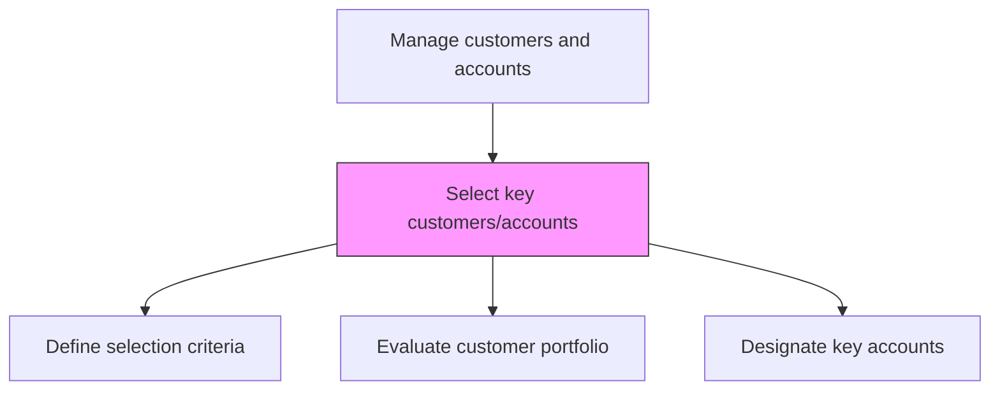
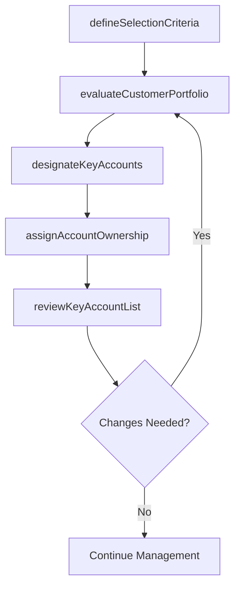

# Select key customers/accounts

> Business-as-Code definition for key customer and account selection. Models the identification, evaluation, and designation of strategic accounts based on revenue potential, growth trajectory, and strategic importance to the organization.

## Overview

Choosing principal clients that are vital for the company.

## Process Hierarchy



## GraphDL

```yaml
select:
  object: Key Customers/accounts
  actor: SalesDirector
  result: KeyAccountDesignation
```

## Actions

| Action | Description |
|--------|-------------|
| defineSelectionCriteria | Establish the criteria for classifying customers as key accounts based on revenue, growth, and strategic value |
| evaluateCustomerPortfolio | Score all customers against key account criteria to identify candidates |
| designateKeyAccounts | Formally classify qualifying customers as key accounts with tiered status |
| assignAccountOwnership | Assign key account managers and executive sponsors to designated accounts |
| reviewKeyAccountList | Periodically reassess key account designations based on performance changes |

## Events

| Event | Description |
|-------|-------------|
| selectionCriteriaDefined | Key account classification criteria established |
| customerPortfolioEvaluated | Customer base scored and ranked for key account selection |
| keyAccountsDesignated | Customers formally classified as key accounts |
| accountOwnershipAssigned | Account managers and sponsors assigned to key accounts |
| keyAccountListReviewed | Key account designations reviewed and updated |

## Searches

| Search | Description |
|--------|-------------|
| getKeyAccounts | Retrieve designated key accounts with tier and status |
| getAccountScores | Access customer scoring data against key account criteria |
| getAccountOwnership | Query account manager and sponsor assignments |

## Process Flow



## RACI Matrix

| Activity | Responsible | Accountable | Consulted | Informed |
|----------|-------------|-------------|-----------|----------|
| defineSelectionCriteria | SalesDirector | VP Sales | Finance | Strategy |
| evaluateCustomerPortfolio | SalesOperationsManager | SalesDirector | Finance | Sales |
| designateKeyAccounts | SalesDirector | VP Sales | ExecutiveTeam | Finance |

## Related Processes

| Process | Relationship |
|---------|-------------|
| 3.5.2.2 Develop sales/key account plan | Downstream - selected accounts get dedicated plans |
| 3.4.6 Establish customer management goals, and strategies | Upstream - strategy defines key account criteria |
| 3.5.1 Manage leads/opportunities | Upstream - converted opportunities become account candidates |

## Related Departments

| Department | Role |
|-----------|------|
| Sales | Selects and manages key customer accounts |
| Sales Operations | Provides customer analytics for account scoring |
| Finance | Validates revenue data for account evaluation |
| Strategy | Defines strategic criteria for account selection |

## Related Occupations

| Occupation | Involvement |
|-----------|-------------|
| Sales Director | Leads key account selection and designation |
| Sales Operations Manager | Provides data and analytics for account evaluation |
| Key Account Manager | Manages designated key accounts |

## KPIs

| KPI | Description | Unit |
|-----|-------------|------|
| Key Account Revenue Share | Percentage of total revenue from key accounts | % |
| Key Account Coverage | Percentage of key accounts with assigned account managers | % |
| Selection Accuracy | Percentage of key accounts meeting performance expectations | % |

## Usage

```typescript
import { selectKeyCustomersAccounts } from '@headlessly/select-key-customers-accounts'

const selection = selectKeyCustomersAccounts()

// Evaluate customer portfolio for key account designation
const scored = await selection.evaluateCustomerPortfolio({
  criteria: { minRevenue: 500000, minGrowthRate: 0.10, strategicFit: true },
  customerBase: 'all-active'
})

// Designate key accounts
const designated = await selection.designateKeyAccounts({
  candidates: scored.topTier,
  tiers: ['platinum', 'gold', 'silver'],
  maxAccounts: 50
})
```
