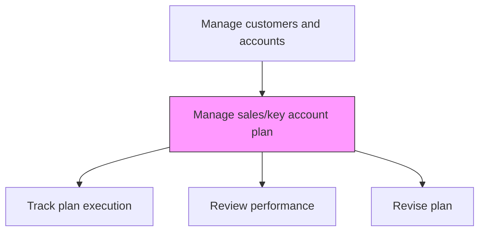
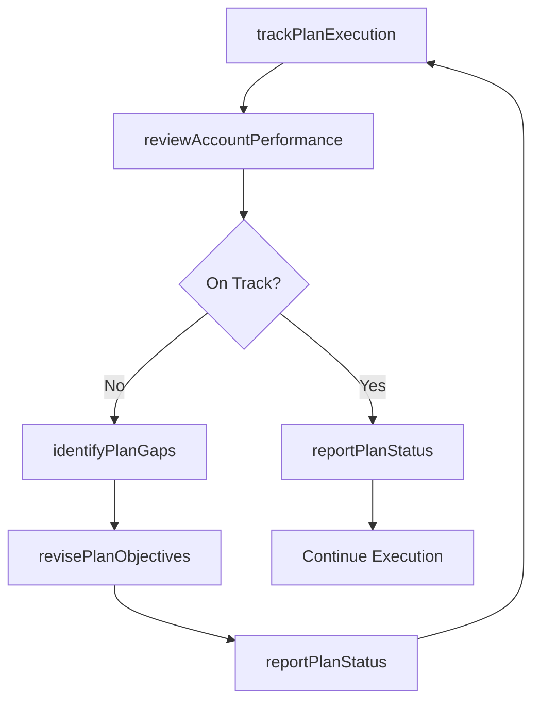

# Manage sales/key account plan

> Business-as-Code definition for sales and key account plan management. Models the ongoing execution, tracking, and revision of account plans including performance monitoring, milestone tracking, and plan adjustment cycles.

## Overview

Handling the accounts of important clients.

## Process Hierarchy



## GraphDL

```yaml
manage:
  object: Sales/key Account Plan
  actor: KeyAccountManager
  result: AccountPlanProgressReport
```

## Actions

| Action | Description |
|--------|-------------|
| trackPlanExecution | Monitor progress against account plan milestones and action items |
| reviewAccountPerformance | Conduct regular performance reviews comparing actuals to plan targets |
| identifyPlanGaps | Detect areas where execution is behind plan and diagnose root causes |
| revisePlanObjectives | Adjust account plan targets and tactics based on performance data |
| reportPlanStatus | Communicate account plan progress to leadership and stakeholders |

## Events

| Event | Description |
|-------|-------------|
| planExecutionTracked | Account plan milestone progress updated |
| accountPerformanceReviewed | Account performance review completed against plan |
| planGapsIdentified | Execution gaps detected and root causes analyzed |
| planObjectivesRevised | Account plan targets and tactics adjusted |
| planStatusReported | Account plan progress communicated to leadership |

## Searches

| Search | Description |
|--------|-------------|
| getPlanProgress | Retrieve account plan execution progress and milestone status |
| getPerformanceVsPlan | Compare actual account metrics against plan targets |
| getPlanGaps | Access identified gaps and remediation actions for account plans |

## Process Flow



## RACI Matrix

| Activity | Responsible | Accountable | Consulted | Informed |
|----------|-------------|-------------|-----------|----------|
| trackPlanExecution | KeyAccountManager | SalesDirector | SalesOperations | CustomerSuccess |
| reviewAccountPerformance | KeyAccountManager | VP Sales | Finance | SalesOperations |
| revisePlanObjectives | KeyAccountManager | SalesDirector | VP Sales | Finance |

## Related Processes

| Process | Relationship |
|---------|-------------|
| 3.5.2.2 Develop sales/key account plan | Upstream - created plans are managed ongoing |
| 3.4.7 Establish customer management measures | Upstream - measures define tracking criteria |
| 3.5.2.6 Manage customer relationships | Parallel - relationship health informs plan adjustments |

## Related Departments

| Department | Role |
|-----------|------|
| Sales | Executes and tracks account plans |
| Sales Operations | Provides analytics and performance dashboards |
| Customer Success | Contributes retention and satisfaction insights |
| Finance | Validates revenue actuals against plan targets |

## Related Occupations

| Occupation | Involvement |
|-----------|-------------|
| Key Account Manager | Manages day-to-day account plan execution |
| Sales Director | Oversees account plan performance reviews |
| Sales Operations Analyst | Builds account performance dashboards |

## KPIs

| KPI | Description | Unit |
|-----|-------------|------|
| Plan Execution Rate | Percentage of account plan milestones completed on time | % |
| Revenue vs. Plan | Actual account revenue compared to plan target | % |
| Plan Revision Frequency | Number of plan adjustments per review cycle | Count |

## Usage

```typescript
import { manageSalesKeyAccountPlan } from '@headlessly/manage-sales-key-account-plan'

const planMgmt = manageSalesKeyAccountPlan()

// Track plan execution
const progress = await planMgmt.trackPlanExecution({
  accountId: 'enterprise-acme-corp',
  milestones: true,
  actionItems: true
})

// Review account performance
const review = await planMgmt.reviewAccountPerformance({
  accountId: 'enterprise-acme-corp',
  period: 'current-quarter',
  compareToTargets: true
})
```
