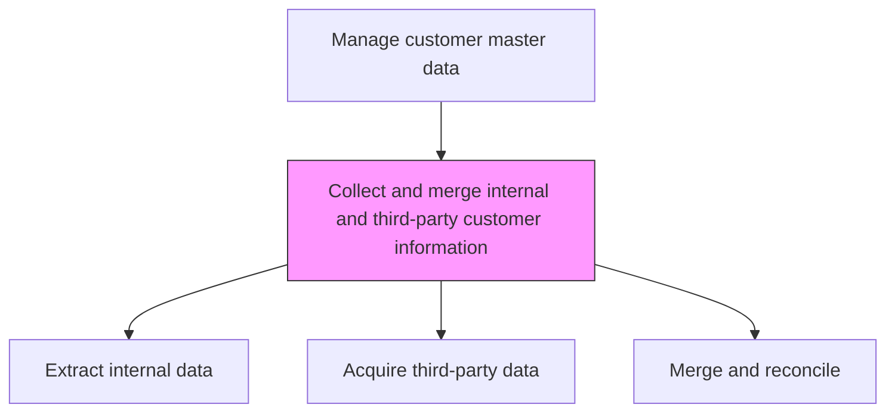
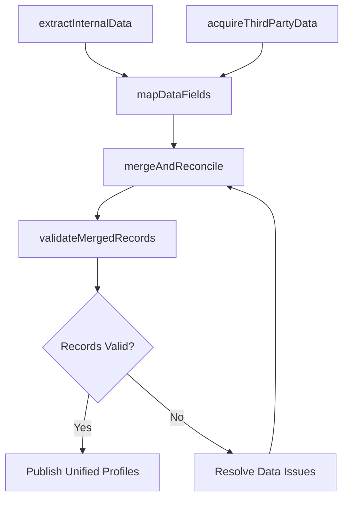

# Collect and merge internal and third-party customer information

> Business-as-Code definition for customer data collection and merging. Models the aggregation of internal CRM data with third-party enrichment sources to build comprehensive, unified customer profiles.

## Overview

Gathering the data about customers. Combine the information available locally with the data obtained from external sources.

## Process Hierarchy



## GraphDL

```yaml
collect:
  object: And Merge Internal And Third-party Customer Information
  actor: DataSteward
  result: UnifiedCustomerProfile
```

## Actions

| Action | Description |
|--------|-------------|
| extractInternalData | Pull customer data from CRM, ERP, support systems, and transactional databases |
| acquireThirdPartyData | Source customer enrichment data from external providers including firmographics and technographics |
| mapDataFields | Align field definitions across internal and external sources for merge compatibility |
| mergeAndReconcile | Combine data sources into unified customer profiles, resolving conflicts and gaps |
| validateMergedRecords | Verify accuracy and completeness of merged customer records |

## Events

| Event | Description |
|-------|-------------|
| internalDataExtracted | Customer data pulled from all internal systems |
| thirdPartyDataAcquired | External enrichment data received from providers |
| dataFieldsMapped | Field mappings established across data sources |
| dataMergedAndReconciled | Customer records merged with conflicts resolved |
| mergedRecordsValidated | Unified customer profiles verified for accuracy |

## Searches

| Search | Description |
|--------|-------------|
| getCustomerProfile | Retrieve unified customer profile with all data sources |
| getDataSources | List active internal and third-party data sources for a customer |
| getMergeConflicts | Query unresolved data conflicts requiring manual review |

## Process Flow



## RACI Matrix

| Activity | Responsible | Accountable | Consulted | Informed |
|----------|-------------|-------------|-----------|----------|
| extractInternalData | DataSteward | DataGovernanceManager | IT | SalesOperations |
| acquireThirdPartyData | DataSteward | DataGovernanceManager | Procurement | Marketing |
| mergeAndReconcile | DataSteward | DataGovernanceManager | IT | Sales |

## Related Processes

| Process | Relationship |
|---------|-------------|
| 3.5.2.7.2 De-duplicate customer data | Downstream - merged data needs deduplication |
| 3.5.4.2 Collect and maintain account information | Parallel - account data feeds customer master |
| 8.4.4 Manage business information content | Upstream - data governance policies guide collection |

## Related Departments

| Department | Role |
|-----------|------|
| Data Management | Manages customer data collection and integration |
| IT | Provides system integration and ETL infrastructure |
| Sales Operations | Consumes unified customer data for analytics |
| Marketing | Uses enriched profiles for targeting and segmentation |

## Related Occupations

| Occupation | Involvement |
|-----------|-------------|
| Data Steward | Manages customer data collection and quality |
| Data Engineer | Builds data pipelines for merging customer sources |
| CRM Administrator | Maintains CRM data structures and integrations |

## KPIs

| KPI | Description | Unit |
|-----|-------------|------|
| Data Completeness | Percentage of customer records with all required fields populated | % |
| Merge Success Rate | Percentage of records successfully merged without manual intervention | % |
| Data Freshness | Average age of customer data from last enrichment | Days |

## Usage

```typescript
import { collectAndMergeInternalAndThirdPartyCustomerInformation } from '@headlessly/collect-and-merge-internal-and-third-party-customer-information'

const customerData = collectAndMergeInternalAndThirdPartyCustomerInformation()

// Extract and merge customer data
const merged = await customerData.mergeAndReconcile({
  internalSources: ['crm', 'erp', 'support-system'],
  externalSources: ['firmographic-provider', 'technographic-provider'],
  conflictResolution: 'most-recent-wins'
})

// Validate merged records
const validation = await customerData.validateMergedRecords({
  records: merged.profiles,
  checks: ['completeness', 'accuracy', 'consistency']
})
```
