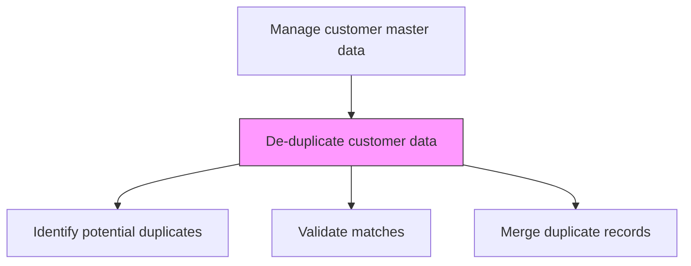
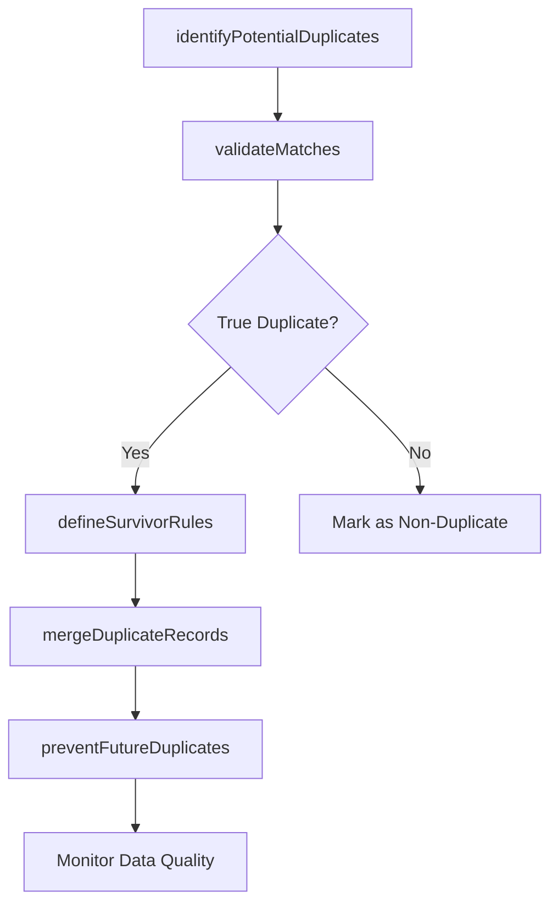

# De-duplicate customer data

> Business-as-Code definition for customer data deduplication. Models the identification, matching, and merging of duplicate customer records to maintain a clean, authoritative customer master.

## Overview

Eliminating redundant information in customer data.

## Process Hierarchy



## GraphDL

```yaml
de-duplicate:
  object: Customer Data
  actor: DataSteward
  result: DeduplicatedCustomerMaster
```

## Actions

| Action | Description |
|--------|-------------|
| identifyPotentialDuplicates | Run matching algorithms to detect possible duplicate customer records |
| validateMatches | Review potential duplicates to confirm true matches vs. false positives |
| defineSurvivorRules | Establish rules for which record values survive when merging duplicates |
| mergeDuplicateRecords | Combine confirmed duplicate records into a single authoritative record |
| preventFutureDuplicates | Implement validation rules to block creation of new duplicate records |

## Events

| Event | Description |
|-------|-------------|
| potentialDuplicatesIdentified | Matching algorithms flagged possible duplicate records |
| matchesValidated | Duplicate candidates reviewed and confirmed or rejected |
| survivorRulesDefined | Record merge survivorship rules established |
| duplicateRecordsMerged | Confirmed duplicates combined into single records |
| duplicationPreventionEnabled | Validation rules deployed to prevent new duplicates |

## Searches

| Search | Description |
|--------|-------------|
| getDuplicateCandidates | Retrieve records flagged as potential duplicates |
| getMergeHistory | Access the history of duplicate merges and surviving records |
| getDuplicateRate | Query the current duplicate rate across the customer master |

## Process Flow



## RACI Matrix

| Activity | Responsible | Accountable | Consulted | Informed |
|----------|-------------|-------------|-----------|----------|
| identifyPotentialDuplicates | DataSteward | DataGovernanceManager | IT | SalesOperations |
| validateMatches | DataSteward | DataGovernanceManager | Sales | CustomerSuccess |
| mergeDuplicateRecords | DataSteward | DataGovernanceManager | IT | SalesOperations |

## Related Processes

| Process | Relationship |
|---------|-------------|
| 3.5.2.7.1 Collect and merge internal and third-party customer information | Upstream - data merging introduces duplicates |
| 3.5.4.2 Collect and maintain account information | Parallel - account updates may create duplicates |
| 8.4.4 Manage business information content | Upstream - data governance policies guide dedup |

## Related Departments

| Department | Role |
|-----------|------|
| Data Management | Owns deduplication processes and tools |
| IT | Maintains matching algorithms and merge infrastructure |
| Sales Operations | Validates duplicate matches and reports data issues |
| Sales | Consumes clean customer data for selling activities |

## Related Occupations

| Occupation | Involvement |
|-----------|-------------|
| Data Steward | Manages deduplication rules and validation |
| Data Quality Analyst | Runs matching algorithms and reviews results |
| CRM Administrator | Implements duplicate prevention rules in CRM |

## KPIs

| KPI | Description | Unit |
|-----|-------------|------|
| Duplicate Rate | Percentage of customer records identified as duplicates | % |
| Merge Accuracy | Percentage of merges that correctly combined true duplicates | % |
| Duplicate Prevention Rate | Percentage of potential duplicates blocked at creation | % |

## Usage

```typescript
import { deDuplicateCustomerData } from '@headlessly/de-duplicate-customer-data'

const dedup = deDuplicateCustomerData()

// Identify potential duplicates
const candidates = await dedup.identifyPotentialDuplicates({
  matchingFields: ['company-name', 'domain', 'address'],
  confidenceThreshold: 0.85,
  scope: 'full-customer-master'
})

// Merge confirmed duplicates
const merged = await dedup.mergeDuplicateRecords({
  duplicatePairs: candidates.confirmed,
  survivorRule: 'most-complete-record',
  preserveHistory: true
})
```
