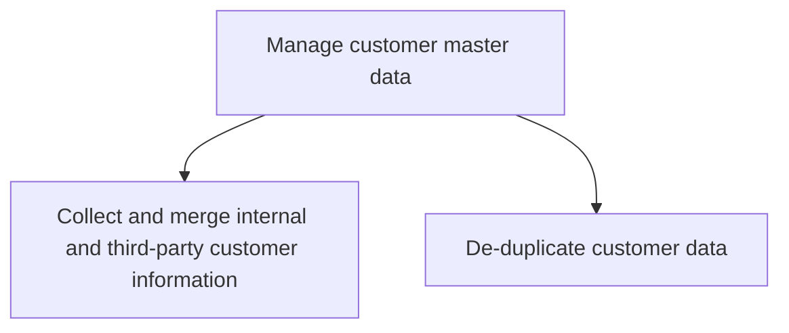
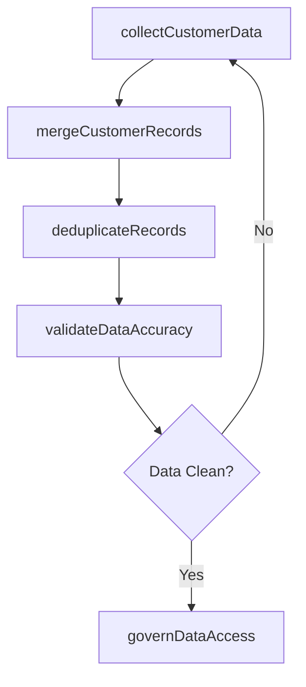

# Manage customer master data

> Business-as-Code definition for customer master data management. Models the collection, merging, deduplication, and governance of customer data from internal and third-party sources to maintain a single source of truth.

## Overview

Managing the corpus of data relating all customers acquired over time. Manage the storage, maintenance, access, revision, and usage of all data on customers. Ensure its security, and determine legitimate use cases that are beneficial to the organization.

## Process Hierarchy



## GraphDL

```yaml
manage:
  object: Customer Master Data
  actor: MasterDataManager
  result: CleanCustomerMasterRecord
```

## Actions

| Action | Description |
|--------|-------------|
| collectCustomerData | Gather customer information from internal systems and third-party sources |
| mergeCustomerRecords | Consolidate customer data from multiple sources into unified profiles |
| deduplicateRecords | Identify and eliminate duplicate customer records |
| validateDataAccuracy | Verify customer data accuracy against authoritative sources |
| governDataAccess | Manage data security, access controls, and usage policies |

## Events

| Event | Description |
|-------|-------------|
| customerDataCollected | Customer data gathered from all designated sources |
| customerRecordsMerged | Customer profiles consolidated from multiple systems |
| recordsDeduplicated | Duplicate customer records identified and resolved |
| dataAccuracyValidated | Customer data accuracy verification completed |
| dataAccessGoverned | Data access policies reviewed and enforced |

## Searches

| Search | Description |
|--------|-------------|
| getCustomerRecord | Retrieve master customer record by ID or search criteria |
| getDuplicateCandidates | Identify potential duplicate customer records |
| getDataQualityMetrics | Access customer data quality scores and completeness metrics |
| getDataLineage | Trace customer data origins and transformation history |

## Process Flow



## RACI Matrix

| Activity | Responsible | Accountable | Consulted | Informed |
|----------|-------------|-------------|-----------|----------|
| collectCustomerData | DataIntegrationSpecialist | MasterDataManager | IT | Sales |
| mergeCustomerRecords | MasterDataManager | CRMDirector | SalesOperations | Marketing |
| deduplicateRecords | DataQualityAnalyst | MasterDataManager | IT | Sales |
| governDataAccess | MasterDataManager | CRMDirector | Legal | Security |

## Sub-Processes

| ID | Name | Description |
|----|------|-------------|
| 3.5.2.7.1 | Collect and merge internal and third-party customer information | Gathering the data about customers. Combine the information available locally with the data obtained |
| 3.5.2.7.2 | De-duplicate customer data | Eliminating redundant information in customer data. |

## Related Processes

| Process | Relationship |
|---------|-------------|
| 3.5.2.6 Manage customer relationships | Parallel - relationship data feeds master records |
| 3.5.4.2 Collect and maintain account information | Parallel - account data enriches master records |
| 3.3.7 Track customer management measures | Downstream - clean data enables accurate measurement |
| 3.3.8 Analyze and respond to customer insight | Downstream - master data supports customer analysis |

## Related Departments

| Department | Role |
|-----------|------|
| Master Data Management | Governs customer data quality and standards |
| IT | Provides data integration infrastructure and tools |
| Sales Operations | Maintains CRM data and reporting accuracy |
| Legal | Ensures data management complies with privacy regulations |
| Marketing | Uses customer data for segmentation and targeting |

## Related Occupations

| Occupation | Involvement |
|-----------|-------------|
| Master Data Manager | Oversees customer data governance and quality |
| Data Quality Analyst | Identifies and resolves data quality issues |
| CRM Administrator | Manages CRM system configuration and data integrity |
| Data Integration Specialist | Builds and maintains data integration pipelines |

## KPIs

| KPI | Description | Unit |
|-----|-------------|------|
| Data Completeness Rate | Percentage of customer records with all required fields | % |
| Duplicate Record Rate | Percentage of customer records identified as duplicates | % |
| Data Accuracy Score | Percentage of customer records matching authoritative sources | % |
| Data Merge Success Rate | Percentage of merge operations completed without conflict | % |
| Data Governance Compliance | Percentage of data access meeting policy requirements | % |

## Usage

```typescript
import { manageCustomerMasterData } from '@headlessly/manage-customer-master-data'

const masterData = manageCustomerMasterData()

// Collect and merge customer data from all sources
const merged = await masterData.mergeCustomerRecords({
  sources: ['crm', 'billing', 'support', 'marketing-automation'],
  matchingRules: ['email', 'company-domain', 'phone']
})

// Deduplicate customer records
const dedup = await masterData.deduplicateRecords({
  datasetId: merged.id,
  confidenceThreshold: 0.90,
  autoMerge: true
})
```
