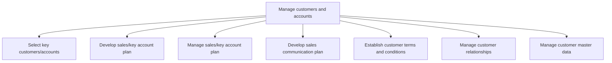
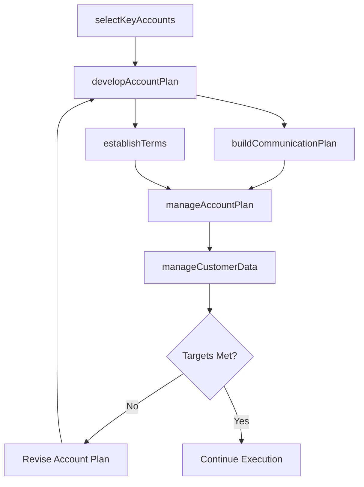

# Manage customers and accounts

> Business-as-Code definition for customer and account management. Models the selection of key accounts, account plan development and execution, customer communication, terms establishment, relationship management, and master data governance.

## Overview

Managing the customer's expectations, with the intent of responsibly increasing the sale of the organization's products/services. Create a systematic method for governing sales, using sales forecasts and customer management measures. Develop a blueprint to manage relationships with customers and the data it holds on them, as well as the sale of its products/services to these customers. Devise a recipe for handling the organization's key customers in order to manage their expectations with tact and responsibility while maximizing revenue.

## Process Hierarchy



## GraphDL

```yaml
manage:
  object: Customers And Accounts
  actor: AccountManager
  result: AccountPerformanceReport
```

## Actions

| Action | Description |
|--------|-------------|
| selectKeyAccounts | Identify and tier customers based on revenue potential and strategic value |
| developAccountPlan | Create comprehensive sales and engagement plans for key accounts |
| manageAccountPlan | Execute, monitor, and adjust account plans against targets |
| buildCommunicationPlan | Design communication cadence and touchpoints for each account |
| establishTerms | Define and negotiate customer-specific terms and conditions |
| manageCustomerData | Maintain accurate and complete customer master data records |

## Events

| Event | Description |
|-------|-------------|
| keyAccountsSelected | Customer tiering and key account selection completed |
| accountPlanDeveloped | Key account sales plan created and approved |
| accountPlanManaged | Account plan progress reviewed and actions updated |
| communicationPlanBuilt | Customer communication schedule and cadence established |
| termsEstablished | Customer terms and conditions negotiated and documented |
| customerDataManaged | Customer master data validated and updated |

## Searches

| Search | Description |
|--------|-------------|
| getAccountPlan | Retrieve account plan by customer, tier, or territory |
| getCustomerProfile | Access comprehensive customer profile and relationship history |
| getAccountPerformance | Query account-level revenue, growth, and engagement metrics |
| getCustomerTerms | Retrieve customer-specific terms and pricing agreements |
| getCustomerMasterData | Access customer master records and data quality scores |

## Process Flow



## RACI Matrix

| Activity | Responsible | Accountable | Consulted | Informed |
|----------|-------------|-------------|-----------|----------|
| selectKeyAccounts | AccountManager | VP Sales | Finance | CustomerSuccess |
| developAccountPlan | AccountManager | SalesManager | Marketing | PreSales |
| manageAccountPlan | AccountManager | SalesManager | SalesOperations | Finance |
| establishTerms | AccountManager | VP Sales | Legal | Finance |
| manageCustomerData | CRMAdministrator | SalesOperationsManager | IT | Sales |

## Sub-Processes

| ID | Name | Description |
|----|------|-------------|
| 3.5.2.1 | Select key customers/accounts | Choosing principal clients that are vital for the company. |
| 3.5.2.2 | Develop sales/key account plan | Creating a plan for managing the accounts of key customers in order to better maintain relationships |
| 3.5.2.3 | Manage sales/key account plan | Handling the accounts of important clients. |
| 3.5.2.4 | Develop sales communication plan | Designing the communication cadence, channel preferences, and touchpoint schedule for customer engagement throughout the account lifecycle. |
| 3.5.2.5 | Establish customer terms and conditions | Defining and negotiating customer-specific commercial terms including payment schedules, discount structures, SLAs, and contractual conditions. |
| 3.5.2.6 | Manage customer relationships | Managing the organization's relationship with its customers, by systematically coordinating interact |
| 3.5.2.7 | Manage customer master data | Managing the corpus of data relating all customers acquired over time. Manage the storage, maintenan |

## Related Processes

| Process | Relationship |
|---------|-------------|
| 3.5.1 Manage leads/opportunities | Upstream - qualified leads become managed accounts |
| 3.5.3 Develop and manage sales proposals, bids, and quotes | Downstream - account plans trigger proposal activity |
| 3.4.6 Establish customer management goals, and strategies | Upstream - account strategies guide plan development |
| 5.0 Manage Customer Service | Parallel - service quality supports account health |

## Related Departments

| Department | Role |
|-----------|------|
| Sales | Manages key account relationships and executes account plans |
| Customer Success | Supports account health and retention |
| Sales Operations | Maintains CRM data and provides account analytics |
| Legal | Reviews customer terms and contract provisions |
| Finance | Monitors account profitability and credit terms |

## Related Occupations

| Occupation | Involvement |
|-----------|-------------|
| Account Manager | Develops and executes account plans for assigned customers |
| Key Account Executive | Manages strategic accounts and executive relationships |
| CRM Administrator | Maintains customer data quality and system integrity |
| Customer Success Manager | Ensures customer health and drives renewal |

## KPIs

| KPI | Description | Unit |
|-----|-------------|------|
| Account Plan Coverage | Percentage of key accounts with approved account plans | % |
| Net Revenue Retention | Revenue retained from existing accounts including expansion | % |
| Account Satisfaction Score | Average customer satisfaction for managed accounts | Score (1-10) |
| Account Growth Rate | Year-over-year revenue growth from managed accounts | % |
| Data Quality Score | Completeness and accuracy of customer master data | Score (1-100) |

## Usage

```typescript
import { manageCustomersAndAccounts } from '@headlessly/manage-customers-and-accounts'

const accounts = manageCustomersAndAccounts()

// Select and tier key accounts
const keyAccounts = await accounts.selectKeyAccounts({
  criteria: { minRevenue: 100000, minGrowthPotential: 0.15 },
  tiers: ['strategic', 'growth', 'maintain']
})

// Develop account plan for a strategic account
const plan = await accounts.developAccountPlan({
  accountId: keyAccounts.strategic[0].id,
  objectives: ['expand-departments', 'upsell-enterprise', 'executive-alignment'],
  revenueTarget: 500000
})
```
