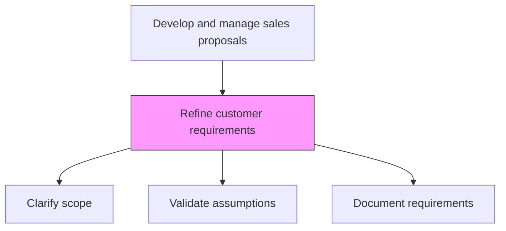
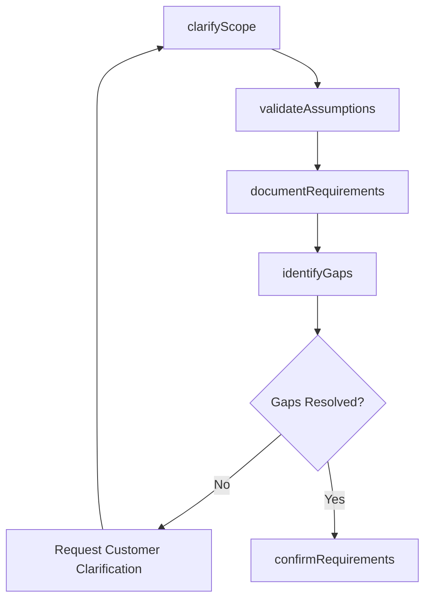

# Refine customer requirements

> Business-as-Code definition for customer requirement refinement. Models the clarification, validation, and documentation of customer needs including scope, timeline, data sources, and success criteria to ensure accurate proposal responses.

## Overview

Clarifying the details about procurement requests, such as the scope, timeline, data sources, type and characteristics and evaluation criteria for the goods or services to be delivered, and any additional terms, conditions or special requirements.

## Process Hierarchy



## GraphDL

```yaml
refine:
  object: Customer Requirements
  actor: SolutionArchitect
  result: RefinedRequirementsDocument
```

## Actions

| Action | Description |
|--------|-------------|
| clarifyScope | Conduct discovery sessions with the customer to clarify project scope and deliverables |
| validateAssumptions | Confirm assumptions about requirements, constraints, and dependencies with stakeholders |
| documentRequirements | Compile a structured requirements document with priorities and acceptance criteria |
| identifyGaps | Flag requirements that are ambiguous, missing, or conflicting for customer clarification |
| confirmRequirements | Obtain customer sign-off on the refined requirements before proposal development |

## Events

| Event | Description |
|-------|-------------|
| scopeClarified | Customer scope and deliverables clarified through discovery |
| assumptionsValidated | Requirement assumptions confirmed with customer stakeholders |
| requirementsDocumented | Structured requirements document completed |
| gapsIdentified | Ambiguous or missing requirements flagged for clarification |
| requirementsConfirmed | Customer sign-off obtained on refined requirements |

## Searches

| Search | Description |
|--------|-------------|
| getRequirements | Retrieve refined requirements for a specific RFP |
| getRequirementGaps | Access open questions and gaps needing customer clarification |
| getRequirementHistory | Query requirement changes and versions for an RFP |

## Process Flow



## RACI Matrix

| Activity | Responsible | Accountable | Consulted | Informed |
|----------|-------------|-------------|-----------|----------|
| clarifyScope | SolutionArchitect | ProposalManager | AccountExecutive | CustomerStakeholders |
| documentRequirements | SolutionArchitect | ProposalManager | ProductManagement | Delivery |
| confirmRequirements | AccountExecutive | ProposalManager | SolutionArchitect | Legal |

## Related Processes

| Process | Relationship |
|---------|-------------|
| 3.5.3.1 Receive RFP/RFQ | Upstream - received RFP triggers requirement refinement |
| 3.5.3.6 Understand customer business and requirements | Parallel - deeper customer understanding supports refinement |
| 3.5.3.7 Develop solution and delivery approach | Downstream - refined requirements guide solution design |

## Related Departments

| Department | Role |
|-----------|------|
| Pre-Sales | Leads requirement clarification and documentation |
| Sales | Facilitates customer access and relationship |
| Product Management | Validates product capability against requirements |
| Delivery | Assesses implementation feasibility of requirements |

## Related Occupations

| Occupation | Involvement |
|-----------|-------------|
| Solution Architect | Leads requirement refinement and documentation |
| Account Executive | Facilitates customer engagement for clarification |
| Business Analyst | Structures and documents detailed requirements |

## KPIs

| KPI | Description | Unit |
|-----|-------------|------|
| Requirement Clarity Score | Percentage of requirements rated as clear and actionable | % |
| Gap Resolution Time | Average days to resolve requirement gaps | Days |
| Requirement Change Rate | Number of requirement changes after initial sign-off | Count |

## Usage

```typescript
import { refineCustomerRequirements } from '@headlessly/refine-customer-requirements'

const requirements = refineCustomerRequirements()

// Clarify scope through discovery
const scope = await requirements.clarifyScope({
  rfpId: 'rfp-001',
  discoveryTopics: ['integration-requirements', 'data-migration', 'user-volumes'],
  stakeholders: ['cto', 'vp-engineering', 'it-director']
})

// Document refined requirements
const doc = await requirements.documentRequirements({
  rfpId: 'rfp-001',
  categories: ['functional', 'technical', 'operational'],
  priorityLevels: ['must-have', 'should-have', 'nice-to-have']
})
```
