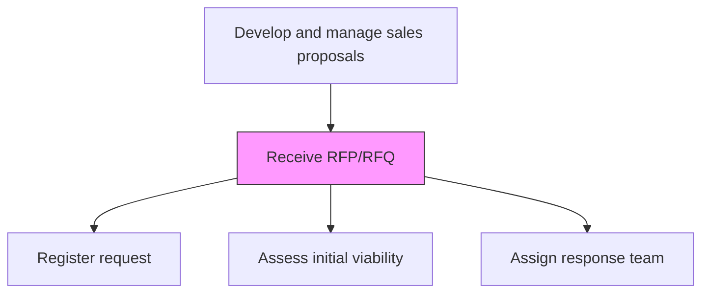
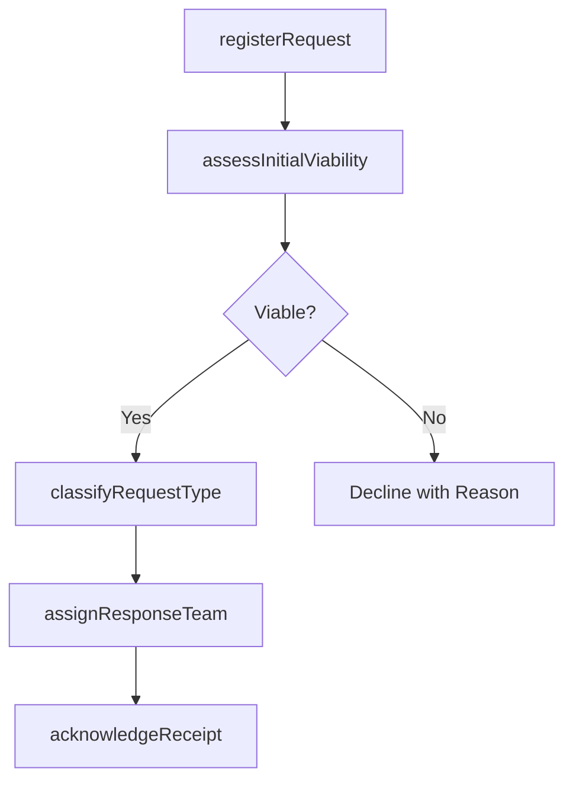

# Receive Request For Proposal (RFP)/Request For Quote (RFQ)

> Business-as-Code definition for RFP and RFQ reception. Models the intake, registration, and initial assessment of incoming requests for proposals and quotes from prospective customers.

## Overview

Accepting procurement proposals.

## Process Hierarchy



## GraphDL

```yaml
receive:
  object: Request For Proposal (RFP)/Request For Quote (RFQ)
  actor: ProposalCoordinator
  result: RegisteredRFP
```

## Actions

| Action | Description |
|--------|-------------|
| registerRequest | Log the incoming RFP or RFQ into the proposal management system with metadata |
| assessInitialViability | Perform a quick-look assessment of scope, timeline, and strategic fit |
| classifyRequestType | Categorize the request by type, complexity, and required response effort |
| assignResponseTeam | Designate proposal lead, subject matter experts, and reviewers |
| acknowledgeReceipt | Send formal acknowledgment to the requesting customer |

## Events

| Event | Description |
|-------|-------------|
| requestRegistered | RFP or RFQ logged and assigned tracking number |
| initialViabilityAssessed | Quick-look assessment of request feasibility completed |
| requestTypeClassified | Request categorized by type and complexity |
| responseTeamAssigned | Proposal response team designated |
| receiptAcknowledged | Formal acknowledgment sent to customer |

## Searches

| Search | Description |
|--------|-------------|
| getActiveRFPs | Retrieve active RFP and RFQ requests by status or deadline |
| getResponseTeam | Access assigned response team members for a specific request |
| getRFPHistory | Query historical RFP submissions for a customer |

## Process Flow



## RACI Matrix

| Activity | Responsible | Accountable | Consulted | Informed |
|----------|-------------|-------------|-----------|----------|
| registerRequest | ProposalCoordinator | ProposalManager | Sales | IT |
| assessInitialViability | ProposalManager | VP Sales | Strategy | Finance |
| assignResponseTeam | ProposalManager | VP Sales | PreSales | Delivery |

## Related Processes

| Process | Relationship |
|---------|-------------|
| 3.5.3.2 Refine customer requirements | Downstream - received RFP advances to requirement refinement |
| 3.5.1 Manage leads/opportunities | Upstream - opportunity generates the RFP |
| 3.5.3.3 Review RFP/RFQ request | Downstream - registered RFP undergoes detailed review |

## Related Departments

| Department | Role |
|-----------|------|
| Proposal Management | Manages RFP intake and team assignment |
| Sales | Sources RFP opportunities and maintains customer relationship |
| Pre-Sales | Provides initial technical feasibility assessment |
| Legal | Reviews terms and conditions attached to RFPs |

## Related Occupations

| Occupation | Involvement |
|-----------|-------------|
| Proposal Coordinator | Registers and tracks incoming RFPs |
| Proposal Manager | Assesses viability and assigns response teams |
| Account Executive | Maintains customer context for RFP response |

## KPIs

| KPI | Description | Unit |
|-----|-------------|------|
| RFP Registration Time | Hours from RFP receipt to system registration | Hours |
| Response Team Assignment Time | Hours from registration to team assignment | Hours |
| RFP Acceptance Rate | Percentage of received RFPs the organization decides to pursue | % |

## Usage

```typescript
import { receiveRequestForProposalRfpRequestForQuoteRfq } from '@headlessly/receive-request-for-proposal-rfp-request-for-quote-rfq'

const rfpIntake = receiveRequestForProposalRfpRequestForQuoteRfq()

// Register an incoming RFP
const rfp = await rfpIntake.registerRequest({
  customer: 'enterprise-client-001',
  type: 'RFP',
  deadline: '2026-03-15',
  scope: 'enterprise-platform-implementation'
})

// Assign response team
await rfpIntake.assignResponseTeam({
  rfpId: rfp.id,
  proposalLead: 'proposal-mgr-01',
  smes: ['solution-architect-01', 'delivery-lead-01'],
  reviewers: ['vp-sales', 'legal-counsel']
})
```
