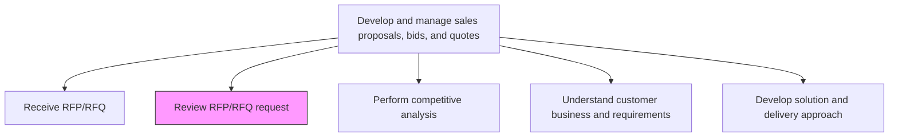
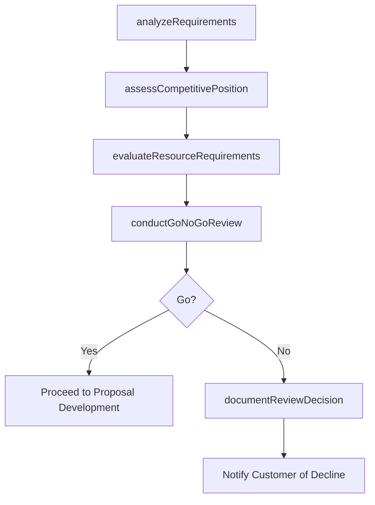

# Review RFP/RFQ request

> Business-as-Code definition for RFP/RFQ request review. Models the detailed evaluation of procurement solicitations for strengths, weaknesses, competitive positioning, and go/no-go decision-making.

## Overview

Evaluating individual price and delivery solicitations for their strengths and weaknesses. Analyze how closely the submitted bids respond to the requirements outlined in the RFPs.

## Process Hierarchy



## GraphDL

```yaml
review:
  object: RFP/RFQ Request
  actor: ProposalManager
  result: RFPReviewAssessment
```

## Actions

| Action | Description |
|--------|-------------|
| analyzeRequirements | Evaluate RFP requirements against organizational capabilities and product fit |
| assessCompetitivePosition | Evaluate competitive landscape and likelihood of winning the bid |
| evaluateResourceRequirements | Estimate the effort and resources needed to respond and deliver |
| conductGoNoGoReview | Convene a review board to decide whether to pursue the RFP |
| documentReviewDecision | Record the go/no-go decision with rationale and conditions |

## Events

| Event | Description |
|-------|-------------|
| requirementsAnalyzed | RFP requirements evaluated against organizational capabilities |
| competitivePositionAssessed | Competitive analysis for the bid completed |
| resourceRequirementsEvaluated | Response and delivery resource estimates prepared |
| goNoGoReviewConducted | Go/no-go decision made by review board |
| reviewDecisionDocumented | Decision and rationale recorded |

## Searches

| Search | Description |
|--------|-------------|
| getReviewStatus | Retrieve RFP review status and go/no-go decision |
| getCompetitiveAssessment | Access competitive analysis for a specific RFP |
| getGoNoGoHistory | Query historical go/no-go decisions and outcomes |

## Process Flow



## RACI Matrix

| Activity | Responsible | Accountable | Consulted | Informed |
|----------|-------------|-------------|-----------|----------|
| analyzeRequirements | SolutionArchitect | ProposalManager | ProductManagement | Delivery |
| conductGoNoGoReview | ProposalManager | VP Sales | Finance | ExecutiveTeam |
| documentReviewDecision | ProposalCoordinator | ProposalManager | Sales | Legal |

## Related Processes

| Process | Relationship |
|---------|-------------|
| 3.5.3.1 Receive RFP/RFQ | Upstream - registered RFP advances to review |
| 3.5.3.4 Perform competitive analysis | Parallel - competitive analysis supports review |
| 3.5.3.5 Validate with strategy/business plans | Parallel - strategic alignment informs go/no-go |

## Related Departments

| Department | Role |
|-----------|------|
| Proposal Management | Coordinates the review process |
| Pre-Sales | Provides technical capability assessment |
| Finance | Evaluates financial viability of pursuit |
| Sales | Provides customer intelligence and win probability |

## Related Occupations

| Occupation | Involvement |
|-----------|-------------|
| Proposal Manager | Leads the RFP review and go/no-go process |
| Solution Architect | Assesses technical fit and capability gaps |
| Sales Director | Provides strategic input on pursuit decision |

## KPIs

| KPI | Description | Unit |
|-----|-------------|------|
| Go/No-Go Decision Time | Days from RFP receipt to pursuit decision | Days |
| Win Rate of Pursued RFPs | Percentage of pursued RFPs resulting in wins | % |
| Decline Rate | Percentage of RFPs declined after review | % |

## Usage

```typescript
import { reviewRfpRfqRequest } from '@headlessly/review-rfp-rfq-request'

const review = reviewRfpRfqRequest()

// Conduct go/no-go review
const decision = await review.conductGoNoGoReview({
  rfpId: 'rfp-001',
  criteria: ['strategic-fit', 'capability-match', 'resource-availability', 'win-probability'],
  reviewBoard: ['vp-sales', 'proposal-manager', 'delivery-lead', 'finance-director']
})
```
