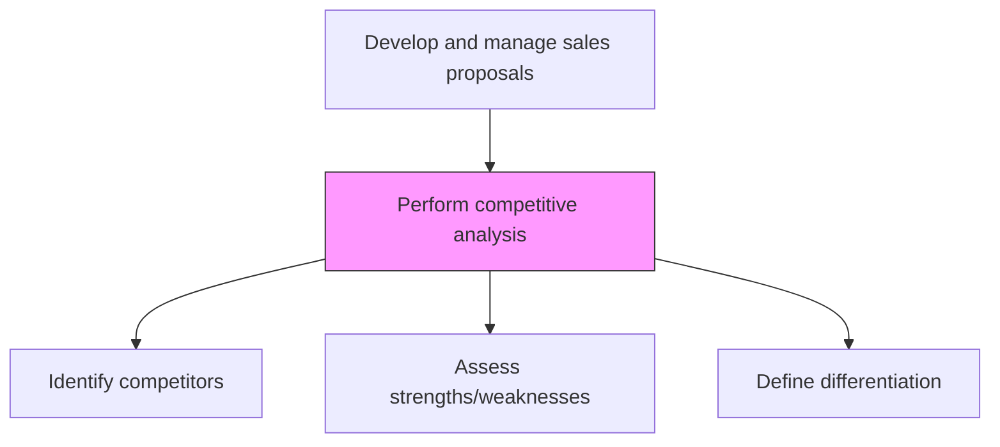
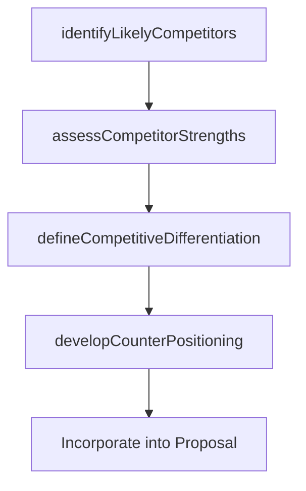

# Perform competitive analysis

> Business-as-Code definition for proposal competitive analysis. Models the comparison of competing bids in terms of cost, solution approach, value proposition, and competitive positioning to strengthen the proposal response.

## Overview

Comparing the proposals submitted by different bidders in terms of cost, efficiency and value.

## Process Hierarchy



## GraphDL

```yaml
perform:
  object: Competitive Analysis
  actor: CompetitiveIntelligenceAnalyst
  result: CompetitivePositioningReport
```

## Actions

| Action | Description |
|--------|-------------|
| identifyLikelyCompetitors | Determine which competitors are likely bidding on the same opportunity |
| assessCompetitorStrengths | Evaluate competitor capabilities, pricing, and customer relationships |
| defineCompetitiveDifferentiation | Articulate key differentiators and unique value propositions for the bid |
| developCounterPositioning | Create messaging to address competitor strengths and highlight their weaknesses |

## Events

| Event | Description |
|-------|-------------|
| likelyCompetitorsIdentified | Competing bidders identified for the opportunity |
| competitorStrengthsAssessed | Competitor capability and pricing analysis completed |
| competitiveDifferentiationDefined | Key differentiators and value propositions articulated |
| counterPositioningDeveloped | Competitive messaging and counter-positioning prepared |

## Searches

| Search | Description |
|--------|-------------|
| getCompetitiveAnalysis | Retrieve competitive analysis for a specific opportunity |
| getCompetitorProfiles | Access competitor capability and pricing profiles |
| getWinLossData | Query historical win/loss data against specific competitors |

## Process Flow



## RACI Matrix

| Activity | Responsible | Accountable | Consulted | Informed |
|----------|-------------|-------------|-----------|----------|
| identifyLikelyCompetitors | CompetitiveIntelligenceAnalyst | ProposalManager | Sales | Marketing |
| defineCompetitiveDifferentiation | CompetitiveIntelligenceAnalyst | ProposalManager | ProductMarketing | PreSales |
| developCounterPositioning | ProposalManager | VP Sales | Marketing | AccountExecutive |

## Related Processes

| Process | Relationship |
|---------|-------------|
| 3.5.3.3 Review RFP/RFQ request | Parallel - competitive analysis supports go/no-go review |
| 1.1.1.1 Identify competitors | Upstream - corporate competitive intelligence feeds analysis |
| 3.5.3.7 Develop solution and delivery approach | Downstream - differentiation guides solution design |

## Related Departments

| Department | Role |
|-----------|------|
| Competitive Intelligence | Provides competitor data and analysis |
| Proposal Management | Integrates competitive positioning into proposals |
| Product Marketing | Defines competitive messaging and differentiation |
| Sales | Provides field-level competitive intelligence |

## Related Occupations

| Occupation | Involvement |
|-----------|-------------|
| Competitive Intelligence Analyst | Conducts competitor research and analysis |
| Proposal Manager | Integrates competitive positioning into bid strategy |
| Product Marketing Manager | Develops competitive messaging and battle cards |

## KPIs

| KPI | Description | Unit |
|-----|-------------|------|
| Competitive Intelligence Coverage | Percentage of pursued RFPs with competitive analysis completed | % |
| Win Rate vs. Key Competitors | Win percentage against identified competitors | % |
| Differentiation Effectiveness | Customer rating of differentiation clarity in proposals | Score (1-10) |

## Usage

```typescript
import { performCompetitiveAnalysis } from '@headlessly/perform-competitive-analysis'

const compAnalysis = performCompetitiveAnalysis()

// Identify likely competitors
const competitors = await compAnalysis.identifyLikelyCompetitors({
  opportunityId: 'opp-001',
  customerIndustry: 'financial-services',
  dealSize: 'enterprise'
})

// Define competitive differentiation
const positioning = await compAnalysis.defineCompetitiveDifferentiation({
  competitors: competitors.map(c => c.id),
  strengths: ['platform-flexibility', 'integration-ecosystem', 'time-to-value'],
  winThemes: ['lower-tco', 'faster-deployment', 'superior-support']
})
```
