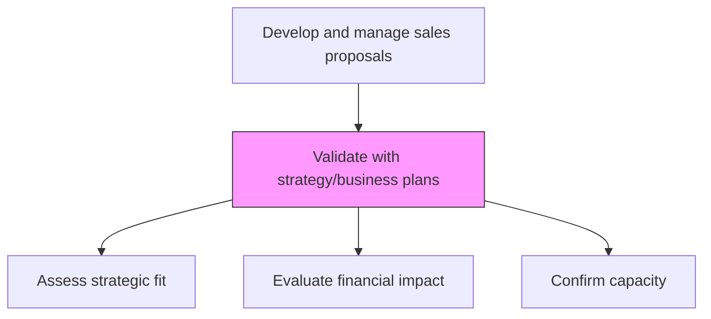
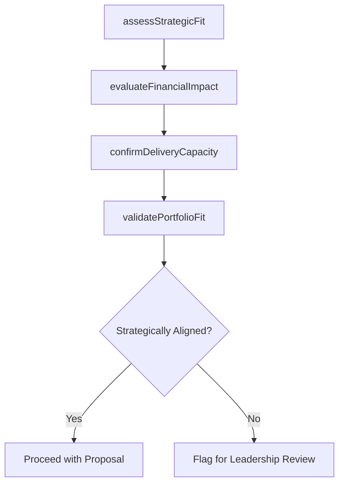

# Validate with strategy/business plans

> Business-as-Code definition for strategic validation of proposals. Models the assessment of bid opportunities against organizational business strategy, financial forecasts, and capacity constraints to ensure strategic alignment.

## Overview

Assessing the business strategy, forecasted performance, financing and cash flow of the proposals.

## Process Hierarchy



## GraphDL

```yaml
validate:
  object: With Strategy/business Plans
  actor: StrategyAnalyst
  result: StrategicValidationReport
```

## Actions

| Action | Description |
|--------|-------------|
| assessStrategicFit | Evaluate how the opportunity aligns with corporate strategy and growth priorities |
| evaluateFinancialImpact | Model the revenue, margin, and cash flow implications of winning the bid |
| confirmDeliveryCapacity | Verify that the organization has capacity to deliver the proposed solution |
| validatePortfolioFit | Ensure the opportunity fits within the desired product and customer portfolio mix |

## Events

| Event | Description |
|-------|-------------|
| strategicFitAssessed | Opportunity evaluated against corporate strategy priorities |
| financialImpactEvaluated | Revenue and margin impact modeled for the opportunity |
| deliveryCapacityConfirmed | Organizational delivery capacity verified |
| portfolioFitValidated | Opportunity assessed for portfolio and customer mix alignment |

## Searches

| Search | Description |
|--------|-------------|
| getStrategicValidation | Retrieve strategic alignment assessment for an RFP |
| getFinancialImpact | Access financial projections for a bid opportunity |
| getCapacityStatus | Query current delivery capacity and availability |

## Process Flow



## RACI Matrix

| Activity | Responsible | Accountable | Consulted | Informed |
|----------|-------------|-------------|-----------|----------|
| assessStrategicFit | StrategyAnalyst | VP Sales | Strategy | ExecutiveTeam |
| evaluateFinancialImpact | FinancialPlanningAnalyst | CFO | Finance | ProposalManager |
| confirmDeliveryCapacity | DeliveryManager | VP Delivery | HR | ProposalManager |

## Related Processes

| Process | Relationship |
|---------|-------------|
| 3.5.3.3 Review RFP/RFQ request | Parallel - strategic validation supports go/no-go review |
| 1.2 Define and evaluate strategic options | Upstream - corporate strategy defines alignment criteria |
| 3.5.3.10 Conduct profitability analysis | Downstream - financial validation feeds profitability |

## Related Departments

| Department | Role |
|-----------|------|
| Strategy | Defines strategic alignment criteria |
| Finance | Models financial impact of the opportunity |
| Delivery | Confirms capacity to execute the proposed solution |
| Sales | Provides customer and deal context for assessment |

## Related Occupations

| Occupation | Involvement |
|-----------|-------------|
| Strategy Analyst | Evaluates opportunity alignment with business strategy |
| Financial Planning Analyst | Models revenue and margin impact |
| Delivery Manager | Assesses organizational delivery capacity |

## KPIs

| KPI | Description | Unit |
|-----|-------------|------|
| Strategic Alignment Score | Rating of opportunity fit with corporate strategy | Score (1-10) |
| Financial Viability Rating | Assessment of opportunity financial attractiveness | Score (1-10) |
| Capacity Utilization Impact | Projected impact on delivery capacity if won | % |

## Usage

```typescript
import { validateWithStrategyBusinessPlans } from '@headlessly/validate-with-strategy-business-plans'

const validation = validateWithStrategyBusinessPlans()

// Assess strategic fit
const fit = await validation.assessStrategicFit({
  opportunityId: 'opp-001',
  strategicPriorities: ['enterprise-growth', 'platform-expansion', 'vertical-depth'],
  minimumAlignmentScore: 7
})
```
