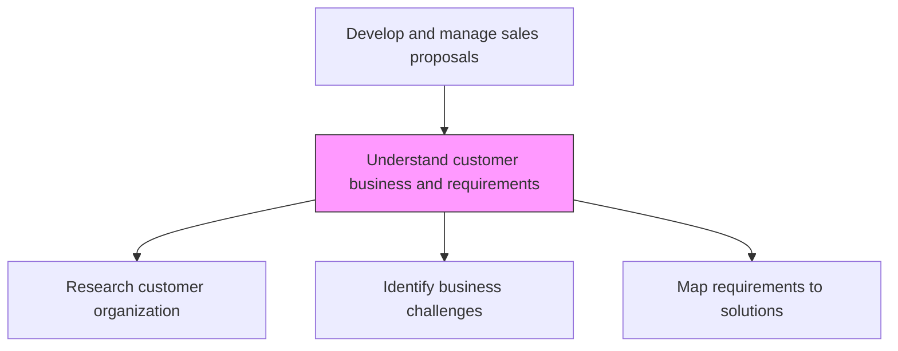
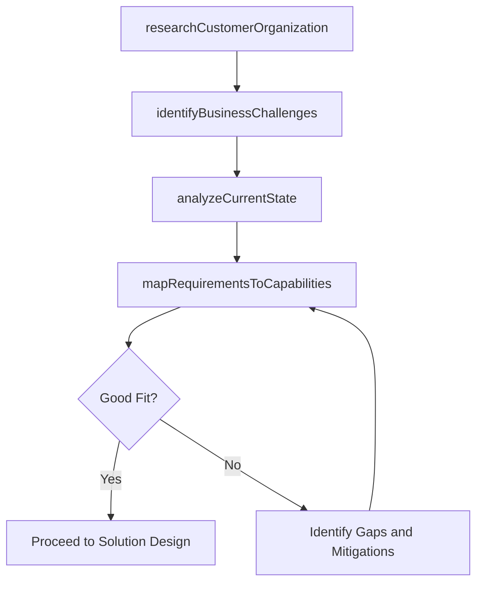

# Understand customer business and requirements

> Business-as-Code definition for customer business understanding. Models the deep-dive research into the customer organization, industry context, business challenges, and operational requirements to inform solution design.

## Overview

Deepening knowledge about the customer's field of operation and business needs.

## Process Hierarchy



## GraphDL

```yaml
understand:
  object: Customer Business And Requirements
  actor: SolutionArchitect
  result: CustomerBusinessAssessment
```

## Actions

| Action | Description |
|--------|-------------|
| researchCustomerOrganization | Study the customer industry, market position, organizational structure, and technology landscape |
| identifyBusinessChallenges | Discover the customer key pain points, strategic initiatives, and operational gaps |
| analyzeCurrentState | Assess the customer existing systems, processes, and technology stack |
| mapRequirementsToCapabilities | Align customer requirements to the organization solution capabilities and roadmap |

## Events

| Event | Description |
|-------|-------------|
| customerOrganizationResearched | Customer industry and organizational analysis completed |
| businessChallengesIdentified | Customer pain points and strategic priorities documented |
| currentStateAnalyzed | Customer existing systems and processes assessed |
| requirementsMappedToCapabilities | Requirements aligned to solution capabilities |

## Searches

| Search | Description |
|--------|-------------|
| getCustomerAssessment | Retrieve customer business assessment for a specific opportunity |
| getIndustryContext | Access industry trends and challenges relevant to the customer |
| getCapabilityMapping | Query requirement-to-capability mapping for a proposal |

## Process Flow



## RACI Matrix

| Activity | Responsible | Accountable | Consulted | Informed |
|----------|-------------|-------------|-----------|----------|
| researchCustomerOrganization | SolutionArchitect | ProposalManager | AccountExecutive | Marketing |
| identifyBusinessChallenges | SolutionArchitect | ProposalManager | AccountExecutive | ProductManagement |
| mapRequirementsToCapabilities | SolutionArchitect | ProposalManager | ProductManagement | Engineering |

## Related Processes

| Process | Relationship |
|---------|-------------|
| 3.5.3.2 Refine customer requirements | Parallel - requirement refinement complements business understanding |
| 3.5.3.7 Develop solution and delivery approach | Downstream - business understanding informs solution design |
| 3.1.1 Perform customer and market intelligence analysis | Upstream - market intelligence provides industry context |

## Related Departments

| Department | Role |
|-----------|------|
| Pre-Sales | Leads customer business research and analysis |
| Sales | Provides customer relationship context and intel |
| Product Management | Contributes product-market fit assessment |
| Marketing | Provides industry research and customer insights |

## Related Occupations

| Occupation | Involvement |
|-----------|-------------|
| Solution Architect | Leads customer business and requirements analysis |
| Account Executive | Facilitates customer access and relationship context |
| Industry Analyst | Provides sector-specific industry intelligence |

## KPIs

| KPI | Description | Unit |
|-----|-------------|------|
| Customer Understanding Depth | Rating of assessment completeness by proposal reviewers | Score (1-10) |
| Capability Coverage | Percentage of customer requirements addressable by current capabilities | % |
| Research Cycle Time | Days to complete customer business assessment | Days |

## Usage

```typescript
import { understandCustomerBusinessAndRequirements } from '@headlessly/understand-customer-business-and-requirements'

const customerUnderstanding = understandCustomerBusinessAndRequirements()

// Research customer organization
const research = await customerUnderstanding.researchCustomerOrganization({
  customerId: 'enterprise-client-001',
  dimensions: ['industry-position', 'org-structure', 'tech-stack', 'strategic-initiatives']
})

// Map requirements to capabilities
const mapping = await customerUnderstanding.mapRequirementsToCapabilities({
  requirements: rfpRequirements,
  productCatalog: ['platform', 'analytics', 'integrations', 'support']
})
```
