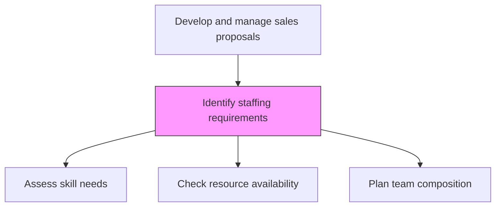
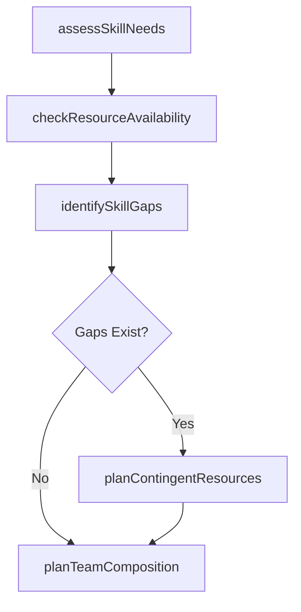

# Identify staffing requirements

> Business-as-Code definition for proposal staffing requirement identification. Models the determination of internal resource needs, skill gaps, and team composition required to deliver the proposed solution.

## Overview

Determining the needs for internal resources and vacancies.

## Process Hierarchy



## GraphDL

```yaml
identify:
  object: Staffing Requirements
  actor: ResourceManager
  result: StaffingPlan
```

## Actions

| Action | Description |
|--------|-------------|
| assessSkillNeeds | Identify the technical and functional skills required to deliver the proposed solution |
| checkResourceAvailability | Verify availability of required resources within the planned delivery timeline |
| identifySkillGaps | Detect gaps between required skills and available team capabilities |
| planTeamComposition | Design the delivery team structure with roles, responsibilities, and allocations |
| planContingentResources | Identify external contractors or partners to fill resource gaps |

## Events

| Event | Description |
|-------|-------------|
| skillNeedsAssessed | Required skills and competencies identified |
| resourceAvailabilityChecked | Team availability confirmed against delivery timeline |
| skillGapsIdentified | Gaps between required and available skills documented |
| teamCompositionPlanned | Delivery team structure and roles defined |
| contingentResourcesPlanned | External resource needs identified and sourced |

## Searches

| Search | Description |
|--------|-------------|
| getStaffingPlan | Retrieve the staffing plan for a specific proposal |
| getResourceAvailability | Access resource availability by skill and timeframe |
| getSkillGaps | Query identified skill gaps for a proposal |

## Process Flow



## RACI Matrix

| Activity | Responsible | Accountable | Consulted | Informed |
|----------|-------------|-------------|-----------|----------|
| assessSkillNeeds | ResourceManager | DeliveryManager | SolutionArchitect | HR |
| checkResourceAvailability | ResourceManager | DeliveryManager | HR | ProjectManagement |
| planTeamComposition | ResourceManager | ProposalManager | DeliveryManager | Finance |

## Related Processes

| Process | Relationship |
|---------|-------------|
| 3.5.3.7 Develop solution and delivery approach | Upstream - solution design drives staffing needs |
| 3.5.3.9 Develop pricing and scheduling estimates | Downstream - staffing plan informs cost estimates |
| 7.1 Develop and manage human resources planning | Upstream - HR planning provides resource pool data |

## Related Departments

| Department | Role |
|-----------|------|
| Resource Management | Plans and allocates delivery team resources |
| Delivery | Defines team requirements and skill needs |
| HR | Provides workforce data and supports external hiring |
| Procurement | Sources external contractors when needed |

## Related Occupations

| Occupation | Involvement |
|-----------|-------------|
| Resource Manager | Plans team composition and resource allocation |
| Delivery Manager | Defines delivery team requirements |
| HR Business Partner | Supports talent gap resolution |

## KPIs

| KPI | Description | Unit |
|-----|-------------|------|
| Resource Coverage Rate | Percentage of required roles filled from internal resources | % |
| Staffing Plan Accuracy | Variance between planned and actual team composition | % |
| Skill Gap Closure Time | Average days to fill identified skill gaps | Days |

## Usage

```typescript
import { identifyStaffingRequirements } from '@headlessly/identify-staffing-requirements'

const staffing = identifyStaffingRequirements()

// Assess skill needs for the proposal
const skills = await staffing.assessSkillNeeds({
  solutionId: 'solution-001',
  roles: ['project-manager', 'solution-architect', 'developer', 'data-engineer'],
  duration: { months: 6 }
})

// Plan team composition
const team = await staffing.planTeamComposition({
  skillRequirements: skills,
  preferInternal: true,
  startDate: '2026-04-01'
})
```
