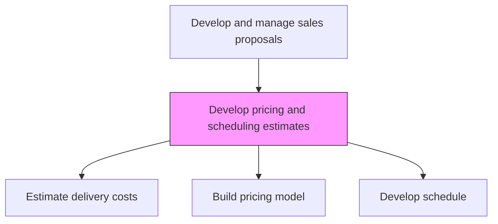
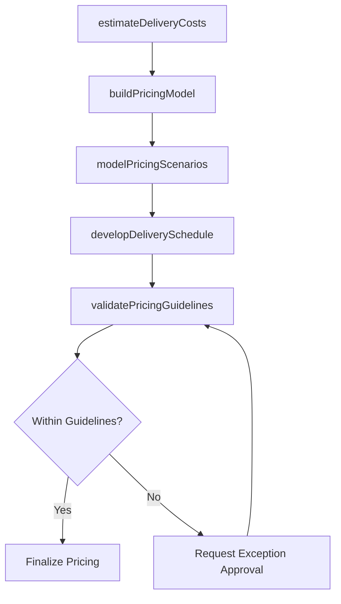

# Develop pricing and scheduling estimates

> Business-as-Code definition for pricing and scheduling estimate development. Models the creation of cost estimates, pricing structures, delivery schedules, and financial terms for proposals and bids.

## Overview

Establishing predicted delivery costs, fees and timelines.

## Process Hierarchy



## GraphDL

```yaml
develop:
  object: Pricing And Scheduling Estimates
  actor: PricingAnalyst
  result: PricingAndScheduleEstimate
```

## Actions

| Action | Description |
|--------|-------------|
| estimateDeliveryCosts | Calculate the total cost of delivery including labor, infrastructure, and third-party costs |
| buildPricingModel | Construct the pricing structure including licensing, services, and ongoing fees |
| developDeliverySchedule | Create a detailed timeline with payment milestones tied to deliverables |
| modelPricingScenarios | Build multiple pricing scenarios to test sensitivity to deal terms and discounts |
| validatePricingGuidelines | Ensure pricing complies with approved rate cards and discount authorities |

## Events

| Event | Description |
|-------|-------------|
| deliveryCostsEstimated | Total delivery cost estimate completed |
| pricingModelBuilt | Pricing structure and fee schedule created |
| deliveryScheduleDeveloped | Delivery timeline with payment milestones finalized |
| pricingScenariosModeled | Multiple pricing scenarios analyzed |
| pricingGuidelinesValidated | Pricing confirmed within approved guidelines |

## Searches

| Search | Description |
|--------|-------------|
| getPricingEstimate | Retrieve pricing estimate for a specific proposal |
| getDeliverySchedule | Access the delivery timeline and milestone schedule |
| getPricingScenarios | Query modeled pricing scenarios and sensitivity analysis |

## Process Flow



## RACI Matrix

| Activity | Responsible | Accountable | Consulted | Informed |
|----------|-------------|-------------|-----------|----------|
| estimateDeliveryCosts | PricingAnalyst | ProposalManager | DeliveryManager | Finance |
| buildPricingModel | PricingAnalyst | VP Sales | Finance | ProposalManager |
| validatePricingGuidelines | PricingAnalyst | VP Sales | Finance | Legal |

## Related Processes

| Process | Relationship |
|---------|-------------|
| 3.5.3.8 Identify staffing requirements | Upstream - staffing plan informs cost estimates |
| 3.5.3.10 Conduct profitability analysis | Downstream - pricing feeds profitability assessment |
| 3.3.4 Develop and manage pricing | Upstream - pricing strategy provides rate cards and guidelines |

## Related Departments

| Department | Role |
|-----------|------|
| Finance | Validates cost estimates and pricing models |
| Proposal Management | Integrates pricing into proposal documents |
| Delivery | Provides delivery cost and timeline inputs |
| Sales | Provides deal terms and discount context |

## Related Occupations

| Occupation | Involvement |
|-----------|-------------|
| Pricing Analyst | Develops pricing models and cost estimates |
| Financial Analyst | Validates cost assumptions and margin calculations |
| Proposal Manager | Integrates pricing into the overall proposal |

## KPIs

| KPI | Description | Unit |
|-----|-------------|------|
| Pricing Accuracy | Variance between estimated and actual deal pricing | % |
| Schedule Accuracy | Variance between estimated and actual delivery timeline | % |
| Discount Rate | Average discount applied relative to list pricing | % |

## Usage

```typescript
import { developPricingAndSchedulingEstimates } from '@headlessly/develop-pricing-and-scheduling-estimates'

const pricing = developPricingAndSchedulingEstimates()

// Build pricing model
const model = await pricing.buildPricingModel({
  components: [
    { type: 'license', product: 'platform-enterprise', term: { months: 36 } },
    { type: 'services', category: 'implementation', effort: { hours: 2000 } },
    { type: 'support', level: 'premium', term: { months: 36 } }
  ],
  discountAuthority: 'standard'
})
```
