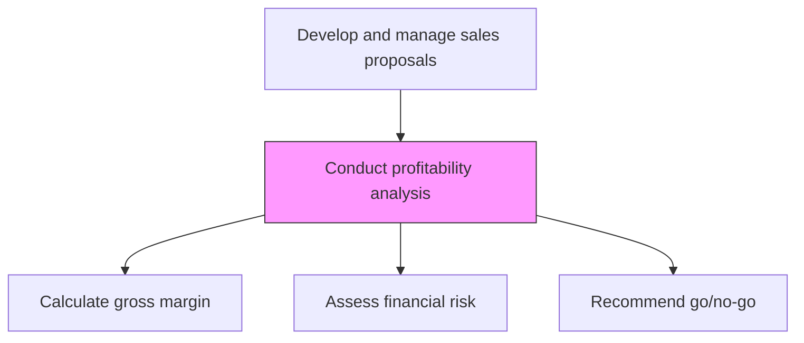
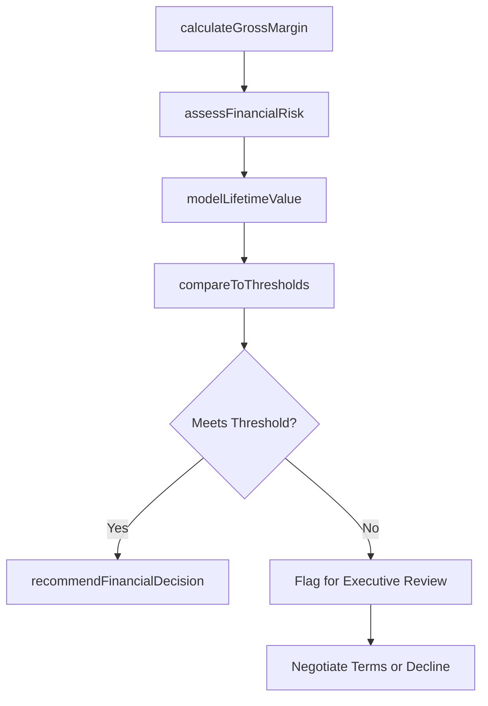

# Conduct profitability analysis

> Business-as-Code definition for proposal profitability analysis. Models the systematic evaluation of deal economics including margin analysis, return projections, and financial risk assessment to ensure acceptable profitability.

## Overview

Reviewing profitability data. Analyze systematically all relevant metrics and parameters. Report findings and make recommendations for changes to operational strategies.

## Process Hierarchy



## GraphDL

```yaml
conduct:
  object: Profitability Analysis
  actor: FinancialAnalyst
  result: ProfitabilityAssessment
```

## Actions

| Action | Description |
|--------|-------------|
| calculateGrossMargin | Compute expected margin by subtracting estimated costs from proposed pricing |
| assessFinancialRisk | Evaluate financial risks including cost overruns, scope changes, and payment delays |
| modelLifetimeValue | Project the total customer lifetime value including renewals and expansion |
| compareToThresholds | Compare projected profitability against minimum acceptable margin thresholds |
| recommendFinancialDecision | Provide a profitability-based recommendation to proceed or adjust the deal |

## Events

| Event | Description |
|-------|-------------|
| grossMarginCalculated | Expected deal margin computed |
| financialRiskAssessed | Financial risk evaluation completed |
| lifetimeValueModeled | Customer lifetime value projection created |
| thresholdsCompared | Profitability compared against minimum thresholds |
| financialDecisionRecommended | Profitability recommendation issued |

## Searches

| Search | Description |
|--------|-------------|
| getProfitabilityAnalysis | Retrieve profitability assessment for a specific proposal |
| getMarginProjection | Access margin projection details by deal component |
| getRiskAssessment | Query financial risk evaluation for a proposal |

## Process Flow



## RACI Matrix

| Activity | Responsible | Accountable | Consulted | Informed |
|----------|-------------|-------------|-----------|----------|
| calculateGrossMargin | FinancialAnalyst | CFO | PricingAnalyst | ProposalManager |
| assessFinancialRisk | FinancialAnalyst | CFO | Delivery | Legal |
| recommendFinancialDecision | FinancialAnalyst | CFO | VP Sales | ExecutiveTeam |

## Related Processes

| Process | Relationship |
|---------|-------------|
| 3.5.3.9 Develop pricing and scheduling estimates | Upstream - pricing data feeds profitability analysis |
| 3.5.3.11 Manage internal reviews | Downstream - profitability assessment reviewed internally |
| 3.4.4.5 Calculate net profit | Parallel - deal profitability contributes to overall profit |

## Related Departments

| Department | Role |
|-----------|------|
| Finance | Owns profitability analysis and threshold management |
| Proposal Management | Provides cost and pricing inputs |
| Delivery | Contributes delivery cost risk assessment |
| Sales | Provides deal context and customer value perspective |

## Related Occupations

| Occupation | Involvement |
|-----------|-------------|
| Financial Analyst | Conducts deal profitability analysis |
| Pricing Analyst | Provides pricing input for margin calculation |
| Proposal Manager | Integrates profitability results into proposal strategy |

## KPIs

| KPI | Description | Unit |
|-----|-------------|------|
| Deal Gross Margin | Expected gross margin for the proposed deal | % |
| Profitability Threshold Pass Rate | Percentage of proposals meeting minimum margin requirements | % |
| Margin Forecast Accuracy | Variance between projected and actual deal margin | % |

## Usage

```typescript
import { conductProfitabilityAnalysis } from '@headlessly/conduct-profitability-analysis'

const profitability = conductProfitabilityAnalysis()

// Calculate deal margin
const margin = await profitability.calculateGrossMargin({
  proposedRevenue: 2000000,
  estimatedCosts: { labor: 800000, infrastructure: 200000, thirdParty: 150000 }
})

// Model lifetime value
const ltv = await profitability.modelLifetimeValue({
  initialDealValue: 2000000,
  renewalRate: 0.90,
  expansionRate: 0.15,
  horizon: { years: 5 }
})
```
