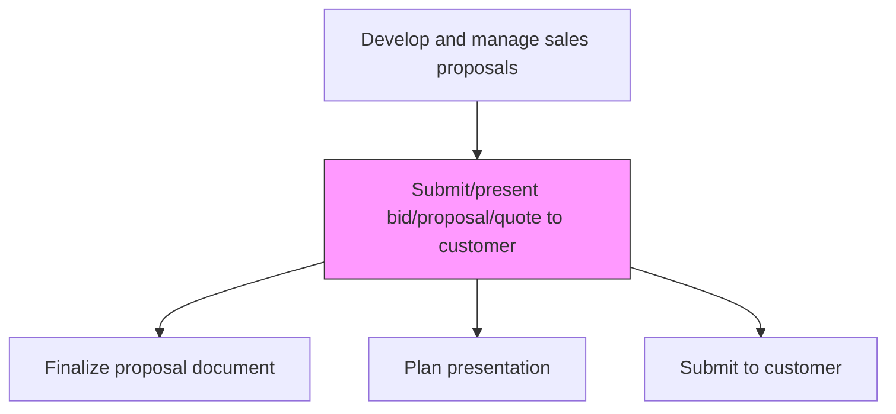
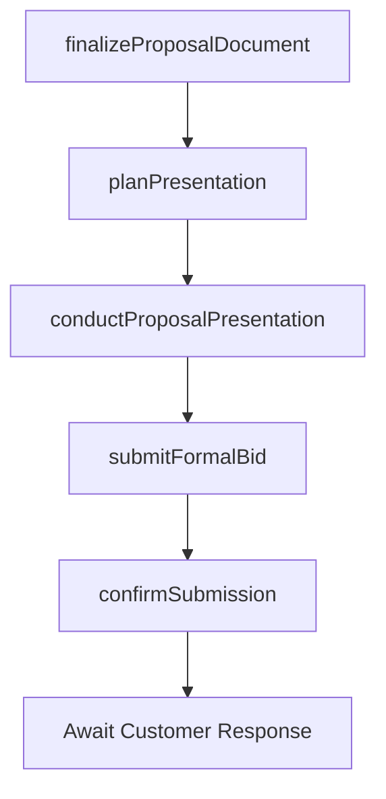

# Submit/present bid/proposal/quote to customer

> Business-as-Code definition for bid and proposal submission. Models the final preparation, packaging, and delivery of the proposal to the customer, including presentation planning and formal submission logistics.

## Overview

Delivering the proposal to the potential client.

## Process Hierarchy



## GraphDL

```yaml
submit/present:
  object: Bid/proposal/quote To Customer
  actor: ProposalManager
  result: SubmittedProposal
```

## Actions

| Action | Description |
|--------|-------------|
| finalizeProposalDocument | Complete final formatting, quality review, and packaging of the proposal |
| planPresentation | Prepare the presentation strategy, materials, and presenter assignments |
| conductProposalPresentation | Present the proposal to customer stakeholders with Q&A session |
| submitFormalBid | Deliver the formal written proposal per customer submission requirements |
| confirmSubmission | Verify receipt and completeness of the submitted proposal |

## Events

| Event | Description |
|-------|-------------|
| proposalDocumentFinalized | Proposal document completed and quality-checked |
| presentationPlanned | Presentation strategy and materials prepared |
| proposalPresented | Proposal presentation delivered to customer |
| formalBidSubmitted | Written proposal delivered per submission requirements |
| submissionConfirmed | Customer confirmed receipt of the proposal |

## Searches

| Search | Description |
|--------|-------------|
| getSubmissionStatus | Retrieve the submission status for a proposal |
| getProposalDocument | Access the final proposal document and attachments |
| getSubmissionHistory | Query historical proposal submissions to a customer |

## Process Flow



## RACI Matrix

| Activity | Responsible | Accountable | Consulted | Informed |
|----------|-------------|-------------|-----------|----------|
| finalizeProposalDocument | ProposalCoordinator | ProposalManager | SolutionArchitect | Sales |
| conductProposalPresentation | AccountExecutive | VP Sales | SolutionArchitect | ProposalManager |
| submitFormalBid | ProposalCoordinator | ProposalManager | AccountExecutive | Legal |

## Related Processes

| Process | Relationship |
|---------|-------------|
| 3.5.3.12 Manage internal approvals | Upstream - approved proposals proceed to submission |
| 3.5.3.14 Revise bid/proposal/quote | Downstream - customer feedback may trigger revision |
| 3.5.3.15 Manage notification outcome | Downstream - submission leads to win/loss notification |

## Related Departments

| Department | Role |
|-----------|------|
| Proposal Management | Finalizes and submits proposal documents |
| Sales | Presents proposal to customer and manages relationship |
| Pre-Sales | Supports technical presentation and Q&A |
| Marketing | Provides branded templates and presentation materials |

## Related Occupations

| Occupation | Involvement |
|-----------|-------------|
| Proposal Manager | Oversees proposal finalization and submission |
| Account Executive | Leads customer presentation and relationship |
| Proposal Coordinator | Manages submission logistics and confirmation |

## KPIs

| KPI | Description | Unit |
|-----|-------------|------|
| On-Time Submission Rate | Percentage of proposals submitted before customer deadline | % |
| Presentation Quality Score | Customer rating of proposal presentation | Score (1-10) |
| Submission Completeness | Percentage of submissions meeting all customer requirements | % |

## Usage

```typescript
import { submitPresentBidProposalQuoteToCustomer } from '@headlessly/submit-present-bid-proposal-quote-to-customer'

const submission = submitPresentBidProposalQuoteToCustomer()

// Finalize and submit proposal
await submission.finalizeProposalDocument({
  proposalId: 'prop-001',
  qualityChecks: ['formatting', 'completeness', 'compliance']
})

// Submit formal bid
await submission.submitFormalBid({
  proposalId: 'prop-001',
  submissionMethod: 'customer-portal',
  deadline: '2026-03-15T17:00:00Z'
})
```
