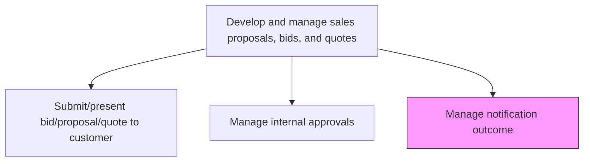
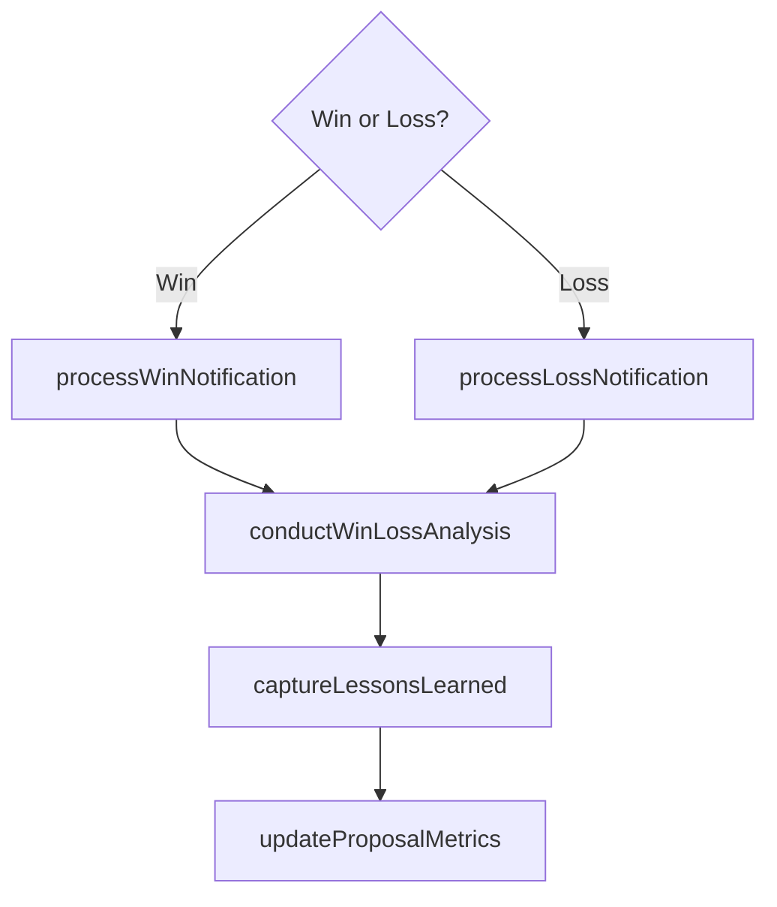

# Manage notification outcome

> Business-as-Code definition for proposal notification outcome management. Models the handling of win or loss notifications including contract transition for wins, loss analysis for defeats, and lessons-learned capture.

## Overview

Handling proposals depending on whether they were accepted or rejected.

## Process Hierarchy



## GraphDL

```yaml
manage:
  object: Notification Outcome
  actor: ProposalManager
  result: OutcomeRecord
```

## Actions

| Action | Description |
|--------|-------------|
| processWinNotification | Handle win notification by initiating contract execution and delivery handoff |
| processLossNotification | Handle loss notification by requesting debrief and capturing loss reasons |
| conductWinLossAnalysis | Analyze factors that contributed to the win or loss outcome |
| captureLessonsLearned | Document insights and improvement opportunities for future proposals |
| updateProposalMetrics | Record outcome data to track proposal win rates and performance trends |

## Events

| Event | Description |
|-------|-------------|
| winNotificationProcessed | Win notification received and contract transition initiated |
| lossNotificationProcessed | Loss notification received and debrief requested |
| winLossAnalysisConducted | Post-decision analysis completed with key findings |
| lessonsLearnedCaptured | Insights documented for proposal process improvement |
| proposalMetricsUpdated | Win/loss data recorded in proposal performance tracking |

## Searches

| Search | Description |
|--------|-------------|
| getOutcomeStatus | Retrieve the outcome status for a submitted proposal |
| getWinLossAnalysis | Access win/loss analysis findings for a proposal |
| getWinRateMetrics | Query overall proposal win rates and trends |

## Process Flow



## RACI Matrix

| Activity | Responsible | Accountable | Consulted | Informed |
|----------|-------------|-------------|-----------|----------|
| processWinNotification | ProposalManager | VP Sales | Legal | Delivery |
| processLossNotification | ProposalManager | VP Sales | AccountExecutive | Sales |
| conductWinLossAnalysis | ProposalManager | VP Sales | SalesOperations | PreSales |

## Related Processes

| Process | Relationship |
|---------|-------------|
| 3.5.3.13 Submit/present bid/proposal/quote to customer | Upstream - submission leads to outcome notification |
| 3.5.4 Manage sales orders | Downstream - won proposals become sales orders |
| 3.5.1.5 Develop opportunity win plans | Parallel - win/loss insights improve future win planning |

## Related Departments

| Department | Role |
|-----------|------|
| Proposal Management | Manages outcome processing and analysis |
| Sales | Handles customer communication around outcomes |
| Legal | Initiates contract execution for wins |
| Sales Operations | Tracks proposal metrics and win/loss data |

## Related Occupations

| Occupation | Involvement |
|-----------|-------------|
| Proposal Manager | Coordinates outcome processing and lessons learned |
| Account Executive | Manages customer relationship through outcome |
| Sales Operations Analyst | Tracks and analyzes proposal win/loss metrics |

## KPIs

| KPI | Description | Unit |
|-----|-------------|------|
| Win Rate | Percentage of submitted proposals resulting in wins | % |
| Loss Debrief Rate | Percentage of lost proposals with completed debrief | % |
| Lessons Learned Adoption | Percentage of recommendations implemented in subsequent proposals | % |

## Usage

```typescript
import { manageNotificationOutcome } from '@headlessly/manage-notification-outcome'

const outcome = manageNotificationOutcome()

// Process a win notification
await outcome.processWinNotification({
  proposalId: 'prop-001',
  contractValue: 2000000,
  startDate: '2026-04-01',
  handoffTo: 'delivery-team'
})

// Conduct win/loss analysis
const analysis = await outcome.conductWinLossAnalysis({
  proposalId: 'prop-001',
  outcome: 'won',
  factors: ['pricing', 'solution-fit', 'relationships', 'competition']
})
```
