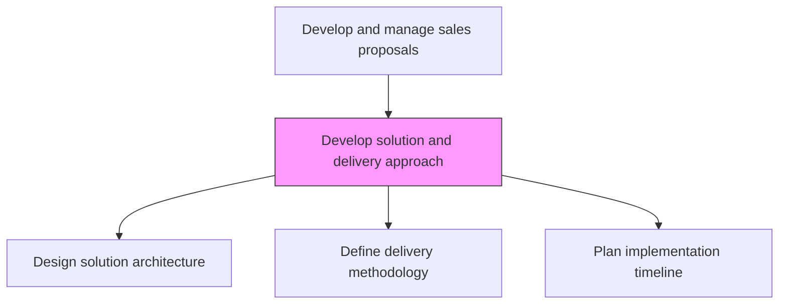
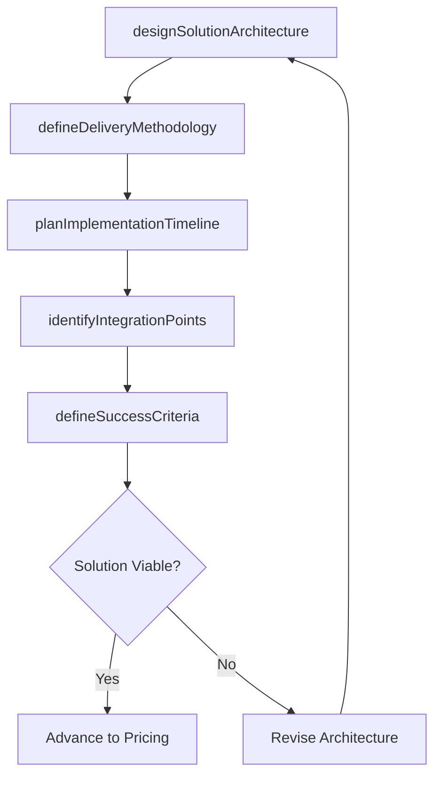

# Develop solution and delivery approach

> Business-as-Code definition for solution and delivery approach development. Models the design of the proposed solution architecture, implementation methodology, delivery timeline, and resource plan to address customer requirements.

## Overview

Creating a plan with detailed steps about how produce and deliver the goods or services.

## Process Hierarchy



## GraphDL

```yaml
develop:
  object: Solution And Delivery Approach
  actor: SolutionArchitect
  result: SolutionDeliveryPlan
```

## Actions

| Action | Description |
|--------|-------------|
| designSolutionArchitecture | Create the technical solution design addressing customer requirements |
| defineDeliveryMethodology | Select and tailor the implementation methodology for the engagement |
| planImplementationTimeline | Develop a phased delivery timeline with milestones and dependencies |
| identifyIntegrationPoints | Map integration requirements with customer existing systems |
| defineSuccessCriteria | Establish measurable success criteria and acceptance gates |

## Events

| Event | Description |
|-------|-------------|
| solutionArchitectureDesigned | Technical solution design completed |
| deliveryMethodologyDefined | Implementation approach and methodology selected |
| implementationTimelinePlanned | Phased delivery timeline with milestones created |
| integrationPointsIdentified | System integration requirements mapped |
| successCriteriaDefined | Acceptance criteria and success measures established |

## Searches

| Search | Description |
|--------|-------------|
| getSolutionDesign | Retrieve solution architecture for a specific proposal |
| getDeliveryTimeline | Access implementation timeline and milestone schedule |
| getIntegrationRequirements | Query integration points and dependencies |

## Process Flow



## RACI Matrix

| Activity | Responsible | Accountable | Consulted | Informed |
|----------|-------------|-------------|-----------|----------|
| designSolutionArchitecture | SolutionArchitect | ProposalManager | Engineering | ProductManagement |
| planImplementationTimeline | DeliveryManager | ProposalManager | SolutionArchitect | ProjectManagement |
| defineSuccessCriteria | SolutionArchitect | ProposalManager | AccountExecutive | CustomerStakeholders |

## Related Processes

| Process | Relationship |
|---------|-------------|
| 3.5.3.6 Understand customer business and requirements | Upstream - customer understanding guides solution design |
| 3.5.3.8 Identify staffing requirements | Downstream - solution approach drives staffing needs |
| 3.5.3.9 Develop pricing and scheduling estimates | Downstream - solution plan feeds pricing and scheduling |

## Related Departments

| Department | Role |
|-----------|------|
| Pre-Sales | Designs the proposed solution architecture |
| Delivery | Defines methodology and implementation timeline |
| Engineering | Validates technical feasibility and integration design |
| Product Management | Confirms product capabilities and roadmap alignment |

## Related Occupations

| Occupation | Involvement |
|-----------|-------------|
| Solution Architect | Designs the solution architecture and integration approach |
| Delivery Manager | Plans implementation methodology and timeline |
| Project Manager | Develops the delivery schedule and resource plan |

## KPIs

| KPI | Description | Unit |
|-----|-------------|------|
| Solution Completeness | Percentage of customer requirements addressed by solution design | % |
| Technical Review Pass Rate | Percentage of solutions passing internal technical review | % |
| Delivery Estimate Accuracy | Variance between estimated and actual delivery timeline | % |

## Usage

```typescript
import { developSolutionAndDeliveryApproach } from '@headlessly/develop-solution-and-delivery-approach'

const solution = developSolutionAndDeliveryApproach()

// Design solution architecture
const architecture = await solution.designSolutionArchitecture({
  rfpId: 'rfp-001',
  requirements: refinedRequirements,
  components: ['platform', 'integrations', 'data-migration', 'training']
})

// Plan implementation timeline
const timeline = await solution.planImplementationTimeline({
  solutionId: architecture.id,
  phases: ['discovery', 'build', 'test', 'deploy', 'hypercare'],
  totalDuration: { months: 6 }
})
```
