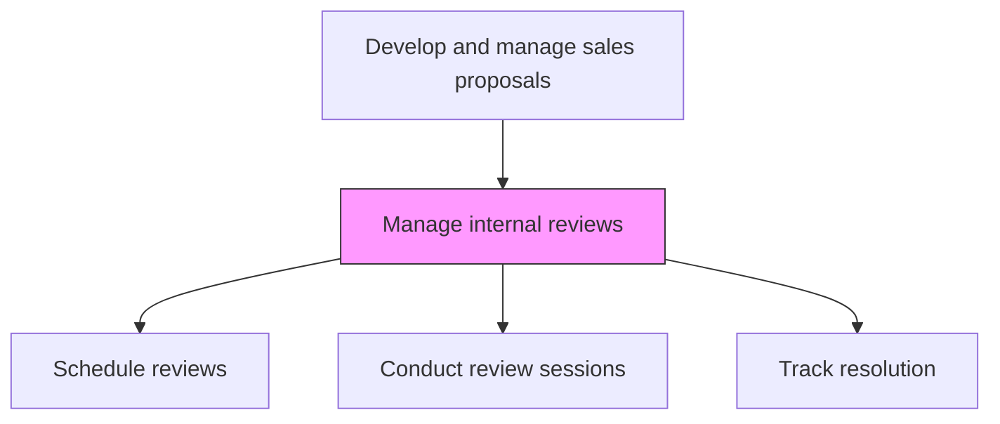
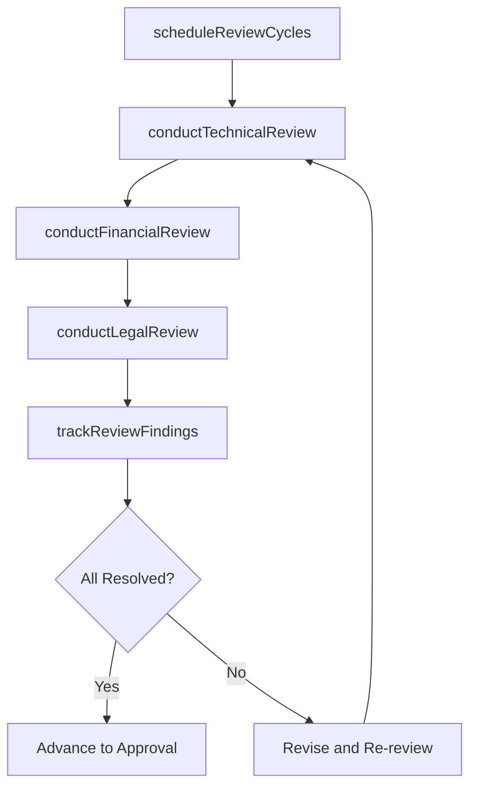

# Manage internal reviews

> Business-as-Code definition for internal proposal review management. Models the coordination of review cycles including technical, legal, financial, and executive reviews to ensure proposal quality and compliance.

## Overview

Overseeing the internal review process.

## Process Hierarchy



## GraphDL

```yaml
manage:
  object: Internal Reviews
  actor: ProposalManager
  result: InternalReviewReport
```

## Actions

| Action | Description |
|--------|-------------|
| scheduleReviewCycles | Plan and coordinate internal review sessions with required reviewers |
| conductTechnicalReview | Have technical experts validate the solution design and feasibility |
| conductFinancialReview | Have finance validate pricing, costs, and profitability analysis |
| conductLegalReview | Have legal review contract terms, compliance, and risk provisions |
| trackReviewFindings | Document, assign, and track resolution of review comments and issues |

## Events

| Event | Description |
|-------|-------------|
| reviewCyclesScheduled | Internal review sessions planned and calendared |
| technicalReviewConducted | Solution design validated by technical reviewers |
| financialReviewConducted | Pricing and profitability approved by finance |
| legalReviewConducted | Contract terms and compliance reviewed by legal |
| reviewFindingsTracked | Review comments resolved and closure verified |

## Searches

| Search | Description |
|--------|-------------|
| getReviewStatus | Retrieve the status of internal reviews for a proposal |
| getReviewFindings | Access review comments and their resolution status |
| getReviewHistory | Query past review cycles and outcomes for a proposal |

## Process Flow



## RACI Matrix

| Activity | Responsible | Accountable | Consulted | Informed |
|----------|-------------|-------------|-----------|----------|
| scheduleReviewCycles | ProposalCoordinator | ProposalManager | AllReviewers | Sales |
| conductTechnicalReview | SolutionArchitect | EngineeringLead | ProposalManager | ProductManagement |
| conductLegalReview | LegalCounsel | GeneralCounsel | ProposalManager | Sales |

## Related Processes

| Process | Relationship |
|---------|-------------|
| 3.5.3.10 Conduct profitability analysis | Upstream - profitability results reviewed in financial review |
| 3.5.3.12 Manage internal approvals | Downstream - resolved reviews advance to approval |
| 3.5.3.7 Develop solution and delivery approach | Upstream - solution design undergoes technical review |

## Related Departments

| Department | Role |
|-----------|------|
| Proposal Management | Coordinates review cycles and tracks findings |
| Engineering | Conducts technical solution reviews |
| Legal | Reviews contract terms and compliance |
| Finance | Reviews pricing and profitability analysis |

## Related Occupations

| Occupation | Involvement |
|-----------|-------------|
| Proposal Manager | Orchestrates internal review process |
| Proposal Coordinator | Schedules reviews and tracks findings |
| Legal Counsel | Conducts legal and compliance reviews |

## KPIs

| KPI | Description | Unit |
|-----|-------------|------|
| Review Cycle Time | Average days to complete all review cycles | Days |
| First-Pass Approval Rate | Percentage of proposals passing review without major revisions | % |
| Finding Resolution Time | Average days to resolve review comments | Days |

## Usage

```typescript
import { manageInternalReviews } from '@headlessly/manage-internal-reviews'

const reviews = manageInternalReviews()

// Schedule review cycles
const schedule = await reviews.scheduleReviewCycles({
  proposalId: 'prop-001',
  reviews: ['technical', 'financial', 'legal'],
  deadline: '2026-03-01'
})

// Track review findings
const findings = await reviews.trackReviewFindings({
  proposalId: 'prop-001',
  filterByStatus: 'open'
})
```
