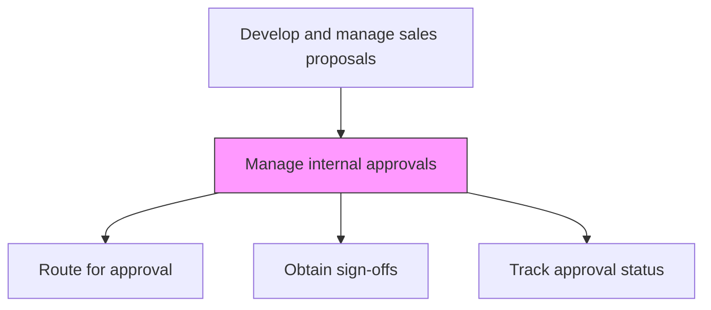
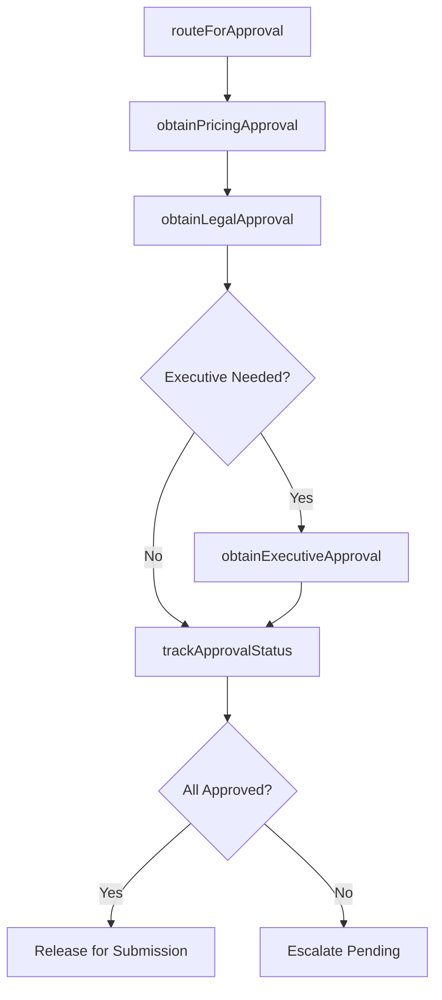

# Manage internal approvals

> Business-as-Code definition for internal proposal approval management. Models the routing of proposals through approval workflows, obtaining required sign-offs from pricing, legal, delivery, and executive stakeholders.

## Overview

Obtaining required company-internal authorizations.

## Process Hierarchy



## GraphDL

```yaml
manage:
  object: Internal Approvals
  actor: ProposalManager
  result: ApprovalRecord
```

## Actions

| Action | Description |
|--------|-------------|
| routeForApproval | Submit the proposal to required approvers based on deal size and terms thresholds |
| obtainPricingApproval | Secure pricing approval from finance or pricing authority |
| obtainLegalApproval | Secure legal sign-off on contract terms and conditions |
| obtainExecutiveApproval | Obtain executive approval for deals exceeding standard thresholds |
| trackApprovalStatus | Monitor the progress of approvals and escalate delays |

## Events

| Event | Description |
|-------|-------------|
| proposalRoutedForApproval | Proposal submitted to approval workflow |
| pricingApprovalObtained | Finance or pricing authority approved deal pricing |
| legalApprovalObtained | Legal signed off on contract terms |
| executiveApprovalObtained | Executive approval granted for the deal |
| approvalStatusTracked | Approval progress monitored and delays escalated |

## Searches

| Search | Description |
|--------|-------------|
| getApprovalStatus | Retrieve current approval status for a proposal |
| getPendingApprovals | List proposals awaiting approval by approver |
| getApprovalHistory | Query approval timeline and sign-off history |

## Process Flow



## RACI Matrix

| Activity | Responsible | Accountable | Consulted | Informed |
|----------|-------------|-------------|-----------|----------|
| routeForApproval | ProposalManager | VP Sales | SalesOperations | ProposalCoordinator |
| obtainPricingApproval | PricingAnalyst | VP Sales | CFO | ProposalManager |
| obtainExecutiveApproval | VP Sales | CEO | CFO | ProposalManager |

## Related Processes

| Process | Relationship |
|---------|-------------|
| 3.5.3.11 Manage internal reviews | Upstream - completed reviews advance to approval |
| 3.5.3.13 Submit/present bid/proposal/quote to customer | Downstream - approved proposals submitted to customer |
| 3.5.3.10 Conduct profitability analysis | Upstream - profitability clearance precedes approval |

## Related Departments

| Department | Role |
|-----------|------|
| Proposal Management | Coordinates approval routing and tracking |
| Finance | Approves pricing and profitability |
| Legal | Approves contract terms |
| Executive Leadership | Approves large or non-standard deals |

## Related Occupations

| Occupation | Involvement |
|-----------|-------------|
| Proposal Manager | Routes proposals and tracks approvals |
| VP Sales | Provides final sales approval |
| CFO | Approves pricing exceptions and large deals |

## KPIs

| KPI | Description | Unit |
|-----|-------------|------|
| Approval Cycle Time | Average days from routing to full approval | Days |
| Approval Bottleneck Rate | Percentage of proposals delayed at any approval stage | % |
| Exception Approval Rate | Percentage of deals requiring non-standard approval | % |

## Usage

```typescript
import { manageInternalApprovals } from '@headlessly/manage-internal-approvals'

const approvals = manageInternalApprovals()

// Route proposal for approval
await approvals.routeForApproval({
  proposalId: 'prop-001',
  dealValue: 2000000,
  approvalPath: 'standard',
  requiredApprovers: ['pricing', 'legal', 'vp-sales']
})

// Track approval status
const status = await approvals.trackApprovalStatus({
  proposalId: 'prop-001',
  escalateAfter: { hours: 48 }
})
```
