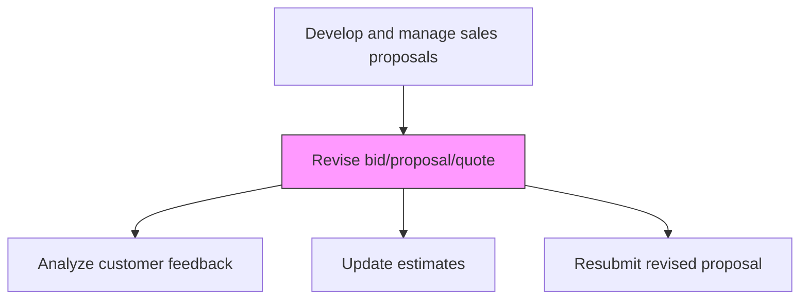
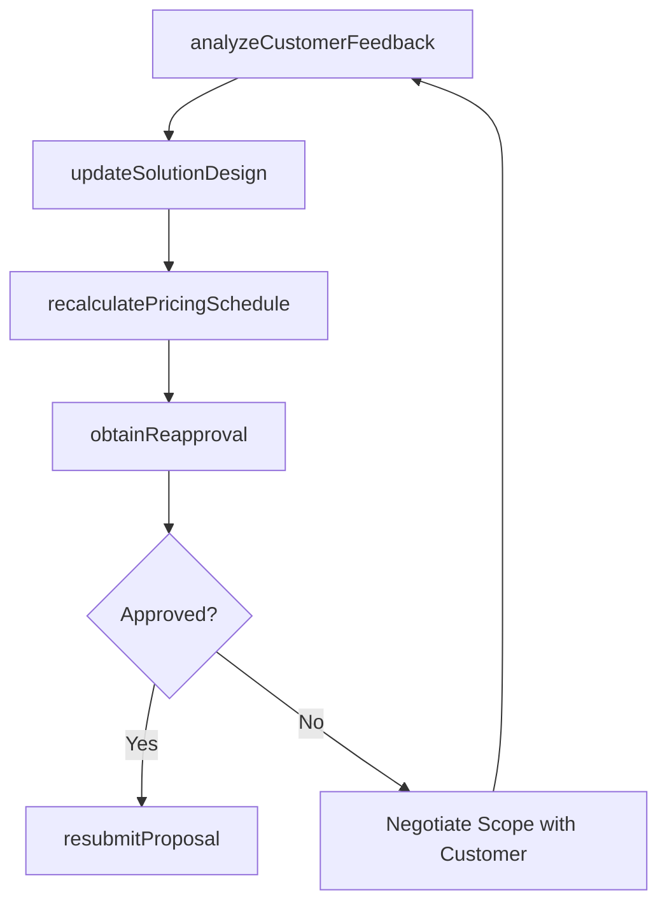

# Revise bid/proposal/quote

> Business-as-Code definition for bid and proposal revision. Models the amendment of submitted proposals with updated time, cost, or delivery estimates in response to customer feedback or changed requirements.

## Overview

Amending bids, proposals or quotes with more accurate time, cost or delivery estimates.

## Process Hierarchy



## GraphDL

```yaml
revise:
  object: Bid/proposal/quote
  actor: ProposalManager
  result: RevisedProposal
```

## Actions

| Action | Description |
|--------|-------------|
| analyzeCustomerFeedback | Review customer feedback, clarification requests, and change requirements |
| updateSolutionDesign | Modify the proposed solution to address customer feedback and new requirements |
| recalculatePricingSchedule | Revise pricing and delivery schedule based on updated solution scope |
| obtainReapproval | Route revised proposal through internal approval workflow for changes |
| resubmitProposal | Submit the revised proposal to the customer with change summary |

## Events

| Event | Description |
|-------|-------------|
| customerFeedbackAnalyzed | Customer feedback reviewed and change impact assessed |
| solutionDesignUpdated | Proposed solution modified to address feedback |
| pricingScheduleRecalculated | Pricing and delivery estimates updated |
| reapprovalObtained | Revised proposal approved internally |
| proposalResubmitted | Revised proposal delivered to customer |

## Searches

| Search | Description |
|--------|-------------|
| getRevisionHistory | Retrieve the revision history for a proposal |
| getChangeImpact | Access the impact analysis of requested changes |
| getRevisedPricing | Query updated pricing after revision |

## Process Flow



## RACI Matrix

| Activity | Responsible | Accountable | Consulted | Informed |
|----------|-------------|-------------|-----------|----------|
| analyzeCustomerFeedback | ProposalManager | AccountExecutive | SolutionArchitect | CustomerStakeholders |
| recalculatePricingSchedule | PricingAnalyst | ProposalManager | Finance | DeliveryManager |
| resubmitProposal | ProposalCoordinator | ProposalManager | AccountExecutive | Legal |

## Related Processes

| Process | Relationship |
|---------|-------------|
| 3.5.3.13 Submit/present bid/proposal/quote to customer | Upstream - initial submission generates customer feedback |
| 3.5.3.12 Manage internal approvals | Parallel - revised proposals need reapproval |
| 3.5.3.15 Manage notification outcome | Downstream - revised proposal leads to final decision |

## Related Departments

| Department | Role |
|-----------|------|
| Proposal Management | Coordinates revision process |
| Pre-Sales | Updates solution design and technical approach |
| Finance | Recalculates pricing and profitability |
| Sales | Manages customer communication during revision |

## Related Occupations

| Occupation | Involvement |
|-----------|-------------|
| Proposal Manager | Oversees proposal revision process |
| Solution Architect | Updates solution design for revised proposal |
| Pricing Analyst | Recalculates pricing for revised scope |

## KPIs

| KPI | Description | Unit |
|-----|-------------|------|
| Revision Cycle Time | Days from feedback receipt to revised submission | Days |
| Revision Win Rate | Win rate for proposals that required revision | % |
| Scope Change Impact | Average pricing change resulting from revisions | % |

## Usage

```typescript
import { reviseBidProposalQuote } from '@headlessly/revise-bid-proposal-quote'

const revision = reviseBidProposalQuote()

// Analyze customer feedback
const impact = await revision.analyzeCustomerFeedback({
  proposalId: 'prop-001',
  feedback: customerFeedbackItems,
  assessImpact: ['scope', 'pricing', 'timeline']
})

// Resubmit revised proposal
await revision.resubmitProposal({
  proposalId: 'prop-001',
  version: 2,
  changeSummary: 'Updated scope to include data migration; revised timeline to 8 months'
})
```
