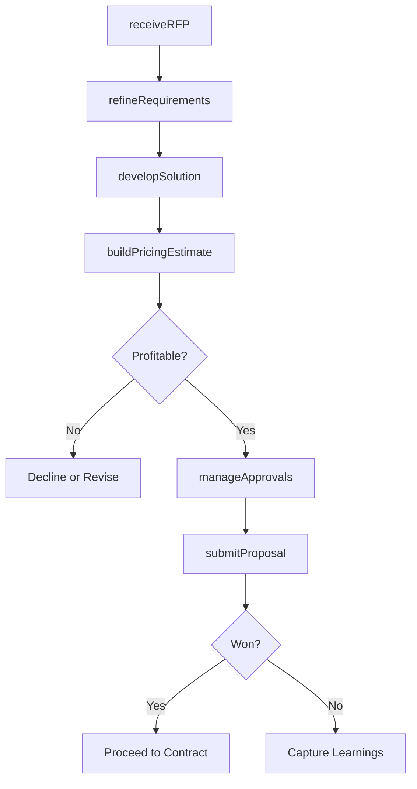

# Develop and manage sales proposals, bids, and quotes

> Business-as-Code definition for sales proposal, bid, and quote management. Models the complete RFP/RFQ lifecycle from requirement intake and solution design through pricing, profitability analysis, internal approval, submission, and outcome management.

## Overview

Understanding and refining the customer requirements as provided in a RFP (Request for Proposal) or RFI (Request for Information).  When compiling the response, they must take into consideration whether the requirements are a match with the strategic or tactical plans of the organization and whether they are able to submit a bid/proposal that is competitive based on an understanding of the offerings of other competing organizations. The next step will be to define the pricing and scheduling of the proposed solution and determine whether the proposal will be profitable for the company if accepted. The bid is then submitted and a notification of whether or not it was successful is received.

## Process Hierarchy

```mermaid
graph TD
    A[Develop and manage sales proposals, bids, and quotes]
    A --> B[Receive Request For Proposal (RFP)/Request For Quote (RFQ)]
    A --> C[Refine customer requirements]
    A --> D[Review RFP/RFQ request]
    A --> E[Perform competitive analysis]
    A --> F[Validate with strategy/business plans]
    A --> G[Understand customer business and requirements]
    A --> H[Develop solution and delivery approach]
    A --> I[Identify staffing requirements]
    A --> J[Develop pricing and scheduling estimates]
    A --> K[Conduct profitability analysis]
    A --> L[Manage internal reviews]
    A --> M[Manage internal approvals]
    A --> N[Submit/present bid/proposal/quote to customer]
    A --> O[Revise bid/proposal/quote]
    A --> P[Manage notification outcome]
```

## GraphDL

```yaml
develop:
  object: And Manage Sales Proposals, Bids, And Quotes
  actor: ProposalManager
  result: SubmittedProposal
```

## Actions

| Action | Description |
|--------|-------------|
| receiveRFP | Accept and register incoming RFP, RFQ, or RFI requests |
| refineRequirements | Clarify and validate customer requirements and scope |
| developSolution | Design the solution approach, delivery model, and staffing plan |
| buildPricingEstimate | Create pricing, scheduling, and profitability projections |
| manageApprovals | Route proposal through internal review and approval workflows |
| submitProposal | Present the final bid, proposal, or quote to the customer |

## Events

| Event | Description |
|-------|-------------|
| rfpReceived | RFP or RFQ registered and assigned for response |
| requirementsRefined | Customer requirements clarified and documented |
| solutionDeveloped | Solution approach and delivery model finalized |
| pricingEstimateBuilt | Pricing and scheduling estimates completed |
| approvalsManaged | Internal reviews and approvals completed |
| proposalSubmitted | Bid or proposal presented to customer |

## Searches

| Search | Description |
|--------|-------------|
| getProposalStatus | Retrieve proposal status by opportunity, customer, or stage |
| getRFPQueue | Access active RFP and RFQ requests pending response |
| getPricingHistory | Query historical pricing and win rates for similar proposals |
| getProposalMetrics | Retrieve proposal win rates, cycle times, and value data |
| getApprovalStatus | Track internal review and approval workflow progress |

## Process Flow



## RACI Matrix

| Activity | Responsible | Accountable | Consulted | Informed |
|----------|-------------|-------------|-----------|----------|
| receiveRFP | ProposalCoordinator | ProposalManager | Sales | Legal |
| refineRequirements | SolutionArchitect | ProposalManager | AccountExecutive | ProductManagement |
| developSolution | SolutionArchitect | ProposalManager | Engineering | Delivery |
| buildPricingEstimate | PricingAnalyst | ProposalManager | Finance | Sales |
| submitProposal | ProposalManager | VP Sales | Legal | Finance |

## Sub-Processes

| ID | Name | Description |
|----|------|-------------|
| 3.5.3.1 | Receive Request For Proposal (RFP)/Request For Quote (RFQ) | Accepting procurement proposals. |
| 3.5.3.2 | Refine customer requirements | Clarifying the details about procurement requests, such as the scope, timeline, data sources, type a |
| 3.5.3.3 | Review RFP/RFQ request | Evaluating individual price and delivery solicitations for their strengths and weaknesses. Analyze h |
| 3.5.3.4 | Perform competitive analysis | Comparing the proposals submitted by different bidders in terms of cost, efficiency and value. |
| 3.5.3.5 | Validate with strategy/business plans | Assessing the business strategy, forecasted performance, financing and cash flow of the proposals. |
| 3.5.3.6 | Understand customer business and requirements | Deepening knowledge about the customer's field of operation and business needs. |
| 3.5.3.7 | Develop solution and delivery approach | Creating a plan with detailed steps about how produce and deliver the goods or services. |
| 3.5.3.8 | Identify staffing requirements | Determining the needs for internal resources and vacancies. |
| 3.5.3.9 | Develop pricing and scheduling estimates | Establishing predicted delivery costs, fees and timelines. |
| 3.5.3.10 | Conduct profitability analysis | Reviewing profitability data. Analyze systematically all relevant metrics and parameters. Report fin |
| 3.5.3.11 | Manage internal reviews | Overseeing the internal review process. |
| 3.5.3.12 | Manage internal approvals | Obtaining required company-internal authorizations. |
| 3.5.3.13 | Submit/present bid/proposal/quote to customer | Delivering the proposal to the potential client. |
| 3.5.3.14 | Revise bid/proposal/quote | Amending bids, proposals or quotes with more accurate time, cost or delivery estimates. |
| 3.5.3.15 | Manage notification outcome | Handling proposals depending on whether they were accepted or rejected. |

## Related Processes

| Process | Relationship |
|---------|-------------|
| 3.5.1 Manage leads/opportunities | Upstream - opportunities trigger proposal development |
| 3.5.4 Manage sales orders | Downstream - won proposals become sales orders |
| 3.5.2 Manage customers and accounts | Parallel - account context informs proposal strategy |
| 3.3.4 Develop and manage pricing | Upstream - pricing strategy guides proposal pricing |

## Related Departments

| Department | Role |
|-----------|------|
| Proposal Management | Coordinates proposal development and submission |
| Pre-Sales | Designs solutions and develops technical responses |
| Sales | Manages customer relationship and proposal strategy |
| Legal | Reviews contract terms and compliance requirements |
| Finance | Validates pricing and profitability analysis |

## Related Occupations

| Occupation | Involvement |
|-----------|-------------|
| Proposal Manager | Coordinates end-to-end proposal development process |
| Solution Architect | Designs solution approach and technical response |
| Pricing Analyst | Develops pricing estimates and profitability models |
| Account Executive | Manages customer relationship and proposal strategy |

## KPIs

| KPI | Description | Unit |
|-----|-------------|------|
| Proposal Win Rate | Percentage of submitted proposals resulting in wins | % |
| Average Proposal Cycle Time | Days from RFP receipt to proposal submission | Days |
| Proposal Value | Average revenue value of submitted proposals | USD |
| Profitability Accuracy | Variance between projected and actual deal profitability | % |
| First-Pass Approval Rate | Percentage of proposals approved without revision | % |

## Usage

```typescript
import { developAndManageSalesProposalsBidsAndQuotes } from '@headlessly/develop-and-manage-sales-proposals-bids-and-quotes'

const proposals = developAndManageSalesProposalsBidsAndQuotes()

// Register and begin processing an RFP
const rfp = await proposals.receiveRFP({
  customerId: 'enterprise-client-001',
  type: 'RFP',
  deadline: '2026-03-15',
  scope: 'enterprise-platform-deployment'
})

// Build pricing estimate for the solution
const pricing = await proposals.buildPricingEstimate({
  rfpId: rfp.id,
  solutionComponents: ['platform-license', 'implementation', 'support'],
  pricingModel: 'subscription',
  contractTerm: { months: 36 }
})
```
