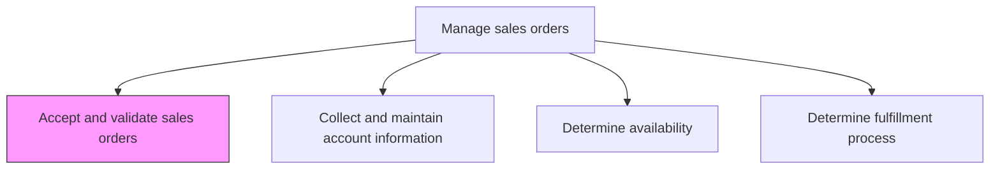
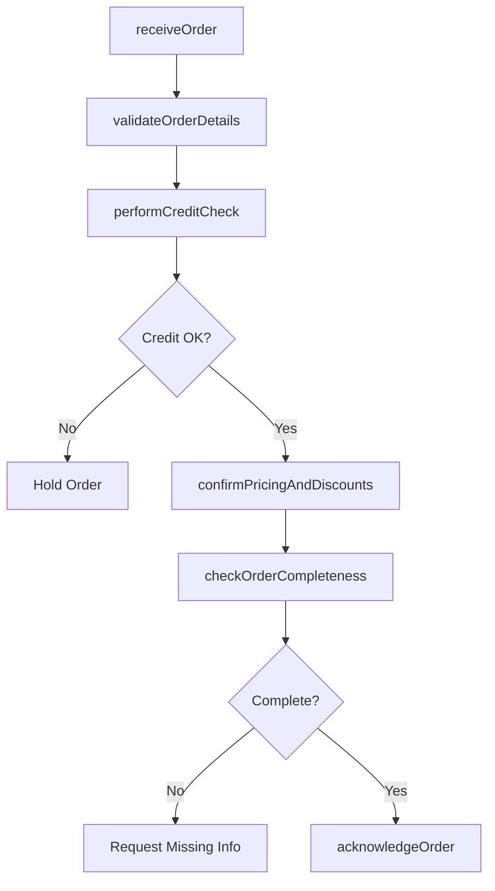

# Accept and validate sales orders

> Business-as-Code definition for sales order acceptance and validation. Models the intake, verification, and confirmation of customer orders including credit checks, pricing validation, and inventory commitment.

## Overview

Receiving and confirming orders from customers. Verify that no extra expenses have to be disbursed on part of the organization for labor or inventory when processing the order.

## Process Hierarchy



## GraphDL

```yaml
accept:
  object: And Validate Sales Orders
  actor: OrderManagementSpecialist
  result: ValidatedSalesOrder
```

## Actions

| Action | Description |
|--------|-------------|
| receiveOrder | Capture incoming sales orders from all channels including web, phone, EDI, and sales reps |
| validateOrderDetails | Verify product codes, quantities, pricing, shipping addresses, and delivery requirements |
| performCreditCheck | Assess customer credit status and payment terms eligibility before order acceptance |
| confirmPricingAndDiscounts | Validate that applied pricing, discounts, and promotional terms match approved agreements |
| checkOrderCompleteness | Ensure all required order fields, documents, and approvals are present |
| acknowledgeOrder | Send order confirmation to the customer with validated details and expected delivery |

## Events

| Event | Description |
|-------|-------------|
| orderReceived | Sales order captured from customer through any channel |
| orderDetailsValidated | Product codes, quantities, and pricing verified against master data |
| creditCheckPerformed | Customer credit status assessed and payment terms confirmed |
| pricingConfirmed | Applied pricing and discounts validated against approved agreements |
| orderCompletenessChecked | Required order fields and documents confirmed present |
| orderAcknowledged | Confirmation sent to customer with validated order details |

## Searches

| Search | Description |
|--------|-------------|
| getOrdersByStatus | Retrieve sales orders filtered by validation status |
| getOrderValidationErrors | Query orders with failed validation checks and error details |
| getCreditCheckResults | Look up credit assessment results by customer or order |
| getOrderAcknowledgments | Access sent order confirmations by customer or date |

## Process Flow



## RACI Matrix

| Activity | Responsible | Accountable | Consulted | Informed |
|----------|-------------|-------------|-----------|----------|
| receiveOrder | OrderManagementSpecialist | OrderManagementManager | Sales | Customer |
| performCreditCheck | CreditAnalyst | CreditManager | Finance | OrderManagementSpecialist |
| confirmPricingAndDiscounts | OrderManagementSpecialist | OrderManagementManager | Pricing | Sales |
| acknowledgeOrder | OrderManagementSpecialist | OrderManagementManager | Logistics | Customer |

## Related Processes

| Process | Relationship |
|---------|-------------|
| 3.5.4.3 Determine availability | Downstream - validated orders require availability checks |
| 3.5.4.5 Enter orders into system | Downstream - validated orders are entered into the order management system |
| 3.5.3 Develop and manage sales proposals/bids/quotes | Upstream - accepted proposals become sales orders |

## Related Departments

| Department | Role |
|-----------|------|
| Order Management | Leads order intake, validation, and acknowledgment |
| Credit | Performs credit checks and approves payment terms |
| Sales | Submits orders and resolves customer inquiries |
| Finance | Oversees credit policies and revenue recognition |

## Related Occupations

| Occupation | Involvement |
|-----------|-------------|
| Order Management Specialist | Validates and processes incoming sales orders |
| Credit Analyst | Assesses customer creditworthiness for order approval |
| Sales Operations Analyst | Monitors order processing efficiency and error rates |

## KPIs

| KPI | Description | Unit |
|-----|-------------|------|
| Order Acceptance Rate | Percentage of received orders that pass validation | % |
| Order Processing Time | Average time from order receipt to acknowledgment | Hours |
| Validation Error Rate | Percentage of orders requiring correction before acceptance | % |
| Credit Hold Rate | Percentage of orders placed on credit hold | % |

## Usage

```typescript
import { acceptAndValidateSalesOrders } from '@headlessly/accept-and-validate-sales-orders'

const orderValidation = acceptAndValidateSalesOrders()

// Validate an incoming sales order
const validated = await orderValidation.validateOrderDetails({
  orderId: 'SO-2026-10501',
  customerId: 'CUST-4820',
  lineItems: [
    { productId: 'SKU-1001', quantity: 50, unitPrice: 99.99 },
    { productId: 'SKU-1002', quantity: 25, unitPrice: 149.99 }
  ],
  shippingAddress: 'warehouse-east',
  requestedDeliveryDate: '2026-03-15'
})

// Perform credit check before order acceptance
const credit = await orderValidation.performCreditCheck({
  customerId: 'CUST-4820',
  orderTotal: validated.orderTotal,
  paymentTerms: 'net-30',
  checkType: 'real-time'
})
```
