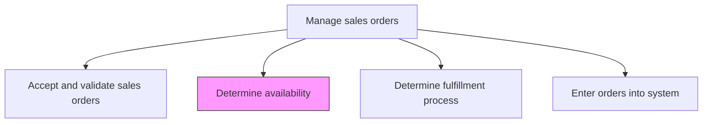
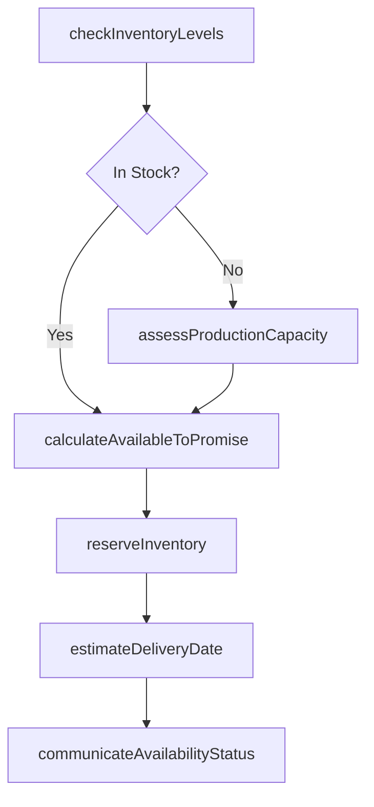

# Determine availability

> Business-as-Code definition for product and service availability determination. Models the process of checking inventory levels, production capacity, and service availability to confirm whether customer orders can be fulfilled on the requested timeline.

## Overview

Ascertaining the volume or scale of products/services to provide to customers to fulfill sales orders. Check the finished products stored in warehouses, the production capacity, and (in the case of services) the processing speed, as well as work force availability.

## Process Hierarchy



## GraphDL

```yaml
determine:
  object: Availability
  actor: InventoryPlanner
  result: AvailabilityConfirmation
```

## Actions

| Action | Description |
|--------|-------------|
| checkInventoryLevels | Query current stock levels across warehouses and distribution centers for ordered items |
| assessProductionCapacity | Evaluate manufacturing or service delivery capacity to fulfill orders not covered by stock |
| calculateAvailableToPromise | Determine the quantity available to promise for each line item based on inventory and demand |
| reserveInventory | Allocate available inventory to the sales order to prevent overselling |
| estimateDeliveryDate | Calculate expected delivery dates based on stock location, production lead times, and logistics |
| communicateAvailabilityStatus | Notify sales and the customer of availability results and any constraints |

## Events

| Event | Description |
|-------|-------------|
| inventoryLevelsChecked | Current stock levels queried across all locations |
| productionCapacityAssessed | Manufacturing or service capacity evaluated for unfulfilled demand |
| availableToPromiseCalculated | Quantity available to promise determined for each order line |
| inventoryReserved | Stock allocated to the sales order |
| deliveryDateEstimated | Expected delivery timeline calculated and confirmed |
| availabilityStatusCommunicated | Availability results shared with sales and customer |

## Searches

| Search | Description |
|--------|-------------|
| getInventoryByProduct | Retrieve current inventory levels by product and location |
| getAvailableToPromise | Query ATP quantities by product and delivery date |
| getProductionSchedule | Look up production capacity and scheduled runs by product |
| getReservationStatus | Access inventory reservation details by order or product |

## Process Flow



## RACI Matrix

| Activity | Responsible | Accountable | Consulted | Informed |
|----------|-------------|-------------|-----------|----------|
| checkInventoryLevels | InventoryPlanner | SupplyChainManager | WarehouseOperations | Sales |
| assessProductionCapacity | ProductionPlanner | OperationsManager | Manufacturing | OrderManagement |
| reserveInventory | InventoryPlanner | SupplyChainManager | OrderManagement | Finance |
| estimateDeliveryDate | LogisticsCoordinator | SupplyChainManager | Shipping | Customer |

## Related Processes

| Process | Relationship |
|---------|-------------|
| 3.5.4.1 Accept and validate sales orders | Upstream - validated orders require availability checks |
| 3.5.4.4 Determine fulfillment process | Downstream - availability results determine which fulfillment path to use |
| 3.5.4.7 Process back orders and updates | Downstream - unavailable items flow to back order processing |

## Related Departments

| Department | Role |
|-----------|------|
| Supply Chain | Leads inventory and capacity availability checks |
| Warehouse Operations | Provides real-time stock level data |
| Production | Assesses manufacturing capacity for made-to-order items |
| Sales | Communicates availability constraints to customers |

## Related Occupations

| Occupation | Involvement |
|-----------|-------------|
| Inventory Planner | Checks stock levels and manages inventory reservations |
| Production Planner | Assesses manufacturing capacity for unfulfilled demand |
| Logistics Coordinator | Estimates delivery timelines based on availability |

## KPIs

| KPI | Description | Unit |
|-----|-------------|------|
| Fill Rate | Percentage of order lines fulfilled from available stock | % |
| Available-to-Promise Accuracy | Accuracy of ATP calculations versus actual fulfillment | % |
| Inventory Check Response Time | Average time to complete availability check per order | Seconds |
| Stockout Rate | Percentage of order lines with zero available inventory | % |

## Usage

```typescript
import { determineAvailability } from '@headlessly/determine-availability'

const availability = determineAvailability()

// Check inventory and calculate available to promise
const atp = await availability.calculateAvailableToPromise({
  lineItems: [
    { productId: 'SKU-1001', quantity: 50 },
    { productId: 'SKU-1002', quantity: 25 }
  ],
  requestedDate: '2026-03-15',
  locations: ['warehouse-east', 'warehouse-west']
})

// Reserve inventory for confirmed order
const reservation = await availability.reserveInventory({
  orderId: 'SO-2026-10501',
  lineItems: atp.availableItems,
  reservationExpiry: '2026-02-20T23:59:59Z'
})
```
