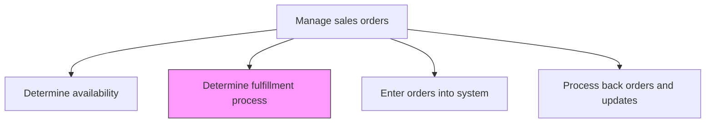
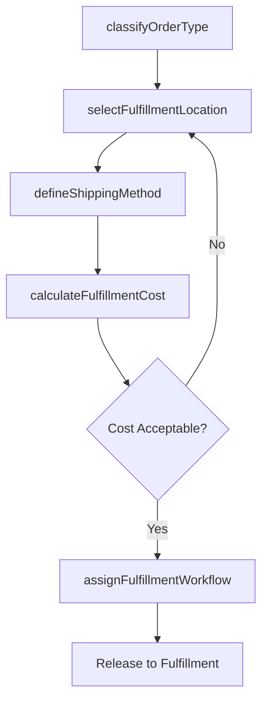

# Determine fulfillment process

> Business-as-Code definition for fulfillment process determination. Models the routing logic that selects the optimal fulfillment path for each sales order based on product type, inventory location, delivery requirements, and cost considerations.

## Overview

Devising a blueprint for order fulfillment. Create a schematic flow encompassing all activities to deliver orders to the customers. Outline a procedure for satisfying these orders by answering questions about what needs to happen in sequence to realize an order.

## Process Hierarchy



## GraphDL

```yaml
determine:
  object: Fulfillment Process
  actor: FulfillmentManager
  result: FulfillmentPlan
```

## Actions

| Action | Description |
|--------|-------------|
| classifyOrderType | Categorize the order by fulfillment type such as ship-from-stock, make-to-order, drop-ship, or digital delivery |
| selectFulfillmentLocation | Determine the optimal warehouse, distribution center, or manufacturing facility to fulfill each line item |
| defineShippingMethod | Select the shipping carrier, service level, and delivery route based on customer requirements and cost |
| assignFulfillmentWorkflow | Map the order to the appropriate fulfillment workflow including pick, pack, ship, or service delivery steps |
| calculateFulfillmentCost | Estimate the total cost of fulfillment including handling, shipping, and any special processing fees |

## Events

| Event | Description |
|-------|-------------|
| orderTypeClassified | Order categorized by fulfillment type |
| fulfillmentLocationSelected | Optimal fulfillment location determined for each line item |
| shippingMethodDefined | Carrier, service level, and route selected |
| fulfillmentWorkflowAssigned | Order mapped to the appropriate fulfillment process |
| fulfillmentCostCalculated | Total fulfillment cost estimated for the order |

## Searches

| Search | Description |
|--------|-------------|
| getFulfillmentOptions | Retrieve available fulfillment paths by product type and location |
| getShippingRates | Query carrier rates by destination, weight, and service level |
| getFulfillmentCosts | Look up estimated fulfillment costs by order or location |
| getFulfillmentWorkflows | Access configured fulfillment workflows by order type |

## Process Flow



## RACI Matrix

| Activity | Responsible | Accountable | Consulted | Informed |
|----------|-------------|-------------|-----------|----------|
| classifyOrderType | OrderManagementSpecialist | FulfillmentManager | Sales | WarehouseOperations |
| selectFulfillmentLocation | FulfillmentManager | SupplyChainDirector | InventoryPlanner | Logistics |
| defineShippingMethod | LogisticsCoordinator | FulfillmentManager | CarrierManagement | Customer |
| calculateFulfillmentCost | FulfillmentAnalyst | FulfillmentManager | Finance | Sales |

## Related Processes

| Process | Relationship |
|---------|-------------|
| 3.5.4.3 Determine availability | Upstream - availability data determines which fulfillment locations and methods are viable |
| 3.5.4.5 Enter orders into system | Downstream - fulfillment plan is recorded with the order in the system |
| 4.3.1 Plan and align supply chain resources | Parallel - supply chain planning informs fulfillment capabilities |

## Related Departments

| Department | Role |
|-----------|------|
| Fulfillment | Leads fulfillment process selection and workflow assignment |
| Logistics | Manages carrier selection and shipping route optimization |
| Warehouse Operations | Executes the assigned fulfillment workflow |
| Finance | Validates fulfillment cost estimates and margin impact |

## Related Occupations

| Occupation | Involvement |
|-----------|-------------|
| Fulfillment Manager | Determines optimal fulfillment process for each order |
| Logistics Coordinator | Selects shipping methods and manages carrier relationships |
| Supply Chain Analyst | Analyzes fulfillment patterns to optimize process selection |

## KPIs

| KPI | Description | Unit |
|-----|-------------|------|
| Fulfillment Routing Accuracy | Percentage of orders routed to the correct fulfillment path on first attempt | % |
| Average Fulfillment Cost | Mean cost per order for picking, packing, and shipping | Currency |
| Fulfillment Process Time | Average time from order release to shipment | Hours |
| On-Time Fulfillment Rate | Percentage of orders fulfilled by the committed delivery date | % |

## Usage

```typescript
import { determineFulfillmentProcess } from '@headlessly/determine-fulfillment-process'

const fulfillment = determineFulfillmentProcess()

// Select the optimal fulfillment location and method
const plan = await fulfillment.selectFulfillmentLocation({
  orderId: 'SO-2026-10501',
  lineItems: [
    { productId: 'SKU-1001', quantity: 50, weight: 2.5 },
    { productId: 'SKU-1002', quantity: 25, weight: 1.8 }
  ],
  destination: { zip: '10001', country: 'US' },
  requestedDelivery: '2026-03-15',
  optimizeFor: 'cost-and-speed'
})

// Assign the fulfillment workflow
const workflow = await fulfillment.assignFulfillmentWorkflow({
  orderId: 'SO-2026-10501',
  fulfillmentType: plan.recommendedType,
  location: plan.selectedLocation,
  shippingMethod: plan.recommendedCarrier
})
```
