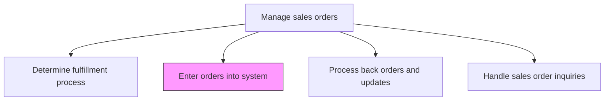
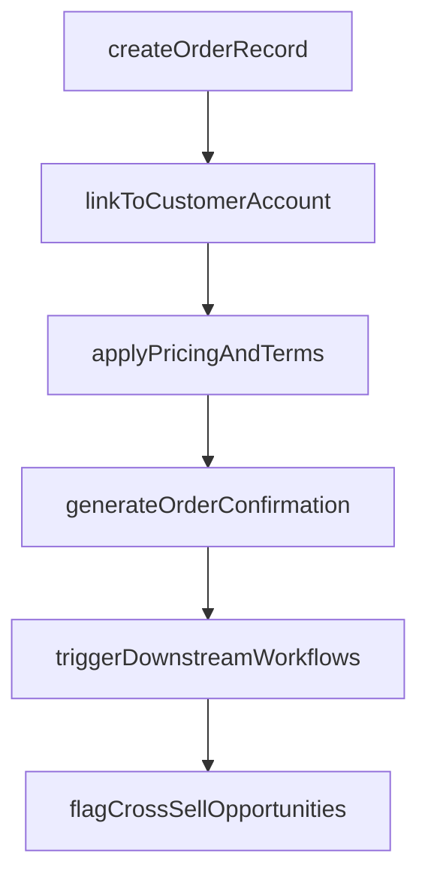

# Enter orders into system

> Business-as-Code definition for sales order system entry. Models the recording of validated sales orders into enterprise systems, triggering downstream fulfillment, billing, and analytics workflows.

## Overview

Analyzing all data relating to sales orders by entering it into a centralized repository, and using the insights generated to create opportunities for cross-/up-selling. Maintain up-to-date records of sales, along with current status. Include all sales activity with relevant information about the associated customers, and identify patterns in the data. Glean insights from these patterns to persuade customers to purchase additional offerings or upgrade purchased products/services.

## Process Hierarchy



## GraphDL

```yaml
enter:
  object: Orders Into System
  actor: OrderEntrySpecialist
  result: SystemRecordedSalesOrder
```

## Actions

| Action | Description |
|--------|-------------|
| createOrderRecord | Enter validated order details including customer, products, pricing, and delivery into the ERP or OMS |
| linkToCustomerAccount | Associate the sales order with the customer master record and account hierarchy |
| applyPricingAndTerms | Confirm and apply negotiated pricing, discounts, payment terms, and tax calculations |
| triggerDownstreamWorkflows | Initiate fulfillment, billing, commission calculation, and inventory reservation processes |
| generateOrderConfirmation | Produce the formal order confirmation document for the customer |
| flagCrossSellOpportunities | Identify and record cross-sell or up-sell opportunities based on order patterns |

## Events

| Event | Description |
|-------|-------------|
| orderRecordCreated | Sales order entered into the enterprise system |
| orderLinkedToAccount | Order associated with customer master record |
| pricingAndTermsApplied | Negotiated pricing and payment terms confirmed in the system |
| downstreamWorkflowsTriggered | Fulfillment, billing, and commission processes initiated |
| orderConfirmationGenerated | Formal order confirmation produced and ready for delivery |
| crossSellOpportunitiesFlagged | Cross-sell or up-sell potential identified from order data |

## Searches

| Search | Description |
|--------|-------------|
| getOrdersByCustomer | Retrieve all orders for a specific customer account |
| getOrderStatus | Query the current status of a sales order in the system |
| getOrderHistory | Look up historical orders by product, customer, or date range |
| getCrossSellRecommendations | Access cross-sell and up-sell opportunities flagged from order patterns |

## Process Flow



## RACI Matrix

| Activity | Responsible | Accountable | Consulted | Informed |
|----------|-------------|-------------|-----------|----------|
| createOrderRecord | OrderEntrySpecialist | OrderManagementManager | Sales | IT |
| applyPricingAndTerms | OrderEntrySpecialist | OrderManagementManager | Pricing | Finance |
| triggerDownstreamWorkflows | OrderManagementSystem | OrderManagementManager | Fulfillment | Billing |
| flagCrossSellOpportunities | SalesAnalyst | SalesManager | Marketing | AccountManagers |

## Related Processes

| Process | Relationship |
|---------|-------------|
| 3.5.4.4 Determine fulfillment process | Upstream - fulfillment plan is recorded with the order |
| 3.5.4.1 Accept and validate sales orders | Upstream - validated orders are entered into the system |
| 3.5.4.9 Identify/perform cross-sell/up-sell activity | Downstream - order entry data feeds cross-sell identification |

## Related Departments

| Department | Role |
|-----------|------|
| Order Management | Enters and maintains order records in enterprise systems |
| IT | Maintains order management system integrations and data flows |
| Sales | Provides order details and acts on cross-sell opportunities |
| Finance | Receives billing triggers and revenue recognition data |

## Related Occupations

| Occupation | Involvement |
|-----------|-------------|
| Order Entry Specialist | Records validated orders into enterprise systems |
| Sales Operations Analyst | Monitors order data quality and identifies process improvements |
| Systems Administrator | Maintains order management system configurations |

## KPIs

| KPI | Description | Unit |
|-----|-------------|------|
| Order Entry Accuracy | Percentage of orders entered without data errors | % |
| Order Entry Cycle Time | Average time from validation to system entry completion | Minutes |
| System Uptime | Availability of order management system for order entry | % |
| Cross-Sell Identification Rate | Percentage of orders with flagged cross-sell opportunities | % |

## Usage

```typescript
import { enterOrdersIntoSystem } from '@headlessly/enter-orders-into-system'

const orderEntry = enterOrdersIntoSystem()

// Create order record in the system
const order = await orderEntry.createOrderRecord({
  customerId: 'CUST-4820',
  lineItems: [
    { productId: 'SKU-1001', quantity: 50, unitPrice: 99.99, discount: 0.10 },
    { productId: 'SKU-1002', quantity: 25, unitPrice: 149.99 }
  ],
  paymentTerms: 'net-30',
  fulfillmentPlan: 'ship-from-warehouse-east',
  requestedDeliveryDate: '2026-03-15'
})

// Trigger downstream workflows
const workflows = await orderEntry.triggerDownstreamWorkflows({
  orderId: order.id,
  workflows: ['fulfillment', 'billing', 'commission-calculation', 'inventory-reservation'],
  priority: 'standard'
})
```
