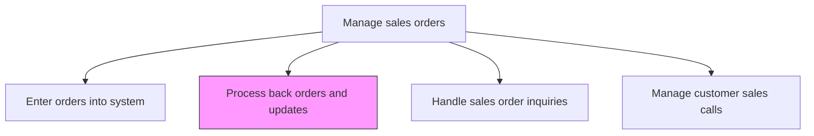
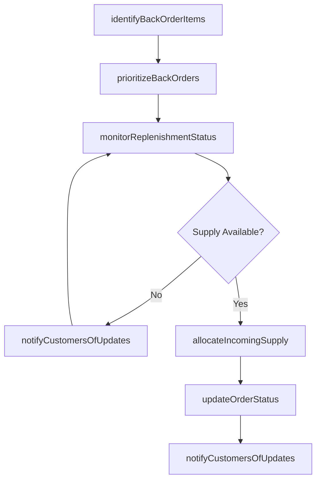

# Process back orders and updates

> Business-as-Code definition for back order processing and order status updates. Models the management of unfulfilled orders due to inventory shortages, including priority allocation, customer communication, and order status tracking.

## Overview

Processing any unfulfilled orders, and updating the status of any orders that have been accepted and are being attended to. Deliver on any purchase orders that remain unserviced due to temporary unavailability of the product/service. Manage any updates to the sales orders. Revise their status in the order system.

## Process Hierarchy



## GraphDL

```yaml
process:
  object: Back Orders And Updates
  actor: OrderManagementSpecialist
  result: ProcessedBackOrder
```

## Actions

| Action | Description |
|--------|-------------|
| identifyBackOrderItems | Flag order line items that cannot be fulfilled from current inventory or production capacity |
| prioritizeBackOrders | Rank unfulfilled orders by customer priority, order age, and business impact for allocation |
| monitorReplenishmentStatus | Track incoming inventory and production schedules for back-ordered items |
| allocateIncomingSupply | Assign newly available inventory to back orders based on priority and allocation rules |
| updateOrderStatus | Revise order status in the system to reflect current fulfillment progress |
| notifyCustomersOfUpdates | Communicate back order status, expected availability dates, and any changes to customers |

## Events

| Event | Description |
|-------|-------------|
| backOrderItemsIdentified | Order lines flagged as unfulfillable from current stock |
| backOrdersPrioritized | Unfulfilled orders ranked for allocation |
| replenishmentStatusMonitored | Incoming supply tracked for back-ordered products |
| incomingSupplyAllocated | New inventory assigned to prioritized back orders |
| orderStatusUpdated | Order status revised in the system |
| customersNotifiedOfUpdates | Back order status and changes communicated to customers |

## Searches

| Search | Description |
|--------|-------------|
| getBackOrders | Retrieve unfulfilled orders by product, customer, or age |
| getReplenishmentETA | Query expected arrival dates for back-ordered products |
| getOrderStatusHistory | Look up the status change history of a sales order |
| getBackOrderAllocations | Access allocation queue and priority assignments |

## Process Flow



## RACI Matrix

| Activity | Responsible | Accountable | Consulted | Informed |
|----------|-------------|-------------|-----------|----------|
| identifyBackOrderItems | OrderManagementSpecialist | OrderManagementManager | InventoryPlanner | Sales |
| prioritizeBackOrders | OrderManagementManager | VP Sales | KeyAccountManagers | Customer |
| allocateIncomingSupply | InventoryPlanner | SupplyChainManager | OrderManagement | Production |
| notifyCustomersOfUpdates | CustomerServiceRep | OrderManagementManager | Sales | Customer |

## Related Processes

| Process | Relationship |
|---------|-------------|
| 3.5.4.3 Determine availability | Upstream - availability shortfalls create back orders |
| 3.5.4.6 Handle sales order inquiries | Parallel - customers inquire about back order status |
| 4.3.2 Procure materials and services | Upstream - procurement and replenishment supply back-ordered items |

## Related Departments

| Department | Role |
|-----------|------|
| Order Management | Manages back order processing and customer notifications |
| Supply Chain | Monitors replenishment and allocates incoming supply |
| Sales | Communicates with priority customers about order delays |
| Customer Service | Handles customer inquiries about back order status |

## Related Occupations

| Occupation | Involvement |
|-----------|-------------|
| Order Management Specialist | Processes back orders and manages allocation queues |
| Inventory Planner | Tracks replenishment and allocates incoming supply |
| Customer Service Representative | Communicates status updates to affected customers |

## KPIs

| KPI | Description | Unit |
|-----|-------------|------|
| Back Order Rate | Percentage of order lines that go to back order status | % |
| Back Order Aging | Average number of days orders remain in back order status | Days |
| Back Order Fill Rate | Percentage of back orders fulfilled within the promised timeframe | % |
| Customer Notification Timeliness | Percentage of status updates communicated within SLA | % |

## Usage

```typescript
import { processBackOrdersAndUpdates } from '@headlessly/process-back-orders-and-updates'

const backOrders = processBackOrdersAndUpdates()

// Prioritize back orders for allocation
const prioritized = await backOrders.prioritizeBackOrders({
  products: ['SKU-1001', 'SKU-1002'],
  priorityRules: ['customer-tier', 'order-age', 'order-value'],
  customerTierWeights: { platinum: 3, gold: 2, silver: 1 }
})

// Allocate incoming supply to back orders
const allocated = await backOrders.allocateIncomingSupply({
  productId: 'SKU-1001',
  incomingQuantity: 200,
  allocationQueue: prioritized.queue,
  allocationMethod: 'priority-first'
})
```
