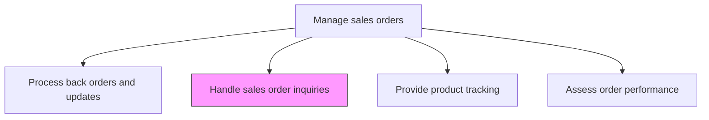
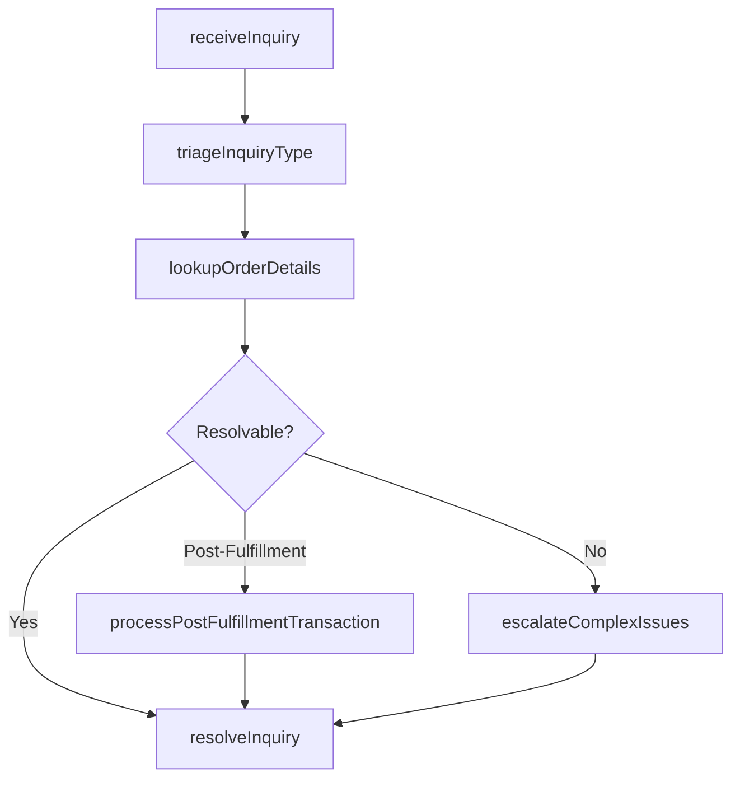

# Handle sales order inquiries including post-order fulfillment transactions

> Business-as-Code definition for sales order inquiry handling. Models the process of receiving, triaging, and resolving customer questions about order status, modifications, returns, and post-fulfillment transactions.

## Overview

Attending to any queries received from the customers, even after a sales order has been serviced. Deploy ad hoc personnel for managing these enquiries.

## Process Hierarchy



## GraphDL

```yaml
handle:
  object: Sales Order Inquiries Including Post-order Fulfillment Transactions
  actor: CustomerServiceRepresentative
  result: ResolvedOrderInquiry
```

## Actions

| Action | Description |
|--------|-------------|
| receiveInquiry | Capture customer questions about orders through phone, email, chat, or self-service portal |
| triageInquiryType | Classify the inquiry as status check, modification request, return, billing question, or complaint |
| lookupOrderDetails | Retrieve complete order information including status, shipment tracking, and fulfillment history |
| resolveInquiry | Provide the customer with the requested information or process the required transaction |
| processPostFulfillmentTransaction | Handle returns, exchanges, credits, or order modifications after delivery |
| escalateComplexIssues | Route unresolved or high-priority inquiries to specialized teams or management |

## Events

| Event | Description |
|-------|-------------|
| inquiryReceived | Customer order inquiry captured through any channel |
| inquiryTriaged | Inquiry classified by type and priority |
| orderDetailsLookedUp | Complete order information retrieved for the customer |
| inquiryResolved | Customer question answered or transaction completed |
| postFulfillmentTransactionProcessed | Return, exchange, or credit processed after delivery |
| complexIssueEscalated | Unresolved inquiry routed to specialized team |

## Searches

| Search | Description |
|--------|-------------|
| getInquiriesByCustomer | Retrieve all open and resolved inquiries for a customer account |
| getInquiryByType | Query inquiries filtered by type, channel, or resolution status |
| getPostFulfillmentTransactions | Look up return, exchange, and credit transactions by order |
| getEscalatedInquiries | Access inquiries escalated to management or specialized teams |

## Process Flow



## RACI Matrix

| Activity | Responsible | Accountable | Consulted | Informed |
|----------|-------------|-------------|-----------|----------|
| receiveInquiry | CustomerServiceRepresentative | CustomerServiceManager | OrderManagement | Sales |
| resolveInquiry | CustomerServiceRepresentative | CustomerServiceManager | Fulfillment | Customer |
| processPostFulfillmentTransaction | ReturnSpecialist | CustomerServiceManager | Finance | Warehouse |
| escalateComplexIssues | CustomerServiceManager | VP CustomerService | Legal | Sales |

## Related Processes

| Process | Relationship |
|---------|-------------|
| 3.5.4.7 Process back orders and updates | Parallel - customers inquire about back-ordered items |
| 3.5.4.9 Provide product tracking | Parallel - tracking inquiries are a common order question type |
| 6.1.2 Manage customer service requests | Parallel - order inquiries are a subset of customer service |

## Related Departments

| Department | Role |
|-----------|------|
| Customer Service | Leads inquiry handling and resolution |
| Order Management | Provides order data and processes modifications |
| Fulfillment | Supports shipment and delivery-related inquiries |
| Finance | Processes credits, refunds, and billing adjustments |

## Related Occupations

| Occupation | Involvement |
|-----------|-------------|
| Customer Service Representative | Handles and resolves customer order inquiries |
| Returns Specialist | Processes post-fulfillment transactions |
| Customer Service Manager | Oversees inquiry resolution and manages escalations |

## KPIs

| KPI | Description | Unit |
|-----|-------------|------|
| First Contact Resolution Rate | Percentage of inquiries resolved on the first interaction | % |
| Average Resolution Time | Mean time from inquiry receipt to resolution | Hours |
| Inquiry Volume per Order | Average number of inquiries generated per sales order | Ratio |
| Customer Satisfaction Score | Post-inquiry satisfaction rating | Score (1-5) |

## Usage

```typescript
import { handleSalesOrderInquiriesIncludingPostOrderFulfillmentTransactions } from '@headlessly/handle-sales-order-inquiries-including-post-order-fulfillment-transactions'

const inquiries = handleSalesOrderInquiriesIncludingPostOrderFulfillmentTransactions()

// Look up order details for a customer inquiry
const details = await inquiries.lookupOrderDetails({
  orderId: 'SO-2026-10501',
  includeShipmentTracking: true,
  includePaymentHistory: true,
  includeModificationHistory: true
})

// Process a post-fulfillment return
const returnTx = await inquiries.processPostFulfillmentTransaction({
  orderId: 'SO-2026-10501',
  transactionType: 'return',
  lineItems: [{ productId: 'SKU-1002', quantity: 5, reason: 'defective' }],
  refundMethod: 'original-payment',
  returnShippingLabel: true
})
```
