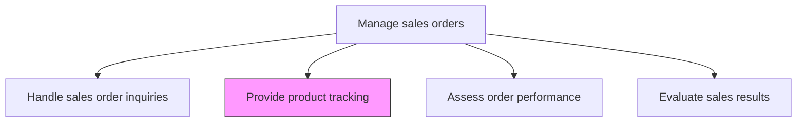
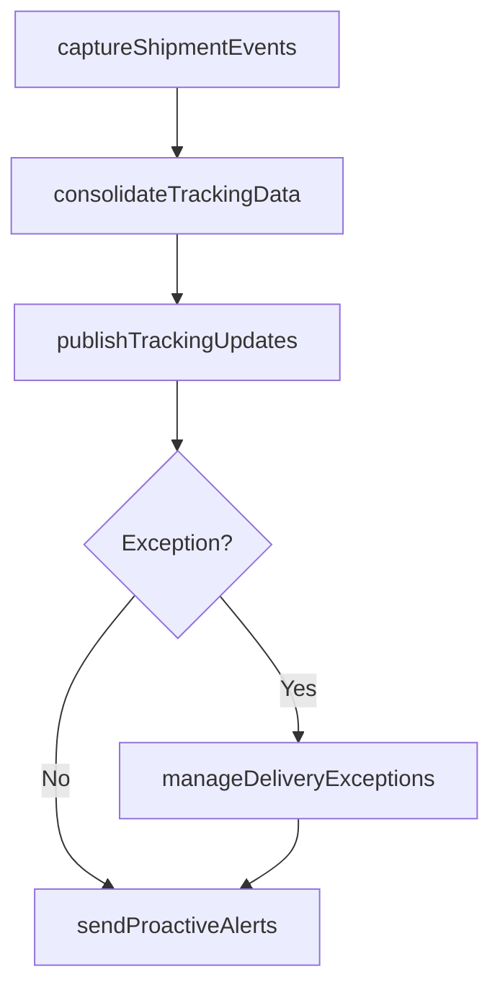

# Provide product tracking

> Business-as-Code definition for product tracking provision. Models the process of capturing, consolidating, and delivering real-time shipment and delivery tracking information to customers and internal stakeholders.

## Overview

Providing customers and internal stakeholders with visibility into the status and location of ordered products throughout the fulfillment and delivery lifecycle. Consolidate tracking data from carriers, warehouses, and logistics systems to enable self-service order tracking, proactive delivery notifications, and exception alerting.

## Process Hierarchy



## GraphDL

```yaml
provide:
  object: Product Tracking
  actor: LogisticsCoordinator
  result: TrackingUpdate
```

## Actions

| Action | Description |
|--------|-------------|
| captureShipmentEvents | Collect tracking events from carriers and logistics systems including pickup, transit, and delivery milestones |
| consolidateTrackingData | Aggregate tracking information from multiple carriers and shipments into a unified order-level view |
| publishTrackingUpdates | Make tracking information available through customer portal, email notifications, and API |
| sendProactiveAlerts | Notify customers of delivery milestones, delays, or exceptions before they inquire |
| manageDeliveryExceptions | Identify and address shipment issues such as delays, damages, or failed deliveries |

## Events

| Event | Description |
|-------|-------------|
| shipmentEventsCaptured | Carrier tracking events collected for shipments |
| trackingDataConsolidated | Multi-carrier tracking data unified at the order level |
| trackingUpdatesPublished | Tracking information made available to customers and stakeholders |
| proactiveAlertsSent | Delivery milestone or exception notifications delivered to customers |
| deliveryExceptionsManaged | Shipment issues identified and resolution actions initiated |

## Searches

| Search | Description |
|--------|-------------|
| getTrackingByOrder | Retrieve tracking status and events for a specific order |
| getShipmentsByStatus | Query shipments filtered by status such as in-transit, delivered, or exception |
| getDeliveryExceptions | Look up shipments with active delivery issues |
| getDeliveryETAs | Access estimated delivery dates by order or shipment |

## Process Flow



## RACI Matrix

| Activity | Responsible | Accountable | Consulted | Informed |
|----------|-------------|-------------|-----------|----------|
| captureShipmentEvents | LogisticsCoordinator | LogisticsManager | Carriers | IT |
| publishTrackingUpdates | IT | LogisticsManager | CustomerService | Customer |
| sendProactiveAlerts | CustomerCommunications | LogisticsManager | CustomerService | Sales |
| manageDeliveryExceptions | LogisticsCoordinator | LogisticsManager | Carriers | CustomerService |

## Related Processes

| Process | Relationship |
|---------|-------------|
| 3.5.4.8 Handle sales order inquiries | Parallel - tracking data supports order status inquiries |
| 3.5.4.7 Process back orders and updates | Parallel - tracking updates reflect back order fulfillment progress |
| 4.4.3 Manage logistics and warehousing | Upstream - logistics operations generate tracking data |

## Related Departments

| Department | Role |
|-----------|------|
| Logistics | Captures and manages shipment tracking data |
| IT | Maintains tracking systems and customer-facing interfaces |
| Customer Service | Uses tracking data to answer customer inquiries |
| Customer Communications | Delivers proactive tracking notifications |

## Related Occupations

| Occupation | Involvement |
|-----------|-------------|
| Logistics Coordinator | Monitors shipments and manages delivery exceptions |
| Systems Integration Specialist | Maintains carrier data integrations |
| Customer Service Representative | Uses tracking data to resolve customer inquiries |

## KPIs

| KPI | Description | Unit |
|-----|-------------|------|
| Tracking Data Availability | Percentage of shipments with real-time tracking data | % |
| Proactive Notification Rate | Percentage of delivery milestones with automated customer notifications | % |
| Exception Detection Time | Average time to detect and flag delivery exceptions | Hours |
| Self-Service Tracking Usage | Percentage of tracking lookups handled through self-service channels | % |

## Usage

```typescript
import { provideProductTracking } from '@headlessly/provide-product-tracking'

const tracking = provideProductTracking()

// Get consolidated tracking for an order
const status = await tracking.consolidateTrackingData({
  orderId: 'SO-2026-10501',
  includeCarrierDetails: true,
  includeETAs: true,
  includeSignatureProof: true
})

// Send proactive delivery alert
const alert = await tracking.sendProactiveAlerts({
  orderId: 'SO-2026-10501',
  alertType: 'out-for-delivery',
  channels: ['email', 'sms'],
  estimatedDeliveryWindow: '2026-03-15T10:00:00Z/2026-03-15T14:00:00Z'
})
```
