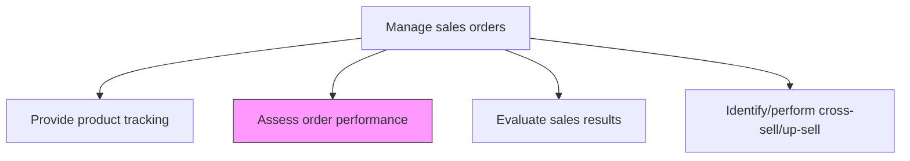
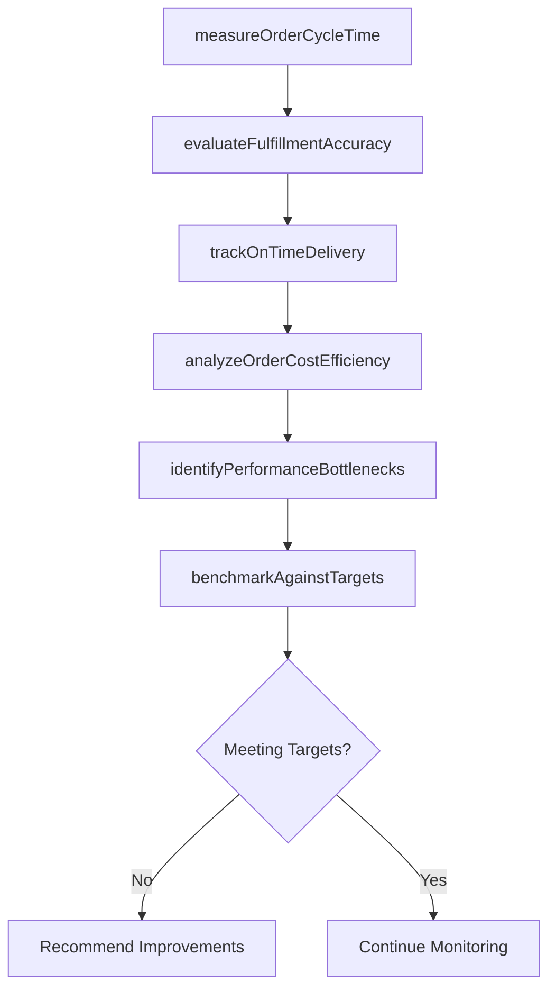

# Assess order performance

> Business-as-Code definition for order performance assessment. Models the measurement and evaluation of order processing efficiency, fulfillment accuracy, delivery timeliness, and customer satisfaction across the order management lifecycle.

## Overview

Evaluating the operational performance of the order management process across key dimensions including processing speed, fulfillment accuracy, on-time delivery, and cost efficiency. Measure order-to-cash cycle times, identify bottlenecks, and benchmark performance against targets and industry standards to drive continuous improvement.

## Process Hierarchy



## GraphDL

```yaml
assess:
  object: Order Performance
  actor: SalesOperationsAnalyst
  result: OrderPerformanceReport
```

## Actions

| Action | Description |
|--------|-------------|
| measureOrderCycleTime | Calculate the elapsed time from order receipt to delivery for each order and segment |
| evaluateFulfillmentAccuracy | Assess the percentage of orders fulfilled completely and correctly without errors |
| trackOnTimeDelivery | Monitor the percentage of orders delivered by the promised date |
| analyzeOrderCostEfficiency | Calculate the cost per order processed across order management operations |
| identifyPerformanceBottlenecks | Pinpoint process steps that create delays or errors in the order lifecycle |
| benchmarkAgainstTargets | Compare actual order performance metrics against established goals and industry standards |

## Events

| Event | Description |
|-------|-------------|
| orderCycleTimeMeasured | Order-to-delivery cycle times calculated |
| fulfillmentAccuracyEvaluated | Order completeness and correctness rates assessed |
| onTimeDeliveryTracked | Delivery timeliness metrics updated |
| orderCostEfficiencyAnalyzed | Per-order processing costs calculated |
| performanceBottlenecksIdentified | Process delays and error sources pinpointed |
| performanceBenchmarked | Actual metrics compared against targets and standards |

## Searches

| Search | Description |
|--------|-------------|
| getOrderPerformanceMetrics | Retrieve order performance data by period, channel, or product |
| getCycleTimeAnalysis | Query order cycle time breakdowns by process step |
| getPerformanceTrends | Look up order performance trends over time |
| getBottleneckReport | Access identified bottlenecks and their impact on performance |

## Process Flow



## RACI Matrix

| Activity | Responsible | Accountable | Consulted | Informed |
|----------|-------------|-------------|-----------|----------|
| measureOrderCycleTime | SalesOperationsAnalyst | SalesOperationsManager | OrderManagement | VP Sales |
| evaluateFulfillmentAccuracy | SalesOperationsAnalyst | SalesOperationsManager | Fulfillment | QualityAssurance |
| identifyPerformanceBottlenecks | SalesOperationsManager | VP Sales | IT | ProcessImprovement |
| benchmarkAgainstTargets | SalesOperationsAnalyst | VP Sales | Finance | ExecutiveTeam |

## Related Processes

| Process | Relationship |
|---------|-------------|
| 3.5.4.11 Evaluate sales results | Parallel - order performance contributes to overall sales evaluation |
| 3.5.4.1 Accept and validate sales orders | Upstream - order acceptance metrics feed performance assessment |
| 3.5.4.4 Determine fulfillment process | Upstream - fulfillment efficiency impacts order performance |

## Related Departments

| Department | Role |
|-----------|------|
| Sales Operations | Leads order performance measurement and analysis |
| Order Management | Provides order processing data and operational insights |
| Fulfillment | Contributes fulfillment accuracy and delivery timeliness data |
| Quality Assurance | Validates measurement methodology and accuracy |

## Related Occupations

| Occupation | Involvement |
|-----------|-------------|
| Sales Operations Analyst | Measures order performance metrics and identifies trends |
| Sales Operations Manager | Reviews performance data and drives improvement initiatives |
| Process Improvement Specialist | Addresses identified bottlenecks and optimizes workflows |

## KPIs

| KPI | Description | Unit |
|-----|-------------|------|
| Order Cycle Time | Average time from order receipt to customer delivery | Days |
| Perfect Order Rate | Percentage of orders delivered complete, accurate, on time, and undamaged | % |
| On-Time Delivery Rate | Percentage of orders delivered by the promised date | % |
| Cost per Order | Average operational cost to process a single sales order | Currency |

## Usage

```typescript
import { assessOrderPerformance } from '@headlessly/assess-order-performance'

const performance = assessOrderPerformance()

// Measure order cycle times by segment
const cycleTimes = await performance.measureOrderCycleTime({
  period: 'last-quarter',
  segments: ['enterprise', 'mid-market', 'smb'],
  breakdownBy: ['validation', 'fulfillment', 'shipping', 'delivery'],
  compareWith: 'prior-quarter'
})

// Identify performance bottlenecks
const bottlenecks = await performance.identifyPerformanceBottlenecks({
  period: 'last-quarter',
  thresholds: { maxCycleTime: 5, minAccuracy: 0.98, minOnTime: 0.95 },
  analyzeRootCauses: true
})
```
