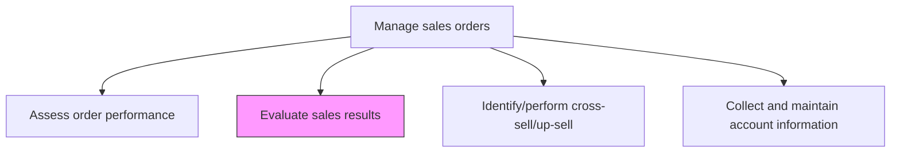
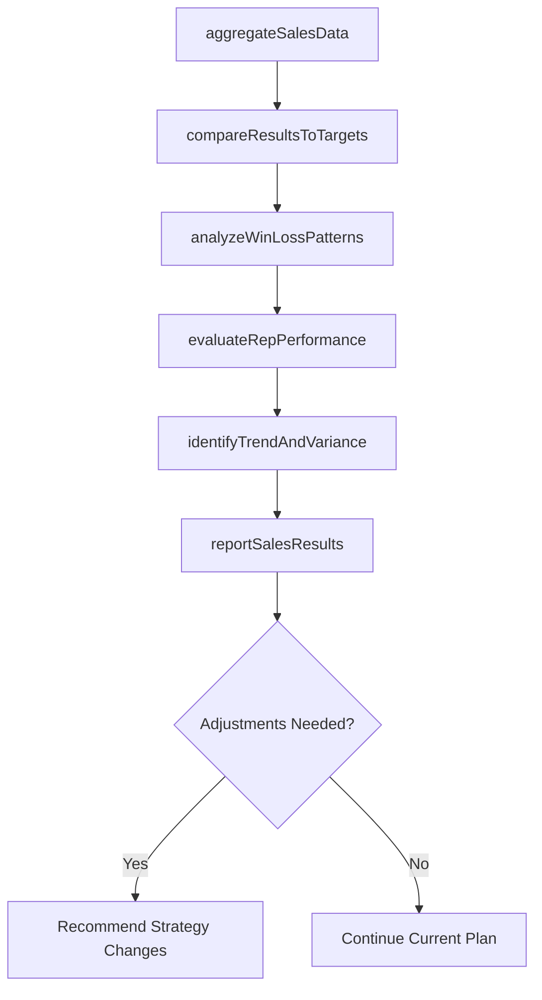

# Evaluate sales results

> Business-as-Code definition for sales results evaluation. Models the analysis of sales outcomes against targets, quotas, and forecasts to measure team effectiveness and inform future planning.

## Overview

Evaluating actual sales performance against established targets, quotas, and forecasts. Compare revenue, volume, and margin results by territory, product, channel, and sales representative. Identify overperforming and underperforming areas, analyze win/loss patterns, and generate insights that inform sales strategy adjustments and resource reallocation.

## Process Hierarchy



## GraphDL

```yaml
evaluate:
  object: Sales Results
  actor: SalesOperationsManager
  result: SalesResultsReport
```

## Actions

| Action | Description |
|--------|-------------|
| aggregateSalesData | Compile sales results across territories, products, channels, and time periods |
| compareResultsToTargets | Measure actual revenue, volume, and margin against quotas and forecasts |
| analyzeWinLossPatterns | Examine closed deals and lost opportunities to identify success factors and barriers |
| evaluateRepPerformance | Assess individual and team sales performance against assigned quotas |
| identifyTrendAndVariance | Detect patterns in sales results and flag significant variances from plan |
| reportSalesResults | Produce comprehensive sales results reports with insights and recommendations |

## Events

| Event | Description |
|-------|-------------|
| salesDataAggregated | Sales results compiled across all dimensions |
| resultsComparedToTargets | Actual performance measured against quotas and forecasts |
| winLossPatternsAnalyzed | Success factors and barriers identified from deal outcomes |
| repPerformanceEvaluated | Individual and team quota attainment assessed |
| trendsAndVariancesIdentified | Significant patterns and deviations flagged |
| salesResultsReported | Comprehensive results reports published to stakeholders |

## Searches

| Search | Description |
|--------|-------------|
| getSalesResults | Retrieve sales results by territory, product, rep, or period |
| getQuotaAttainment | Query quota attainment rates by rep, team, or territory |
| getWinLossAnalysis | Look up win/loss data by product, competitor, or deal size |
| getSalesVarianceReport | Access variance analysis between actual results and plan |

## Process Flow



## RACI Matrix

| Activity | Responsible | Accountable | Consulted | Informed |
|----------|-------------|-------------|-----------|----------|
| aggregateSalesData | SalesOperationsAnalyst | SalesOperationsManager | IT | Finance |
| compareResultsToTargets | SalesOperationsAnalyst | VP Sales | Finance | ExecutiveTeam |
| evaluateRepPerformance | SalesManager | VP Sales | HR | SalesReps |
| reportSalesResults | SalesOperationsManager | VP Sales | Finance | CMO |

## Related Processes

| Process | Relationship |
|---------|-------------|
| 3.5.4.10 Assess order performance | Parallel - order performance data complements sales results evaluation |
| 3.4.5 Establish sales goals and measures | Upstream - established goals provide the benchmarks for evaluation |
| 3.3.7.2 Analyze customer revenue trend | Parallel - customer revenue trends inform sales results interpretation |

## Related Departments

| Department | Role |
|-----------|------|
| Sales Operations | Leads sales results analysis and reporting |
| Sales | Provides deal-level data and qualitative context |
| Finance | Validates revenue figures and margin calculations |
| HR | Uses performance data for compensation and development decisions |

## Related Occupations

| Occupation | Involvement |
|-----------|-------------|
| Sales Operations Manager | Oversees sales results evaluation and reporting |
| Sales Operations Analyst | Aggregates data and produces analysis |
| Sales Manager | Reviews team performance and implements adjustments |

## KPIs

| KPI | Description | Unit |
|-----|-------------|------|
| Quota Attainment | Percentage of sales quota achieved across the organization | % |
| Win Rate | Percentage of qualified opportunities that convert to closed deals | % |
| Average Deal Size | Mean revenue per closed deal | Currency |
| Sales Forecast Accuracy | Variance between forecasted and actual sales results | % |

## Usage

```typescript
import { evaluateSalesResults } from '@headlessly/evaluate-sales-results'

const results = evaluateSalesResults()

// Compare sales results to targets
const comparison = await results.compareResultsToTargets({
  period: 'Q4-2025',
  dimensions: ['territory', 'product-line', 'sales-rep'],
  metrics: ['revenue', 'units', 'margin', 'deal-count'],
  includeVarianceAnalysis: true
})

// Analyze win/loss patterns
const winLoss = await results.analyzeWinLossPatterns({
  period: 'last-12-months',
  segmentBy: ['competitor', 'deal-size', 'product'],
  includeReasons: true,
  minSampleSize: 20
})
```
