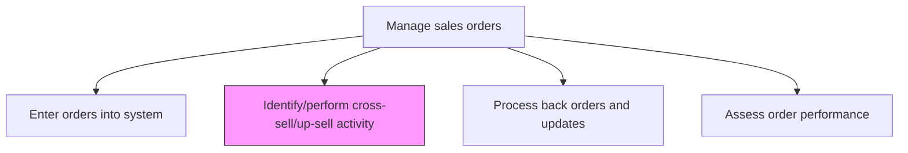
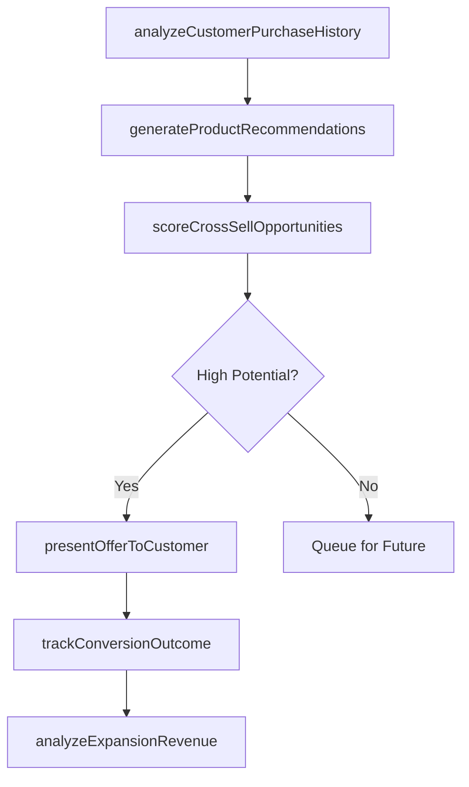

# Identify/perform cross-sell/up-sell activity

> Business-as-Code definition for cross-sell and up-sell activity identification and execution. Models the process of detecting expansion revenue opportunities within existing customer accounts and executing targeted offers for complementary or upgraded products and services.

## Overview

Utilizing customer inquiries as opportunities to either provide a comparable service to the one in question, offer additional complimentary service, or suggest a service that is better than what was initially offered.

## Process Hierarchy



## GraphDL

```yaml
identify/perform:
  object: Cross-sell/up-sell Activity
  actor: AccountManager
  result: CrossSellUpSellOpportunity
```

## Actions

| Action | Description |
|--------|-------------|
| analyzeCustomerPurchaseHistory | Review customer buying patterns, product mix, and usage data to identify expansion opportunities |
| generateProductRecommendations | Use recommendation engines or propensity models to suggest complementary or upgraded products |
| scoreCrossSellOpportunities | Rank identified opportunities by revenue potential, likelihood of acceptance, and customer fit |
| presentOfferToCustomer | Deliver targeted cross-sell or up-sell recommendations through appropriate sales or digital channels |
| trackConversionOutcome | Record whether the customer accepted, declined, or deferred the cross-sell or up-sell offer |
| analyzeExpansionRevenue | Measure the incremental revenue generated from cross-sell and up-sell activities |

## Events

| Event | Description |
|-------|-------------|
| purchaseHistoryAnalyzed | Customer buying patterns reviewed for expansion signals |
| productRecommendationsGenerated | Complementary or upgrade product suggestions created |
| crossSellOpportunitiesScored | Opportunities ranked by potential and fit |
| offerPresentedToCustomer | Cross-sell or up-sell offer delivered to the customer |
| conversionOutcomeTracked | Customer response to the offer recorded |
| expansionRevenueAnalyzed | Incremental revenue from cross-sell/up-sell measured |

## Searches

| Search | Description |
|--------|-------------|
| getCrossSellOpportunities | Retrieve scored cross-sell opportunities by customer or product |
| getProductRecommendations | Query product recommendations for a specific customer account |
| getConversionHistory | Look up cross-sell/up-sell offer outcomes by customer or product |
| getExpansionRevenueMetrics | Access expansion revenue data by account, product, or period |

## Process Flow



## RACI Matrix

| Activity | Responsible | Accountable | Consulted | Informed |
|----------|-------------|-------------|-----------|----------|
| analyzeCustomerPurchaseHistory | SalesAnalyst | SalesManager | CRM | Marketing |
| generateProductRecommendations | DataScientist | SalesOperationsManager | ProductManagement | Sales |
| presentOfferToCustomer | AccountManager | SalesManager | Marketing | CustomerSuccess |
| trackConversionOutcome | SalesOperationsAnalyst | SalesOperationsManager | CRM | Finance |

## Related Processes

| Process | Relationship |
|---------|-------------|
| 3.5.4.5 Enter orders into system | Upstream - order data reveals cross-sell and up-sell patterns |
| 3.5.2.3 Manage customer relationships | Parallel - relationship context informs offer timing and approach |
| 3.3.8.3 Develop business rules to provide personalized offers | Upstream - business rules drive automated recommendations |

## Related Departments

| Department | Role |
|-----------|------|
| Sales | Identifies and presents cross-sell/up-sell offers to customers |
| Data Science | Builds recommendation models and propensity scores |
| Product Management | Defines product bundles and upgrade paths |
| Marketing | Creates offer messaging and supporting materials |

## Related Occupations

| Occupation | Involvement |
|-----------|-------------|
| Account Manager | Presents cross-sell/up-sell offers to assigned accounts |
| Data Scientist | Builds models that identify expansion opportunities |
| Sales Operations Analyst | Tracks conversion rates and measures expansion revenue |

## KPIs

| KPI | Description | Unit |
|-----|-------------|------|
| Cross-Sell Conversion Rate | Percentage of cross-sell offers accepted by customers | % |
| Up-Sell Conversion Rate | Percentage of upgrade offers accepted by customers | % |
| Expansion Revenue | Incremental revenue from cross-sell and up-sell activities | Currency |
| Revenue per Customer | Average revenue per customer including expansion | Currency |

## Usage

```typescript
import { identifyPerformCrossSellUpSellActivity } from '@headlessly/identify-perform-cross-sell-up-sell-activity'

const crossSell = identifyPerformCrossSellUpSellActivity()

// Generate product recommendations for a customer
const recommendations = await crossSell.generateProductRecommendations({
  customerId: 'CUST-4820',
  currentProducts: ['platform-pro', 'analytics-basic'],
  modelType: 'collaborative-filtering',
  maxRecommendations: 5,
  excludeDeclined: true
})

// Track conversion outcome of an offer
const outcome = await crossSell.trackConversionOutcome({
  opportunityId: 'XSELL-2026-0891',
  customerId: 'CUST-4820',
  offeredProduct: 'analytics-enterprise',
  result: 'accepted',
  dealValue: 24000,
  channel: 'account-manager'
})
```
