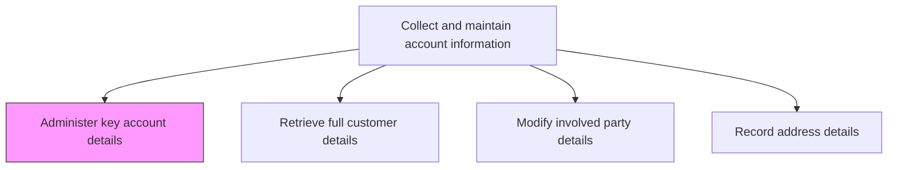
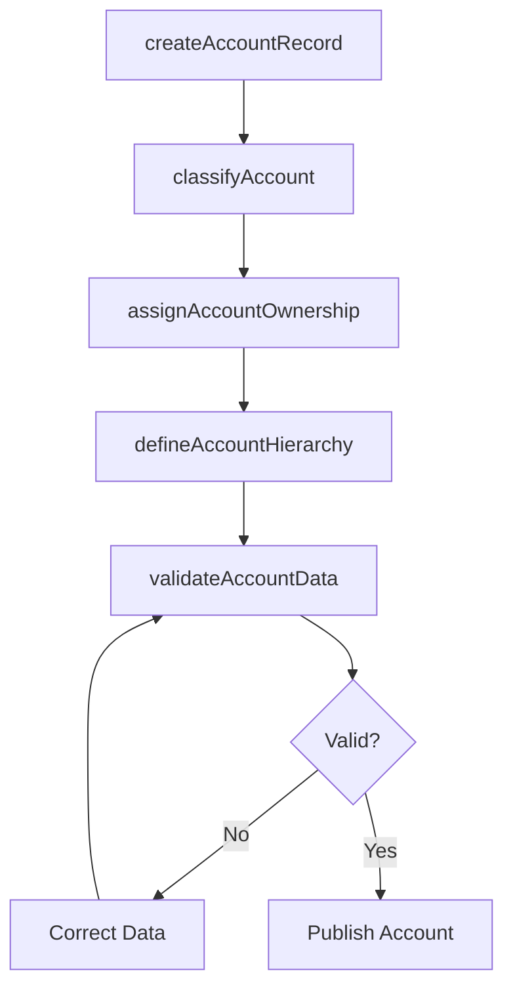

# Administer key account details

> Business-as-Code definition for key account detail administration. Models the creation, maintenance, and governance of core account master data including classification, hierarchy, ownership, and strategic attributes.

## Overview

Managing essential information of customer accounts. Create and maintain account master records with key attributes such as account classification, ownership, hierarchy structure, industry codes, and strategic tier assignments. Ensure account data accuracy, completeness, and governance compliance.

## Process Hierarchy



## GraphDL

```yaml
administer:
  object: Key Account Details
  actor: CRMAdministrator
  result: AccountMasterRecord
```

## Actions

| Action | Description |
|--------|-------------|
| createAccountRecord | Establish a new customer account master record with required attributes |
| classifyAccount | Assign account tier, industry classification, and strategic segmentation |
| assignAccountOwnership | Designate the responsible sales rep, account manager, and support team |
| defineAccountHierarchy | Map parent-child relationships between related accounts and subsidiaries |
| validateAccountData | Verify account details against external sources and enforce data quality rules |

## Events

| Event | Description |
|-------|-------------|
| accountRecordCreated | New customer account master record established |
| accountClassified | Account tier and industry classification assigned |
| accountOwnershipAssigned | Sales rep and account management team designated |
| accountHierarchyDefined | Parent-child account relationships mapped |
| accountDataValidated | Account details verified and data quality confirmed |

## Searches

| Search | Description |
|--------|-------------|
| getAccountDetails | Retrieve account master data by ID, name, or classification |
| getAccountHierarchy | Query parent-child relationships for an account |
| getAccountsByOwner | Look up accounts assigned to a specific sales rep or manager |
| getAccountsByTier | Access accounts filtered by strategic tier or classification |

## Process Flow



## RACI Matrix

| Activity | Responsible | Accountable | Consulted | Informed |
|----------|-------------|-------------|-----------|----------|
| createAccountRecord | CRMAdministrator | SalesOperationsManager | Sales | Finance |
| classifyAccount | SalesOperationsAnalyst | SalesOperationsManager | Marketing | KeyAccountManagers |
| assignAccountOwnership | SalesManager | VP Sales | HR | AccountManagers |

## Related Processes

| Process | Relationship |
|---------|-------------|
| 3.5.4.2.2 Retrieve full customer details | Downstream - administered account data is retrieved for operational use |
| 3.5.2.7 Manage customer master data | Parallel - account details are part of broader customer master data management |
| 3.5.2.1 Select key customers/accounts | Upstream - account selection determines which accounts require administration |

## Related Departments

| Department | Role |
|-----------|------|
| Sales Operations | Leads account master data administration |
| CRM | Maintains the systems that store account records |
| Sales | Provides account context and validates classifications |

## Related Occupations

| Occupation | Involvement |
|-----------|-------------|
| CRM Administrator | Creates and maintains account master records |
| Sales Operations Analyst | Classifies accounts and validates data quality |
| Account Manager | Provides account context and verifies ownership assignments |

## KPIs

| KPI | Description | Unit |
|-----|-------------|------|
| Account Data Completeness | Percentage of required account fields populated | % |
| Account Data Accuracy | Percentage of account records passing validation checks | % |
| Account Creation Time | Average time to create and fully populate a new account record | Hours |

## Usage

```typescript
import { administerKeyAccountDetails } from '@headlessly/administer-key-account-details'

const accounts = administerKeyAccountDetails()

// Create a new account master record
const account = await accounts.createAccountRecord({
  name: 'Acme Corporation',
  industry: 'technology',
  tier: 'enterprise',
  annualRevenue: 50000000,
  employeeCount: 500
})

// Assign account ownership
const ownership = await accounts.assignAccountOwnership({
  accountId: account.id,
  primaryOwner: 'sales-rep-042',
  accountManager: 'kam-015',
  supportTeam: 'enterprise-support-east'
})
```
