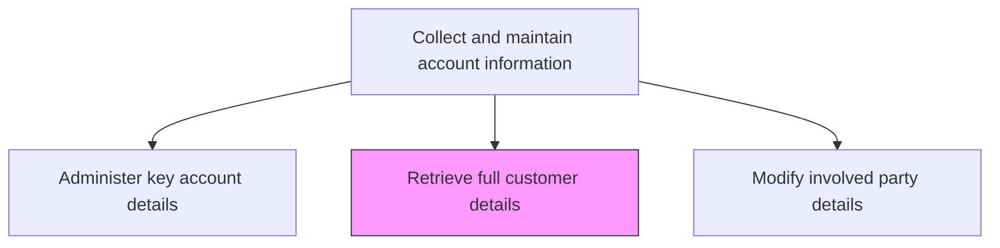
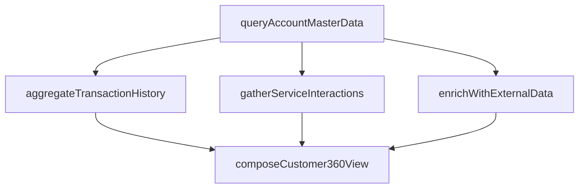

# Retrieve full customer details

> Business-as-Code definition for full customer detail retrieval. Models the aggregation and presentation of comprehensive customer information from CRM, billing, support, and third-party data sources into a unified 360-degree customer view.

## Overview

Obtaining detailed information about customers. Aggregate data from CRM, ERP, support systems, and external enrichment sources to provide a complete view of the customer including account details, contacts, transaction history, service interactions, and engagement data.

## Process Hierarchy



## GraphDL

```yaml
retrieve:
  object: Full Customer Details
  actor: AccountManager
  result: Customer360View
```

## Actions

| Action | Description |
|--------|-------------|
| queryAccountMasterData | Retrieve core account attributes from the CRM master record |
| aggregateTransactionHistory | Compile purchase orders, invoices, and payment history across all systems |
| gatherServiceInteractions | Collect support tickets, service requests, and interaction logs |
| enrichWithExternalData | Supplement internal data with third-party firmographic and technographic information |
| composeCustomer360View | Assemble all data sources into a unified customer profile |

## Events

| Event | Description |
|-------|-------------|
| accountMasterDataQueried | Core account attributes retrieved from CRM |
| transactionHistoryAggregated | Purchase and payment history compiled |
| serviceInteractionsGathered | Support and interaction data collected |
| externalDataEnriched | Third-party enrichment data integrated |
| customer360ViewComposed | Unified customer profile assembled from all sources |

## Searches

| Search | Description |
|--------|-------------|
| getCustomer360 | Retrieve the full unified customer profile by account ID |
| getCustomerTransactions | Query transaction history by customer, product, or date range |
| getCustomerInteractions | Look up service interactions and engagement history |
| getCustomerEnrichment | Access third-party firmographic and technographic data |

## Process Flow



## RACI Matrix

| Activity | Responsible | Accountable | Consulted | Informed |
|----------|-------------|-------------|-----------|----------|
| queryAccountMasterData | CRMAdministrator | SalesOperationsManager | IT | Sales |
| aggregateTransactionHistory | DataEngineer | SalesOperationsManager | Finance | AccountManagers |
| composeCustomer360View | SalesOperationsAnalyst | SalesOperationsManager | CRM | Sales |

## Related Processes

| Process | Relationship |
|---------|-------------|
| 3.5.4.2.1 Administer key account details | Upstream - account master data is the foundation for full retrieval |
| 3.5.2.7 Manage customer master data | Parallel - master data quality determines retrieval accuracy |
| 3.5.2.3 Manage customer relationships | Downstream - retrieved details support relationship management |

## Related Departments

| Department | Role |
|-----------|------|
| Sales Operations | Orchestrates customer data retrieval across systems |
| IT | Maintains integrations that enable cross-system data aggregation |
| Sales | Primary consumer of customer 360 views |

## Related Occupations

| Occupation | Involvement |
|-----------|-------------|
| Account Manager | Consumes customer 360 views for account planning |
| Data Engineer | Builds and maintains data aggregation pipelines |
| CRM Administrator | Manages the systems that store customer master data |

## KPIs

| KPI | Description | Unit |
|-----|-------------|------|
| Data Retrieval Time | Average time to compose a full customer 360 view | Seconds |
| Data Source Coverage | Number of systems integrated into the customer 360 view | Count |
| Profile Completeness | Percentage of data fields populated in the customer 360 view | % |

## Usage

```typescript
import { retrieveFullCustomerDetails } from '@headlessly/retrieve-full-customer-details'

const customerDetails = retrieveFullCustomerDetails()

// Compose a full 360-degree customer view
const profile = await customerDetails.composeCustomer360View({
  customerId: 'CUST-4820',
  includeSections: ['account', 'contacts', 'transactions', 'support', 'engagement'],
  enrichWithExternal: true,
  lookbackPeriod: 'last-24-months'
})

// Aggregate transaction history for a customer
const transactions = await customerDetails.aggregateTransactionHistory({
  customerId: 'CUST-4820',
  period: 'last-12-months',
  includeInvoices: true,
  includePayments: true
})
```
