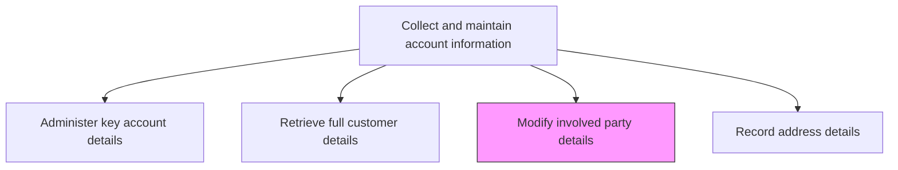
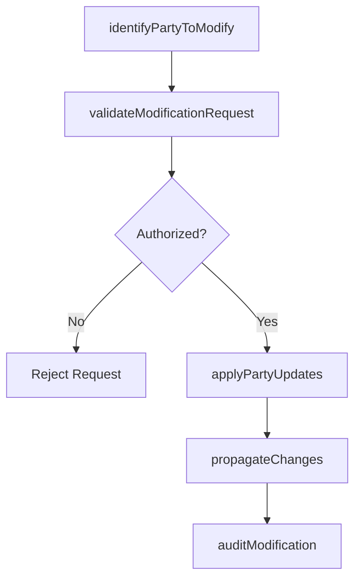

# Modify involved party details

> Business-as-Code definition for involved party detail modification. Models the process of updating stakeholder information associated with customer accounts including billing contacts, shipping recipients, decision makers, and authorized representatives.

## Overview

Altering information about involved parties. Update details for all stakeholders associated with a customer account such as billing contacts, shipping recipients, decision makers, technical contacts, and authorized representatives. Ensure changes are validated, propagated across systems, and audited for compliance.

## Process Hierarchy



## GraphDL

```yaml
modify:
  object: Involved Party Details
  actor: CRMAdministrator
  result: UpdatedPartyRecord
```

## Actions

| Action | Description |
|--------|-------------|
| identifyPartyToModify | Locate the specific involved party record requiring updates |
| validateModificationRequest | Confirm the requester has authorization to change the party details |
| applyPartyUpdates | Update the involved party record with new information |
| propagateChanges | Synchronize party detail changes across CRM, ERP, and billing systems |
| auditModification | Record the change with timestamp, requester, and previous values for compliance |

## Events

| Event | Description |
|-------|-------------|
| partyToModifyIdentified | Involved party record located for update |
| modificationRequestValidated | Authorization to change party details confirmed |
| partyUpdatesApplied | Involved party record updated with new information |
| changesPropagated | Party detail changes synchronized across systems |
| modificationAudited | Change recorded with audit trail for compliance |

## Searches

| Search | Description |
|--------|-------------|
| getInvolvedParties | Retrieve all parties associated with a customer account |
| getPartyModificationHistory | Query the change history for a specific involved party |
| getPendingModifications | Look up party modification requests awaiting approval |

## Process Flow



## RACI Matrix

| Activity | Responsible | Accountable | Consulted | Informed |
|----------|-------------|-------------|-----------|----------|
| validateModificationRequest | CRMAdministrator | SalesOperationsManager | Legal | AccountManager |
| applyPartyUpdates | CRMAdministrator | SalesOperationsManager | Sales | IT |
| propagateChanges | IT | SalesOperationsManager | CRM | Finance |

## Related Processes

| Process | Relationship |
|---------|-------------|
| 3.5.4.2.1 Administer key account details | Parallel - party modifications often accompany account updates |
| 3.5.4.2.4 Record address details | Downstream - party changes may trigger address updates |
| 3.5.4.2.5 Record contact details | Downstream - party modifications often include contact changes |

## Related Departments

| Department | Role |
|-----------|------|
| Sales Operations | Processes and validates party modification requests |
| IT | Ensures changes propagate across integrated systems |
| Legal | Validates authorization for sensitive party changes |

## Related Occupations

| Occupation | Involvement |
|-----------|-------------|
| CRM Administrator | Processes party detail modifications in the system |
| Sales Operations Manager | Approves modifications and ensures data governance |
| Account Manager | Requests party updates based on customer changes |

## KPIs

| KPI | Description | Unit |
|-----|-------------|------|
| Modification Processing Time | Average time from request to completion of party update | Hours |
| Propagation Accuracy | Percentage of party changes correctly synced across all systems | % |
| Unauthorized Modification Attempts | Number of rejected party modification requests per period | Count |

## Usage

```typescript
import { modifyInvolvedPartyDetails } from '@headlessly/modify-involved-party-details'

const partyMgmt = modifyInvolvedPartyDetails()

// Update a billing contact for a customer account
const updated = await partyMgmt.applyPartyUpdates({
  accountId: 'CUST-4820',
  partyId: 'PARTY-2201',
  partyRole: 'billing-contact',
  updates: { name: 'Jane Smith', email: 'jane.smith@acme.com', phone: '+1-555-0199' },
  requestedBy: 'kam-015'
})

// Propagate changes across systems
const propagation = await partyMgmt.propagateChanges({
  partyId: 'PARTY-2201',
  targetSystems: ['crm', 'erp', 'billing', 'support'],
  verifySync: true
})
```
