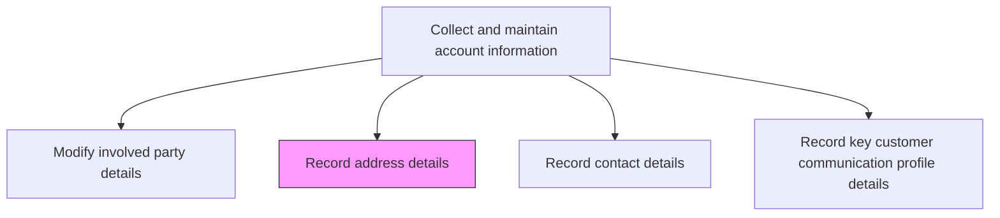
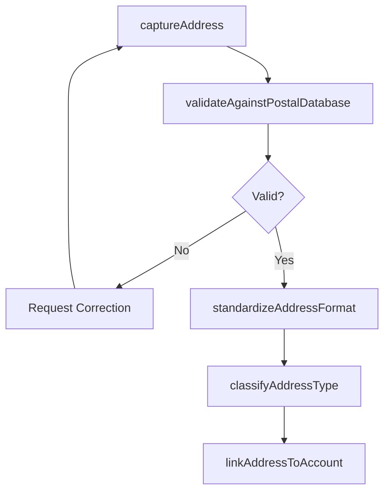

# Record address details

> Business-as-Code definition for address detail recording. Models the capture, validation, and maintenance of physical and mailing addresses for customer accounts including billing, shipping, and headquarters locations.

## Overview

Documenting address information. Capture and maintain accurate billing, shipping, and office addresses for customer accounts. Validate addresses against postal databases, standardize formatting, and ensure all address types are current and complete for order processing, invoicing, and correspondence.

## Process Hierarchy



## GraphDL

```yaml
record:
  object: Address Details
  actor: DataEntrySpecialist
  result: ValidatedAddressRecord
```

## Actions

| Action | Description |
|--------|-------------|
| captureAddress | Enter billing, shipping, or office address details for a customer account |
| validateAgainstPostalDatabase | Verify the address against postal authority databases for deliverability |
| standardizeAddressFormat | Normalize address components to conform to postal standards and system requirements |
| classifyAddressType | Categorize the address as billing, shipping, headquarters, branch, or other type |
| linkAddressToAccount | Associate the validated address with the appropriate customer account and party |

## Events

| Event | Description |
|-------|-------------|
| addressCaptured | Address details entered for a customer account |
| addressValidated | Address verified against postal authority databases |
| addressFormatStandardized | Address components normalized to postal standards |
| addressTypeClassified | Address categorized by type and purpose |
| addressLinkedToAccount | Address associated with the customer account and party |

## Searches

| Search | Description |
|--------|-------------|
| getAddressesByAccount | Retrieve all addresses for a specific customer account |
| getAddressByType | Query addresses filtered by type such as billing or shipping |
| getUnvalidatedAddresses | Look up addresses that have not been verified against postal databases |

## Process Flow



## RACI Matrix

| Activity | Responsible | Accountable | Consulted | Informed |
|----------|-------------|-------------|-----------|----------|
| captureAddress | DataEntrySpecialist | SalesOperationsManager | Sales | Customer |
| validateAgainstPostalDatabase | CRMSystem | SalesOperationsManager | IT | DataEntrySpecialist |
| linkAddressToAccount | DataEntrySpecialist | SalesOperationsManager | AccountManager | Logistics |

## Related Processes

| Process | Relationship |
|---------|-------------|
| 3.5.4.2.3 Modify involved party details | Upstream - party modifications often trigger address updates |
| 3.5.4.2.5 Record contact details | Parallel - contact and address details are often recorded together |
| 3.5.4.1 Accept and validate sales orders | Downstream - validated addresses enable order processing |

## Related Departments

| Department | Role |
|-----------|------|
| Sales Operations | Manages address data capture and validation |
| IT | Maintains postal validation integrations |
| Logistics | Consumes shipping addresses for fulfillment |

## Related Occupations

| Occupation | Involvement |
|-----------|-------------|
| Data Entry Specialist | Captures and records address details |
| CRM Administrator | Configures address validation rules |
| Sales Operations Analyst | Monitors address data quality |

## KPIs

| KPI | Description | Unit |
|-----|-------------|------|
| Address Validation Rate | Percentage of customer addresses validated against postal databases | % |
| Undeliverable Address Rate | Percentage of addresses that result in failed deliveries | % |
| Address Completeness | Percentage of accounts with all required address types populated | % |

## Usage

```typescript
import { recordAddressDetails } from '@headlessly/record-address-details'

const addresses = recordAddressDetails()

// Capture and validate a new shipping address
const address = await addresses.captureAddress({
  accountId: 'CUST-4820',
  addressType: 'shipping',
  street1: '123 Commerce Drive',
  street2: 'Suite 400',
  city: 'Austin',
  state: 'TX',
  postalCode: '78701',
  country: 'US'
})

// Validate against postal database
const validated = await addresses.validateAgainstPostalDatabase({
  addressId: address.id,
  validationService: 'usps',
  autoCorrect: true
})
```
