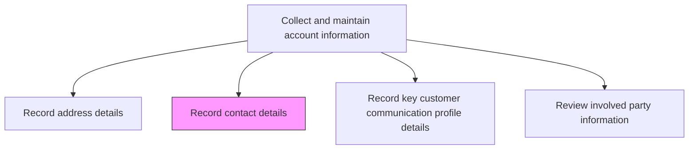
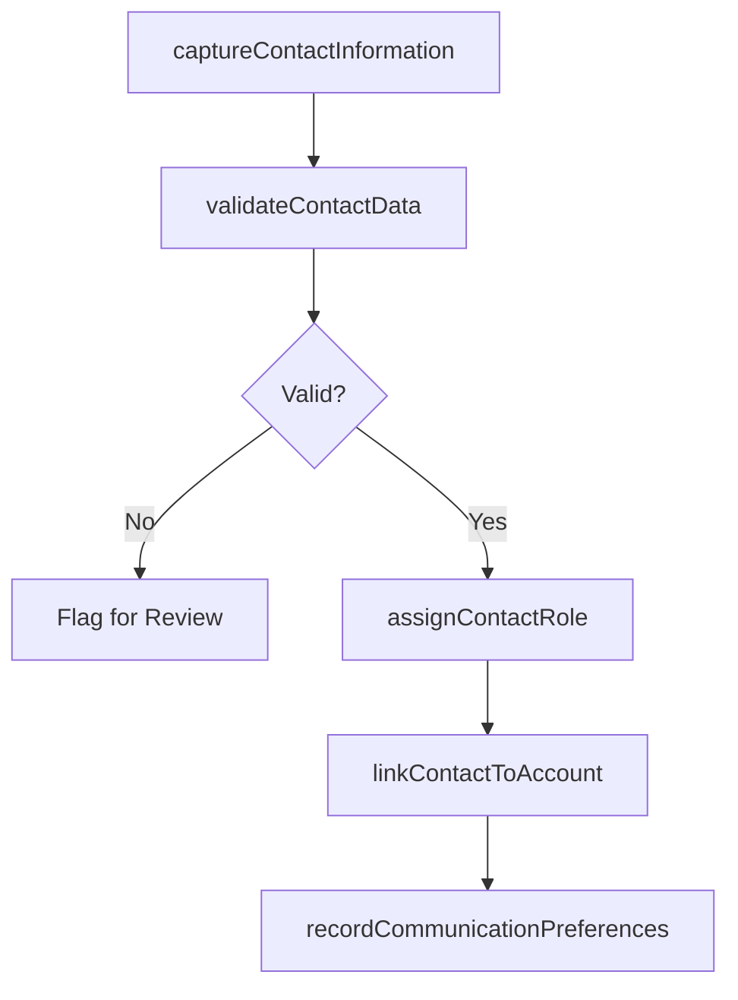

# Record contact details

> Business-as-Code definition for contact detail recording. Models the capture, validation, and maintenance of individual contact information including names, roles, communication preferences, and organizational relationships within customer accounts.

## Overview

Documenting contact information. Capture and maintain individual contact records for people associated with customer accounts including names, titles, phone numbers, email addresses, roles, and communication preferences. Ensure contact data accuracy for sales outreach, support interactions, and marketing campaigns.

## Process Hierarchy



## GraphDL

```yaml
record:
  object: Contact Details
  actor: SalesRepresentative
  result: ContactRecord
```

## Actions

| Action | Description |
|--------|-------------|
| captureContactInformation | Enter individual contact details including name, title, email, phone, and role |
| validateContactData | Verify email deliverability, phone number format, and contact identity |
| assignContactRole | Designate the contact's role such as decision maker, influencer, technical, or billing |
| linkContactToAccount | Associate the contact record with the appropriate customer account and hierarchy |
| recordCommunicationPreferences | Capture preferred contact methods, times, and opt-in/opt-out preferences |

## Events

| Event | Description |
|-------|-------------|
| contactInformationCaptured | Individual contact details entered into the system |
| contactDataValidated | Email, phone, and identity information verified |
| contactRoleAssigned | Contact's role within the account designated |
| contactLinkedToAccount | Contact associated with the customer account |
| communicationPreferencesRecorded | Contact method preferences and opt-in status captured |

## Searches

| Search | Description |
|--------|-------------|
| getContactsByAccount | Retrieve all contacts for a specific customer account |
| getContactsByRole | Query contacts filtered by role such as decision maker or technical |
| getContactPreferences | Look up communication preferences for a specific contact |

## Process Flow



## RACI Matrix

| Activity | Responsible | Accountable | Consulted | Informed |
|----------|-------------|-------------|-----------|----------|
| captureContactInformation | SalesRepresentative | SalesManager | CRM | Marketing |
| validateContactData | CRMAdministrator | SalesOperationsManager | IT | Sales |
| recordCommunicationPreferences | SalesRepresentative | SalesOperationsManager | Marketing | Legal |

## Related Processes

| Process | Relationship |
|---------|-------------|
| 3.5.4.2.4 Record address details | Parallel - address and contact details are often recorded together |
| 3.5.4.2.6 Record key customer communication profile details | Downstream - contact details feed communication profile creation |
| 3.5.2.7 Manage customer master data | Parallel - contact data is a key component of customer master records |

## Related Departments

| Department | Role |
|-----------|------|
| Sales | Primary source of contact data from customer interactions |
| Sales Operations | Ensures contact data quality and governance |
| Marketing | Uses contact data for campaign targeting and outreach |

## Related Occupations

| Occupation | Involvement |
|-----------|-------------|
| Sales Representative | Captures contact details from customer interactions |
| CRM Administrator | Maintains contact data quality and system configurations |
| Marketing Operations Specialist | Uses contact data for campaign segmentation |

## KPIs

| KPI | Description | Unit |
|-----|-------------|------|
| Contact Data Accuracy | Percentage of contact records with validated email and phone | % |
| Contact Coverage | Average number of contacts recorded per customer account | Count |
| Bounce Rate | Percentage of contact emails that bounce on outreach | % |

## Usage

```typescript
import { recordContactDetails } from '@headlessly/record-contact-details'

const contacts = recordContactDetails()

// Capture a new contact for a customer account
const contact = await contacts.captureContactInformation({
  accountId: 'CUST-4820',
  firstName: 'John',
  lastName: 'Doe',
  title: 'VP Engineering',
  email: 'john.doe@acme.com',
  phone: '+1-555-0142',
  department: 'engineering'
})

// Assign role and record preferences
const role = await contacts.assignContactRole({
  contactId: contact.id,
  role: 'technical-decision-maker',
  influenceLevel: 'high',
  buyingStage: 'evaluation'
})
```
